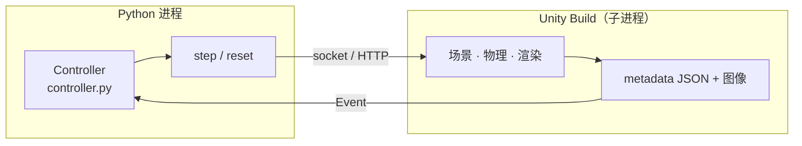
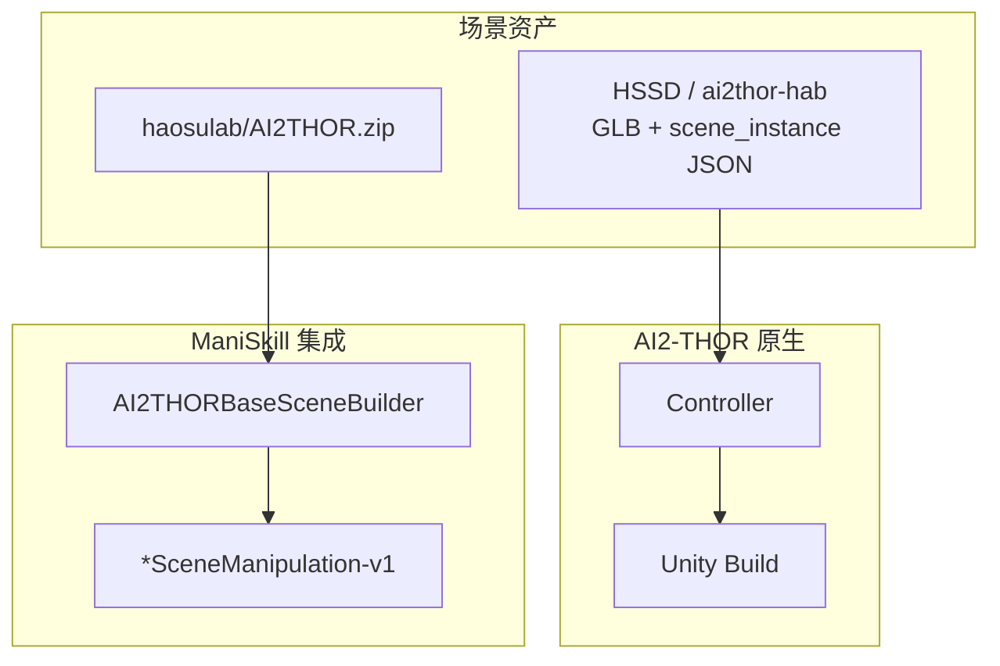

# AI2-THOR 技术介绍

> **Allen Institute for AI (AI2)** · Unity 3D · 近照片级可交互室内仿真  
> 官方仓库：[allenai/ai2thor](https://github.com/allenai/ai2thor) · 本地可选克隆：`../repos/ai2thor/`（`fetch_repos.sh`）  
> 本地对照源码：`../code/ManiSkill-main/`（AI2-THOR 场景在 SAPIEN 中的集成）· `../code/virtualhome-master/`（Unity 子进程通信模式）  
> 官网：[ai2thor.allenai.org](https://ai2thor.allenai.org/) · PRIOR 团队：[prior.allenai.org](https://prior.allenai.org/)  
> 同目录延伸阅读：[基本使用流程.md](基本使用流程.md) · [动作与对象参考.md](动作与对象参考.md) · [../sapien/介绍.md](../sapien/介绍.md)

## 1. 概述

**AI2-THOR**（AI2 Interactive Framework for Embodied AI）是 Allen AI 开源的 **Embodied AI** 研究与训练平台。与侧重 **高速导航** 的 Habitat 不同，AI2-THOR 的核心优势在于：

- **物体状态机**：Open/Close、On/Off、Hot/Cold、Filled/Empty、Slice、Cook 等 **语义状态** 随交互变化  
- **200+ 离散动作**：覆盖导航、抓取、开关电器、打开容器、烹饪等  
- **Unity 物理与渲染**：近照片级室内场景，支持动态光照、物理抛掷/推动  
- **多 agent 类型**：默认人形、**arm**（ManipulaTHOR）、**locobot**（RoboTHOR）、**drone**  

典型研究：visual navigation、instruction following、interactive QA、occlusion reasoning、multi-agent、audio-visual navigation、**Sim2Real**（RoboTHOR）。

首篇论文：[AI2-THOR: An Interactive 3D Environment for Visual AI (arXiv:1712.05417)](https://arxiv.org/abs/1712.05417)

---

## 2. 本地源码对照索引

`embodied-platforms/code/` 中**未包含**完整的 `allenai/ai2thor` 仓库，但有两处与 AI2-THOR 密切相关的对照代码，可用于理解架构与跨平台复用：

| 用途 | 本地路径 | 说明 |
|------|----------|------|
| **官方 Python 入口** | [ai2thor/controller.py](https://github.com/allenai/ai2thor/blob/master/ai2thor/controller.py) | `Controller` 类、`step`/`reset`、Unity 子进程管理 |
| **容器—物体相容表** | [controller.py L48–200+](https://github.com/allenai/ai2thor/blob/master/ai2thor/controller.py#L48) | `RECEPTACLE_OBJECTS`：Cabinet/CounterTop 等可放入何物 |
| **ManiSkill 场景构建** | [scene_builder.py](../code/ManiSkill-main/mani_skill/utils/scene_builder/ai2thor/scene_builder.py) | 将 HSSD/ai2thor-hab 资产载入 SAPIEN PhysX |
| **四套子环境映射** | [constants.py](../code/ManiSkill-main/mani_skill/utils/scene_builder/ai2thor/constants.py) | `SCENE_SOURCE_TO_DATASET`：iTHOR / RoboTHOR / ProcTHOR / ArchitecTHOR |
| **可移动物体列表** | [constants.py L34–140](../code/ManiSkill-main/mani_skill/utils/scene_builder/ai2thor/constants.py#L34-L140) | `MOVEABLE_OBJECT_IDS`（与 Unity metadata 对齐） |
| **场景子类注册** | [variants.py](../code/ManiSkill-main/mani_skill/utils/scene_builder/ai2thor/variants.py) | 四个 `*SceneBuilder` 子类 |
| **资产下载** | [data.py L128–132](../code/ManiSkill-main/mani_skill/utils/assets/data.py#L128-L132) | HuggingFace `haosulab/AI2THOR` 压缩包 |
| **Gym 环境注册** | [scenes/__init__.py](../code/ManiSkill-main/mani_skill/envs/scenes/__init__.py) | 自动注册 `*SceneManipulation-v1` |
| **Unity 启动模式** | [communication.py L88–119](../code/virtualhome-master/simulation/unity_simulator/communication.py#L88-L119) | 注释标明参考 ai2thor `controller.py` 的 `launch_executable` |

完整官方源码可通过 `../repos/fetch_repos.sh` 克隆至 `../repos/ai2thor/`。

---

## 3. 产品线与子环境

AI2-THOR 不是单一场景包，而是 **同一 Unity 后端 + Python Controller** 下的多套 **环境配置**：

| 环境 | 规模 / 特点 | 文档 | 论文 | ManiSkill 集成 |
|------|-------------|------|------|----------------|
| **iTHOR** | 120+ 房间（FloorPlan1–30 等 × 厨房/卧室/浴室/客厅）；2000+ 物体 | [iTHOR Docs](https://ai2thor.allenai.org/ithor/documentation/) | ICCV 2017 系列 | `iTHORSceneBuilder` |
| **ManipulaTHOR** | 在 iTHOR 场景中使用 **7-DoF 机械臂** agent（`agentMode="arm"`） | [ManipulaTHOR Docs](https://ai2thor.allenai.org/manipulathor/documentation/) | [CVPR 2021](https://ai2thor.allenai.org/manipulathor/) | —（Unity 原生） |
| **RoboTHOR** | 89 公寓、600+ 物体；**14 套** Sim+Real 配对；LoCoBot + Kinect | [RoboTHOR](https://ai2thor.allenai.org/robothor/) | [arXiv:2004.06799](https://arxiv.org/abs/2004.06799) | `RoboTHORSceneBuilder` |
| **ProcTHOR** | **程序化** 生成可交互房屋，规模扩展 Embodied AI | [procthor.allenai.org](https://procthor.allenai.org/) | NeurIPS 2022 Outstanding Paper | `ProcTHORSceneBuilder` |
| **ArchitecTHOR** | 建筑师设计的高质量室内（HSSD 子集） | [HSSD](https://huggingface.co/datasets/hssd/ai2thor-hab) | — | `ArchitecTHORSceneBuilder`（10 场景，见 [ArchitecTHOR.json](../code/ManiSkill-main/mani_skill/utils/scene_builder/ai2thor/metadata/ArchitecTHOR.json)） |

四套场景在 ManiSkill 中统一映射（[constants.py L145–170](../code/ManiSkill-main/mani_skill/utils/scene_builder/ai2thor/constants.py#L145-L170)）：

```python
SCENE_SOURCE_TO_DATASET = {
    "ProcTHOR": SceneDataset(metadata_path="ProcTHOR.json", ...),
    "ArchitecTHOR": SceneDataset(metadata_path="ArchitecTHOR.json", ...),
    "iTHOR": SceneDataset(metadata_path="iTHOR.json", ...),
    "RoboTHOR": SceneDataset(metadata_path="RoboTHOR.json", ...),
}
```

### 3.1 iTHOR 场景命名

- 场景 ID：`FloorPlan{编号}`，如 `FloorPlan10`（厨房）、`FloorPlan203`  
- 完整列表：[Scenes 文档](https://ai2thor.allenai.org/ithor/documentation/scenes)  
- 首次 `Controller()` 会从网络下载 Unity build 到 **`~/.ai2thor`**（约 **500MB**）

### 3.2 RoboTHOR 数据划分（摘要）

| Split | 数量 | 说明 |
|-------|------|------|
| Train | 60 | 仅仿真 |
| Val | 15 | 仅仿真 |
| Test-dev | 4 | 仿真 + **真实** 可远程部署 |
| Test-standard | 10 | 盲测物理场景 |

- 89 公寓来自 **15 种墙布局** × 模块化家具；命名 `WallConfiguration_i`  
- **14 类** 保证出现在所有场景的 **导航目标** 小物体（如 mug、laptop、alarm clock 等）  
- 真实机器人：**LoCoBot**，API 基于 [PyRobot](https://github.com/facebookresearch/pyrobot)

### 3.3 ProcTHOR 工作流

```python
# pip install procthor
from procthor.constants import PROCTHOR_10K_ROOMSPEC_SAMPLER
from procthor.generation import HouseGenerator

house = HouseGenerator(...).generate()
# 载入 AI2-THOR
from ai2thor.controller import Controller
controller = Controller(branch="main", scene="Procedural")
controller.step(action="CreateHouse", house=house.data)
```

- 生成房屋 JSON 与 iTHOR **同一 metadata 结构**  
- 支持 `House.validate()` 检查可达性、房间连通性  
- 注意：ProcTHOR 程序化场景 **官方不支持 multi-agent**

---

## 4. 系统架构

### 4.1 交互循环



官方文档描述的标准循环（[Environment State](https://ai2thor.allenai.org/ithor/documentation/environment-state/)）：

```
Python 进程                          Unity Build (本地子进程)
     │                                      │
     │  Controller.step(action, **kwargs)   │
     ├─────────────────────────────────────►│ 执行动作、物理步进、渲染
     │                                      │
     │◄─────────────────────────────────────┤ 返回 Event (JSON + 图像)
     │  event.metadata / event.frame        │
```

- **Backend**：Unity 实时引擎（场景、动作、观测均存于 Unity）  
- **Frontend**：Python `Controller` 通过 socket/HTTP 与 Unity 通信（[controller.py L368–401](https://github.com/allenai/ai2thor/blob/master/ai2thor/controller.py#L368-L401) 初始化参数；[L1011–1054](https://github.com/allenai/ai2thor/blob/master/ai2thor/controller.py#L1011-L1054) `step` 将 action dict 发送至 server）  
- 每次 `step` 返回 **`Event`**（单 agent）或 **`events` 列表**（multi-agent）

VirtualHome 的 Unity 启动逻辑同样参考了该模式（[communication.py L88–92](../code/virtualhome-master/simulation/unity_simulator/communication.py#L88-L92)），说明 **Python 子进程 + Unity 可执行文件 + 端口通信** 是 Allen AI 系仿真器的通用范式。

### 4.2 Event 对象结构

| 字段 | 类型 | 说明 |
|------|------|------|
| `metadata` | dict | 环境状态、agent、所有 `objects` 列表 |
| `frame` | ndarray | RGB（或 BGR，见 `cv2img`） |
| `depth_frame` | ndarray | 深度（需 `renderDepthImage=True`） |
| `instance_segmentation_frame` | ndarray | 实例分割（需 `renderInstanceSegmentation=True`） |
| `cv2img` | ndarray | OpenCV 友好格式 `(H,W,3)` |
| `instance_masks` / `color_to_object_id` | — | 分割 id 映射 |

关键 metadata 字段：

| 键 | 说明 |
|----|------|
| `lastActionSuccess` | 上一步是否成功 |
| `errorMessage` | 失败原因 |
| `lastAction` | 动作名 |
| `actionReturn` | 查询类动作的返回值 |
| `agent` | 位姿、cameraHorizon、held object 等 |
| `objects` | 场景中每个物体的完整 metadata |
| `inventoryObjects` | agent 持有物 |
| `agentId` | 多 agent 时标识 |

详见 [Event Metadata（legacy）](https://allenai.github.io/ai2thor-v2.1.0-documentation/event-metadata) 与 [Environment State](https://ai2thor.allenai.org/ithor/documentation/environment-state/)。

### 4.3 Controller 主要初始化参数

摘自 [controller.py L368–401](https://github.com/allenai/ai2thor/blob/master/ai2thor/controller.py#L368-L401) 与官方文档：

| 参数 | 默认 | 说明 |
|------|------|------|
| `scene` | — | 如 `FloorPlan10`、`Procedural` |
| `agentMode` | `default` | `default` / `arm` / `locobot` / `drone`（[L600](https://github.com/allenai/ai2thor/blob/master/ai2thor/controller.py#L600)） |
| `width` / `height` | 300 | 渲染分辨率 |
| `fieldOfView` | 60（LoCoBot） | 相机 FOV（度） |
| `gridSize` | 0.25 | 导航网格步长（米） |
| `visibilityDistance` | 1.5 | 物体 `visible=True` 的最大距离 |
| `renderDepthImage` | False | 启用深度（更慢） |
| `renderInstanceSegmentation` | False | 启用实例分割（更慢） |
| `platform` | 本地窗口 | **`CloudRendering`** = 无头集群渲染（[L746–746](https://github.com/allenai/ai2thor/blob/master/ai2thor/controller.py#L746)） |
| `headless` | False | 旧版无头选项 |
| `gpu_device` | — | 指定 GPU |
| `branch` / `commit_id` | release | 锁定 Unity build 版本 |
| `local_executable_path` | — | 自定义 Unity 可执行文件 |

`controller.reset(scene=..., ...)` 可运行时切换场景与参数（[L685+](https://github.com/allenai/ai2thor/blob/master/ai2thor/controller.py#L685)）。

---

## 5. Agent 类型

| agentMode | 用途 | 特点 |
|-----------|------|------|
| **default** | iTHOR 人形 | 离散 MoveAhead/TurnLeft；PickupObject 等 |
| **arm** | ManipulaTHOR | 7-DoF 臂 + 基座 + MoveAgent/RotateAgent |
| **locobot** | RoboTHOR | 与真实 LoCoBot 对齐的导航与控制 |
| **drone** | 空中视角 | 默认 FOV 150° |

未设置 `agentMode="arm"` 时使用 ManipulaTHOR 会 **RuntimeError** 或行为不符合文档。`reset` 时若场景为 RoboTHOR 但未设 `agentMode='locobot'` 会抛出明确提示（[controller.py L713–717](https://github.com/allenai/ai2thor/blob/master/ai2thor/controller.py#L713-L717)）。

---

## 6. 物体模型与状态（iTHOR 核心）

每个 sim object 在 `metadata["objects"]` 中含丰富属性（[Object Metadata](https://ai2thor.allenai.org/ithor/documentation/environment-state/)）：

### 6.1 标识与几何

- **`objectId`**：运行时唯一 ID，格式 `ObjectType|x|y|z`（如 `AlarmClock|-02.08|+00.94|-03.62`）  
- **`objectType`**：语义类别（Microwave、Fridge、Apple 等，见 Object Types 文档）  
- **`position` / `rotation`**：世界坐标  
- **`axisAlignedBoundingBox` / `objectOrientedBoundingBox`**：包围盒  

### 6.2 交互属性（布尔 flags）

| 属性 | 含义 |
|------|------|
| `pickupable` / `isPickedUp` | 可抓取 / 正被持有 |
| `receptacle` / `receptacleObjectIds` | 容器 / 内含物体 |
| `openable` / `isOpen` | 可开关（门、抽屉、微波炉） |
| `toggleable` / `isToggled` | 可切换 On/Off（灯、 stove） |
| `breakable` / `isBroken` | 可打碎 |
| `sliceable` / `isSliced` | 可切片 |
| `cookable` / `isCooked` | 可烹饪 |
| `moveable` / `isMoving` | 可 Push/Pull |
| `dirtyable` / `isDirty` | 脏/净 |
| `fillable` / `isFilledWithLiquid` | 液体容器 |
| `canFillWithLiquid` / `canBeUsedUp` | 液体来源/消耗 |

### 6.3 温度与材质

- **`ObjectTemperature`**：`Hot` / `Cold` / `RoomTemp`  
- **`canChangeTempToHot` / `canChangeTempToCold`**：热源/冷源（冰箱、炉灶）  
- **`salientMaterials`**：Metal, Wood, Plastic, Glass, Ceramic, Food 等  

### 6.4 容器相容性（源码）

`controller.py` 内嵌 **`RECEPTACLE_OBJECTS`** 字典，定义各容器类型可接纳的物体集合（[L48–200+](https://github.com/allenai/ai2thor/blob/master/ai2thor/controller.py#L48)），例如：

| 容器 `objectType` | 可放入物体（节选） |
|-------------------|-------------------|
| `Cabinet` | Bowl, Mug, Plate, Laptop, Toaster, … |
| `CounterTop` | Apple, Bread, CoffeeMachine, Egg, … |
| `CoffeeMachine` | Mug, MugFilled |
| `Microwave` | Apple, Bowl, Potato, … |

该表在 Python 侧用于 **最近枢轴点** 等辅助逻辑，与 Unity 侧 `PutObject` 校验一致。更完整的动作—状态映射见 [动作与对象参考.md](动作与对象参考.md)。

这些状态组合支持 **embodied common sense**（例如：冷苹果放进微波炉 → 变热）。

---

## 7. 动作体系（摘要）

动作通过 `controller.step(action="ActionName", **params)` 调用（[controller.py L1011](https://github.com/allenai/ai2thor/blob/master/ai2thor/controller.py#L1011) 支持字符串 shorthand 与 dict）。分为：

1. **导航**：MoveAhead, MoveBack, MoveLeft, MoveRight, RotateRight, RotateLeft, LookUp, LookDown, Teleport, TeleportFull  
2. **物体交互**：PickupObject, PutObject, DropHandObject, OpenObject, CloseObject, ToggleObjectOn/Off, SliceObject, BreakObject, CookObject, DirtyObject, CleanObject, FillObjectWithLiquid, EmptyLiquidFromObject, UseUpObject  
3. **物理**：PushObject, PullObject, DirectionalPush, ThrowObject  
4. **查询**（不改变状态，较快）：GetReachablePositions, GetObjectInFrame, GetCoordinateFromRaycast, GetInteractablePoses  
5. **场景控制**：InitializeObject, CreateHouse（ProcTHOR）, RandomizeLighting, AddThirdPartyCamera  
6. **ManipulaTHOR 臂控**：MoveArm, MoveArmBase, MoveAgent, RotateAgent, PickupObject（带 arm 参数）等  

**典型交互链**：

```python
# 1. 查询可达点
event = controller.step(action="GetReachablePositions")
positions = event.metadata["actionReturn"]

# 2. 点击画面选物体
query = controller.step(action="GetObjectInFrame", x=0.5, y=0.5)
oid = query.metadata["actionReturn"]

# 3. 打开冰箱
event = controller.step(action="OpenObject", objectId=oid, forceAction=False)
```

完整列表与参数见 [动作与对象参考.md](动作与对象参考.md) 与 [Agent Actions 文档](https://ai2thor.allenai.org/ithor/documentation/agent-actions)。

---

## 8. 传感器与 Ground Truth

| 输出 | 启用方式 | 用途 |
|------|----------|------|
| RGB | 默认 | 视觉策略 |
| Depth | `renderDepthImage=True` | 导航、几何 |
| Instance Segmentation | `renderInstanceSegmentation=True` | 物体检测、分割监督 |
| Semantic（部分版本） | 配置 | 类别级分割 |
| Optical flow | 文档/扩展 | 运动估计 |
| 第三人称相机 | `AddThirdPartyCamera` | 多视角、监控 |

- **`visibilityDistance`** 影响 `object.visible`，但不等于「像素可见」——物体需在距离内且未被遮挡逻辑判定  
- 深度单位可通过 `DepthFormat.Meters` 等配置（[controller.py L387](https://github.com/allenai/ai2thor/blob/master/ai2thor/controller.py#L387) `depth_format` 参数）

---

## 9. 多智能体

- 同一场景可 spawn 多个 agent，每步 `step` 返回 **`events` 列表**（每 agent 一个 Event）  
- 支持协作任务（搬运、分工）  
- 示例：[multi-agent notebook](https://github.com/allenai/ai2thor/tree/main/notebooks) · [legacy multi-agent doc](https://allenai.github.io/ai2thor-v2.1.0-documentation/examples)  
- **ProcTHOR 程序化房屋**：官方注明 multi-agent **尚未支持**

---

## 10. 部署模式

| 模式 | 配置 | 场景 |
|------|------|------|
| **本地窗口** | 默认 `Controller()` | 开发调试 |
| **Cloud Rendering** | `platform=CloudRendering` | HPC 集群无 X11（[L1226](https://github.com/allenai/ai2thor/blob/master/ai2thor/controller.py#L1226) 需 NVIDIA GPU） |
| **Docker** | [ai2thor-docker](https://github.com/allenai/ai2thor-docker) | 预配置 X server + Unity |
| **Google Colab** | [ai2thor-colab](https://github.com/allenai/ai2thor-colab) | 零本地安装 |
| **指定 commit** | `pip install --extra-index-url https://ai2thor-pypi.allenai.org ai2thor==0+COMMIT` | 复现论文 |

系统要求（摘要）：macOS 10.9+ / Ubuntu 14.04+；Python 3.5+；Linux 需 X+GLX 或 CloudRendering；SSE2 CPU；支持 DX9/DX11 级 GPU（[Installation](https://ai2thor.allenai.org/ithor/documentation/)）。

---

## 11. 训练框架：AllenAct

**[AllenAct](https://allenact.org/)** 是 AI2 的 Embodied AI 训练框架，对 AI2-THOR **一等公民支持**：

- 预置 iTHOR / RoboTHOR / ManipulaTHOR 实验配置  
- 支持 PPO、DD-PPO、模仿学习等  
- 与 `Controller` 封装集成，便于复现 PRIOR 论文 baseline  

AllenAct 仓库：[allenai/allenact](https://github.com/allenai/allenact)

---

## 12. 跨平台复用：ManiSkill + HSSD

除 Unity 原生 `Controller` 外，AI2-THOR 场景资产可通过 **[HSSD ai2thor-hab](https://huggingface.co/datasets/hssd/ai2thor-hab)** 在 **SAPIEN / ManiSkill** 中加载，实现 **GPU 并行物理仿真 + 光追渲染**（见 [ManiSkill README](../code/ManiSkill-main/README.md) 与 [scenes.md](../code/ManiSkill-main/docs/source/user_guide/datasets/scenes.md)）。



### 12.1 场景构建流程（ManiSkill 源码）

`AI2THORBaseSceneBuilder.build()`（[scene_builder.py L111–252](../code/ManiSkill-main/mani_skill/utils/scene_builder/ai2thor/scene_builder.py#L111-L252)）核心步骤：

1. 读取 `scene_instance.json` 中的 `stage_instance` 与 `object_instances`  
2. 从 `ai2thor-hab/assets/` 加载背景 `.glb`，绕 X 轴旋转 90° 对齐坐标系（[L152–164](../code/ManiSkill-main/mani_skill/utils/scene_builder/ai2thor/scene_builder.py#L152-L164)）  
3. ProcTHOR 场景额外绕 Y 轴旋转 90°（[L155–162](../code/ManiSkill-main/mani_skill/utils/scene_builder/ai2thor/scene_builder.py#L155-L162)）  
4. 按 `semantic_id` 判断静态/动态：非 `MOVEABLE_OBJECT_IDS` 的物体建为 **static actor**；否则建为 **dynamic actor** 并加入 `movable_objects`（[L98–108](../code/ManiSkill-main/mani_skill/utils/scene_builder/ai2thor/scene_builder.py#L98-L108)、[L193–231](../code/ManiSkill-main/mani_skill/utils/scene_builder/ai2thor/scene_builder.py#L193-L231)）  
5. 合并背景为单一 `scene_background` actor，并禁用 Fetch 机器人与背景的碰撞（[L246–272](../code/ManiSkill-main/mani_skill/utils/scene_builder/ai2thor/scene_builder.py#L246-L272)）

### 12.2 预置 Gym 环境

[scenes/__init__.py L17–22](../code/ManiSkill-main/mani_skill/envs/scenes/__init__.py#L17-L22) 为每个已注册 SceneBuilder 自动生成环境 ID：

| 环境 ID | SceneBuilder | 用途 |
|---------|--------------|------|
| `iTHOR_SceneManipulation-v1` | iTHOR | 探索 / benchmark |
| `RoboTHOR_SceneManipulation-v1` | RoboTHOR | 探索 / benchmark |
| `ProcTHOR_SceneManipulation-v1` | ProcTHOR | 探索 / benchmark |
| `ArchitecTHOR_SceneManipulation-v1` | ArchitecTHOR | 探索 / benchmark（文档示例最多） |

`SceneManipulationEnv` 明确说明：**仅用于探索与可视化，无 reward / success 条件**（[base_env.py L21–24](../code/ManiSkill-main/mani_skill/envs/scenes/base_env.py#L21-L24)）。完整 RL 任务仍在开发中（[scenes.md L52–54](../code/ManiSkill-main/docs/source/user_guide/datasets/scenes.md#L52-L54)）。

### 12.3 Unity 原生 vs ManiSkill 对照

| 维度 | AI2-THOR（Unity） | ManiSkill + HSSD |
|------|-------------------|------------------|
| 物理引擎 | Unity PhysX | SAPIEN / PhysX 5 GPU |
| 物体状态机 | 完整（Open/Cook/Slice…） | **仅几何与刚体**（无语义状态机） |
| 并行 env | 多进程 Controller | **单卡数千 `num_envs`** |
| 机械臂 | ManipulaTHOR 7-DoF | Fetch / Panda（SAPIEN） |
| 适用场景 | 交互常识、语言任务、Sim2Real | 大规模视觉导航、合成数据、场景探索 |

详见 [../sapien/介绍.md](../sapien/介绍.md) 与 [基本使用流程.md §流程十二](基本使用流程.md)。

---

## 13. 典型 Benchmark 与研究方向

| 方向 | 说明 | 相关资源 |
|------|------|----------|
| **Visual Navigation** | 在 FloorPlan 中找目标物体 | RoboTHOR ObjectNav |
| **Interactive QA** | 需交互才能回答问题 | THOR 系列论文 |
| **Instruction Following** | 语言→动作序列 | ALFRED 等（常基于 THOR 类环境） |
| **ManipulaTHOR** | 臂爪 pick-place、遮挡 | [ManipulaTHOR paper](https://ai2thor.allenai.org/manipulathor/) |
| **Sim2Real** | 仿真 LoCoBot → 真实公寓 | RoboTHOR Challenge |
| **ProcTHOR 泛化** | 在 10K 程序化房屋上训练/测试 | [ProcTHOR](https://procthor.allenai.org/) |
| **Audio-Visual Nav** | 声音+视觉导航 | AI2-THOR 扩展项目 |
| **跨引擎场景复用** | HSSD 资产在 SAPIEN 中训练 | ManiSkill Scene Datasets |

---

## 14. 与同类平台对比

官方 [Framework Comparison](https://ai2thor.allenai.org/)：

| 能力 | AI2-THOR | Habitat | iGibson |
|------|----------|---------|---------|
| Navigable | ✅ | ✅ | ✅ |
| 3D Scene Scans | ✅ | ✅ | ✅ |
| 3D Asset Library | ✅ | 部分 | ✅ |
| Physics-Based Interaction | ✅ | Collisions 为主 | ✅ |
| **Object States** | ✅ | 有限 | 部分 |
| **Object Specific Reactions** | ✅ | ❌ | 部分 |
| Dynamic Lighting | ✅ | 部分 | PBR |
| Multiple Agents | ✅ | ✅ | 部分 |
| Real Counterpart | ✅ RoboTHOR | Challenge | 有限 |

| 维度 | AI2-THOR | ManiSkill | BEHAVIOR-1K |
|------|----------|-----------|-------------|
| 引擎 | Unity | SAPIEN/PhysX | OmniGibson/Isaac |
| 状态机丰富度 | 极高 | 物理为主 | BDDL 逻辑+流体 |
| 机械臂 | ManipulaTHOR | 原生 GPU 并行 | Fetch 等 |
| 真实配对 | RoboTHOR 14 套 | 有限 | sim2real 实验 |
| AI2-THOR 场景 | 原生 | HSSD 资产复用 | — |

---

## 15. 版本与更新里程碑

| 时间 | 更新 |
|------|------|
| 2017 | AI2-THOR 首发 |
| 2021-02 | v2.7.0 大幅提速 |
| 2021-04 | **ManipulaTHOR** 发布 |
| 2022-02 | **Cloud Rendering** 无头渲染 |
| 2022 | **ProcTHOR** NeurIPS Outstanding Paper |
| 持续 | Unity build 随 `ai2thor` PyPI 更新 |

---

## 16. 许可与引用

- 代码：**Apache-2.0**（见 [GitHub LICENSE](https://github.com/allenai/ai2thor)）  
- Unity 资产：遵循 AI2 使用条款；RoboTHOR 真实部署需遵守远程测试协议  

```bibtex
@inproceedings{kolve2017ai2thor,
  title={AI2-THOR: An Interactive 3D Environment for Visual AI},
  author={Eric Kolve and others},
  booktitle={arXiv:1712.05417},
  year={2017}
}

@inproceedings{procthor,
  title={ProcTHOR: Large-Scale Embodied AI Using Procedural Generation},
  author={Matt Deitke and others},
  booktitle={NeurIPS},
  year={2022}
}

@article{deitke2020robothor,
  title={RoboTHOR: An Open Simulation-to-Real Embodied AI Platform},
  author={Matt Deitke and others},
  journal={arXiv:2004.06799},
  year={2020}
}
```

---

## 17. 官方仓库索引

| 用途 | 路径 |
|------|------|
| Python 入口 | [ai2thor/controller.py](https://github.com/allenai/ai2thor/blob/master/ai2thor/controller.py) |
| Unity 工程 | [unity/](https://github.com/allenai/ai2thor/tree/main/unity) |
| 示例 Notebook | [notebooks/](https://github.com/allenai/ai2thor/tree/main/notebooks) |
| ProcTHOR 生成器 | [allenai/procthor](https://github.com/allenai/procthor) |
| AllenAct 训练 | [allenai/allenact](https://github.com/allenai/allenact) |
| Docker 部署 | [allenai/ai2thor-docker](https://github.com/allenai/ai2thor-docker) |
| HSSD 场景资产 | [hssd/ai2thor-hab](https://huggingface.co/datasets/hssd/ai2thor-hab) |
| ManiSkill 集成（本地） | [scene_builder/ai2thor/](../code/ManiSkill-main/mani_skill/utils/scene_builder/ai2thor/) |
| 安装与 Controller | [基本使用流程.md](基本使用流程.md) |
| 动作与 Object Metadata | [动作与对象参考.md](动作与对象参考.md) |
| 平台总览 | [../总体介绍.md](../总体介绍.md) |

| 外部链接 | URL |
|----------|-----|
| iTHOR 文档 | https://ai2thor.allenai.org/ithor/documentation/ |
| ManipulaTHOR | https://ai2thor.allenai.org/manipulathor/documentation/ |
| RoboTHOR | https://ai2thor.allenai.org/robothor/ |
| ProcTHOR | https://procthor.allenai.org/ |
| 浏览器 Demo | https://ai2thor.allenai.org/demo/ |
| WebGL 打包 | [WEBGL.md](https://github.com/allenai/ai2thor/blob/main/WEBGL.md) |

---

*基于 Allen AI 官方仓库、HSSD 数据集与本地 ManiSkill / VirtualHome 对照源码编写。*
