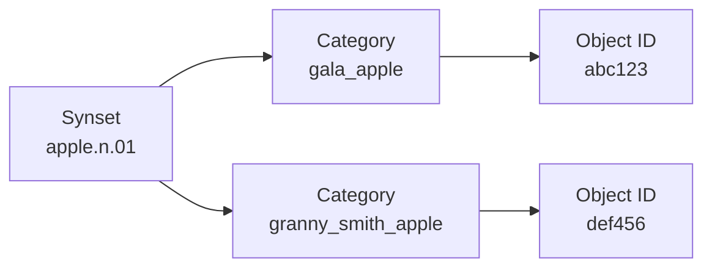

# BDDL 与 BEHAVIOR 任务体系

> 源码根目录：[StanfordVL/BEHAVIOR-1K](https://github.com/StanfordVL/BEHAVIOR-1K) · **本地快照**：[`../code/BEHAVIOR-1K-main/`](../code/BEHAVIOR-1K-main/)  
> 官方文档：[Important Concepts](https://behavior.stanford.edu/getting_started/important_concepts.html) · [Behavior Tasks](https://behavior.stanford.edu/behavior_components/behavior_tasks.html)  
> 同目录：[介绍.md](介绍.md) · [基本使用流程.md](基本使用流程.md) · [OmniGibson技术参考.md](OmniGibson技术参考.md)

---

## 1. BDDL 是什么

**BEHAVIOR Domain Definition Language (BDDL)** 是 BEHAVIOR 生态的 **符号知识库 + 任务语言**（[important_concepts.md L42–51](https://github.com/StanfordVL/BEHAVIOR-1K/blob/main/docs/getting_started/important_concepts.md#L42-L51)）：

- 基于 **一阶逻辑** 描述 **initial conditions** 与 **goal conditions**  
- 与 WordNet 扩展的 **Object Taxonomy（synsets）** 绑定  
- 由 **OmniGibson** 实现 Backend：`BDDLSampler` 采样初始状态、逐步 **check** goal 谓词  

BDDL3 库（`bddl3/bddl/`）主要模块：

| 模块 | 作用 | 本地路径 |
|------|------|----------|
| [`predicates.py`](../code/BEHAVIOR-1K-main/bddl3/bddl/predicates.py) | 谓词 AST 类（`OnTop`、`Inside`、`Cooked`…） | L31+ |
| [`parsing.py`](../code/BEHAVIOR-1K-main/bddl3/bddl/parsing.py) | BDDL 文件解析 | |
| [`knowledge_base/`](../code/BEHAVIOR-1K-main/bddl3/bddl/knowledge_base/) | ORM：synset / category / task 关系 | |
| [`activity_definitions/`](../code/BEHAVIOR-1K-main/bddl3/bddl/activity_definitions/) | **1016** 个活动的 `problem0.bddl` | |
| Transition Rules | 烹饪、洗涤、切片 recipe | BDDL KB + OG `transition_rules.py` |

在线浏览：[Knowledge Base 网站](https://behavior.stanford.edu/knowledgebase)

---

## 2. 谓词类体系（源码）

[`predicates.py`](../code/BEHAVIOR-1K-main/bddl3/bddl/predicates.py) 文档说明谓词是表达式树的 **叶子节点**（L1–24）：

```python
class Predicate(Expression):
    """Base class for all BDDL predicates."""
    arity: int
    STATE_NAME: str  # e.g. "ontop"
    inputs: list[str]  # resolved instance names
```

OmniGibson 在运行时通过 `evaluate_fn` 回调将谓词类映射到 **Object States**（[bddl_utils.py](../code/BEHAVIOR-1K-main/OmniGibson/omnigibson/utils/bddl_utils.py) 中的 backend 实现）。

### 2.1 常用谓词类别

| 类别 | 示例 BDDL token | OmniGibson 侧 |
|------|-----------------|---------------|
| **Spatial** | `ontop`, `inside`, `nextto`, `under` | `OnTop`, `Inside`, `NextTo`… |
| **Articulation** | `open`, `closed`, `toggled_on` | `Open`, `ToggledOn` |
| **Substance** | `filled`, `covered`, `contains` | `Filled`, `Covered`, `Contains` |
| **Semantic** | `cooked`, `sliced`, `soaked` | `Cooked` + Transition Rules |
| **Logical** | `and`, `or`, `not`, `forall`, `forpairs` | 表达式树组合 |

---

## 3. 任务文件结构（真实 BDDL 示例）

本地 [`assembling_gift_baskets/problem0.bddl`](../code/BEHAVIOR-1K-main/bddl3/bddl/activity_definitions/assembling_gift_baskets/problem0.bddl)：

### 3.1 Object Scope

```lisp
(:objects
    wicker_basket.n.01_1 wicker_basket.n.01_2 ... - wicker_basket.n.01
    candle.n.01_1 candle.n.01_2 ... - candle.n.01
    table.n.02_1 - table.n.02
    agent.n.01_1 - agent.n.01
)
```

命名：`{synset}_{index}`，类型为 synset。

### 3.2 Initial Conditions

```lisp
(:init
    (ontop candle.n.01_1 table.n.02_1)
    (inroom table.n.02_1 living_room)
    (ontop agent.n.01_1 floor.n.01_1)
)
```

**Sampling**：`BDDLSampler` 在符合 room type 的场景中放置 scope 物体，使 `:init` 全部满足（[bddl_utils.py L465+](../code/BEHAVIOR-1K-main/OmniGibson/omnigibson/utils/bddl_utils.py#L465)）。

### 3.3 Goal Conditions

```lisp
(:goal
    (and
        (forpairs (?wicker_basket.n.01 - wicker_basket.n.01)
                  (?candle.n.01 - candle.n.01)
                  (inside ?candle.n.01 ?wicker_basket.n.01))
        ...
    )
)
```

**PredicateGoal** 每步调用 `check_goal_fn()`（[predicate_goal.py L32–35](../code/BEHAVIOR-1K-main/OmniGibson/omnigibson/termination_conditions/predicate_goal.py#L32-L35)），返回 `satisfied` / `unsatisfied` 谓词列表。

**部分成功 q_score**：[`TaskMetric`](../code/BEHAVIOR-1K-main/OmniGibson/omnigibson/metrics/task_metric.py) 统计 goal 谓词从初始未满足到 episode 结束时的满足比例（L34–46）。

---

## 4. Synset · Category · Object 三层



官方定义（[important_concepts.md L17–23](https://github.com/StanfordVL/BEHAVIOR-1K/blob/main/docs/getting_started/important_concepts.md#L17-L23)）：

| 层级 | 随机化行为 |
|------|------------|
| **Synset** | BDDL scope；可实例化 descendant synset 物体 |
| **Category** | 同 synset 不同功能外形 **不可互换** randomize |
| **Object** | 6 字符 USD ID；含 articulation + metadata |

Synset **abilities**（openable、fluidSource、heatSource…）驱动 OmniGibson Object States 实例化。

---

## 5. Task Instance 与 Sampling

| 步骤 | 说明 | 源码 |
|------|------|------|
| 1. 选场景 | 匹配 room type | `BDDLSampler` |
| 2. 布局 scope 物体 | 满足 `:init` | `BehaviorTask.reset()` |
| 3. 固定 instance ID | `activity_instance_id` | [behavior_task.py L44–45](../code/BEHAVIOR-1K-main/OmniGibson/omnigibson/tasks/behavior_task.py#L44-L45) |
| 4. 运行 | checker 监控 `:goal` | `PredicateGoal` |

`BehaviorTask` 缓存文件名格式（[L132–147](../code/BEHAVIOR-1K-main/OmniGibson/omnigibson/tasks/behavior_task.py#L132-L147)）：

```
{scene_model}_task_{activity_name}_{definition_id}_{instance_id}_template
```

列出活动：

```python
from omnigibson.utils.bddl_utils import get_behavior_activities, get_knowledge_base

activities = get_behavior_activities()  # bddl_utils.py L276
kb = get_knowledge_base()
```

---

## 6. Substances 与谓词

**Substance synsets** 无独立 object mesh，映射为 **scene-level particle system**（[important_concepts.md L29–31](https://github.com/StanfordVL/BEHAVIOR-1K/blob/main/docs/getting_started/important_concepts.md#L29-L31)）：

- 单例：一场景一个 water system  
- 谓词：`filledWith`、`coveredIn`、`contains`  
- 渲染：流体 isosurface 或粒子 mesh  

OmniGibson 实现：[`systems/micro_particle_system.py`](../code/BEHAVIOR-1K-main/OmniGibson/omnigibson/systems/micro_particle_system.py)、[`macro_particle_system.py`](../code/BEHAVIOR-1K-main/OmniGibson/omnigibson/systems/macro_particle_system.py)。

---

## 7. Transition Rules

当 PhysX/Omniverse **无法原生表达** 某变换时，[`transition_rules.py`](../code/BEHAVIOR-1K-main/OmniGibson/omnigibson/transition_rules.py) 在条件满足时触发（L1–40 导入 `Cooked`、`Filled`、`MixingRecipe` 等）：

| 规则类型 | 示例 |
|----------|------|
| **Washing / Drying** | 污渍移除 |
| **Slicing / Dicing** | 一个 apple → 多个 slice |
| **Melting** | 固体 → 液体（`MELTING_TEMPERATURE`，L52–53） |
| **Recipe** | blender 内 lemon + water → 混合 substance |

BDDL 侧定义 recipe（`CookingRecipe`、`MixingRecipe` 等）；OmniGibson 通过 `translate_bddl_recipe_to_og_recipe` 转换（[bddl_utils.py](../code/BEHAVIOR-1K-main/OmniGibson/omnigibson/utils/bddl_utils.py)）。

评测时需 `gm.ENABLE_TRANSITION_RULES = True`（[eval.py L54](../code/BEHAVIOR-1K-main/OmniGibson/omnigibson/learning/eval.py#L54)）。

---

## 8. BDDL3 与版本

BEHAVIOR-1K **v3.7.x** 使用 **BDDL3**（monorepo `bddl3/`）。本地快照含 **1016** 个 `problem0.bddl`（`activity_definitions/` 目录计数）。

`activity_manifest.txt` 为子集索引；完整活动以 `activity_definitions/` 为准。

---

## 9. 自定义活动

官方 **Activity Creation** 工作流：

1. [Activity Annotation](https://behavior.stanford.edu/activity-annotation) 标注 scope 与条件  
2. 导出 BDDL 至 `activity_definitions/`  
3. `BDDLSampler` 验证可实例化  
4. 仿真中测试 goal 可达性  

---

## 10. 与评测的关系

| 组件 | 角色 | 源码 |
|------|------|------|
| BDDL `:goal` | Primary metric：success / q_score | `TaskMetric` |
| `BehaviorTask` | Termination + reward | `behavior_task.py` |
| `eval.py` | Challenge 统一协议 | Hydra `Evaluator` |
| Standard track | Agent **不能**直接读 BDDL | 仅从传感推理 |
| Privileged track | 可读仿真真值 | 研究用 |

---

## 11. 代码入口索引

| 路径 | 说明 |
|------|------|
| [`bddl3/bddl/predicates.py`](../code/BEHAVIOR-1K-main/bddl3/bddl/predicates.py) | 谓词类定义 |
| [`bddl3/bddl/activity_definitions/`](../code/BEHAVIOR-1K-main/bddl3/bddl/activity_definitions/) | 1016 活动 BDDL |
| [`OmniGibson/omnigibson/tasks/behavior_task.py`](../code/BEHAVIOR-1K-main/OmniGibson/omnigibson/tasks/behavior_task.py) | BehaviorTask |
| [`OmniGibson/omnigibson/utils/bddl_utils.py`](../code/BEHAVIOR-1K-main/OmniGibson/omnigibson/utils/bddl_utils.py) | BDDLSampler、backend |
| [`OmniGibson/omnigibson/transition_rules.py`](../code/BEHAVIOR-1K-main/OmniGibson/omnigibson/transition_rules.py) | 仿真侧 transition |
| [`OmniGibson/omnigibson/termination_conditions/predicate_goal.py`](../code/BEHAVIOR-1K-main/OmniGibson/omnigibson/termination_conditions/predicate_goal.py) | Goal 终止 |
| [`OmniGibson/omnigibson/metrics/task_metric.py`](../code/BEHAVIOR-1K-main/OmniGibson/omnigibson/metrics/task_metric.py) | q_score 计算 |

---

## 12. 延伸阅读

| 资源 | URL |
|------|-----|
| Important Concepts | https://behavior.stanford.edu/getting_started/important_concepts.html |
| Behavior Tasks | https://behavior.stanford.edu/behavior_components/behavior_tasks.html |
| BehaviorTask API | https://behavior.stanford.edu/reference/tasks/behavior_task.html |
| Activity Creation | https://behavior.stanford.edu/activity-creation |
| 安装与加载 | [基本使用流程.md](基本使用流程.md) |

---

*基于本地 BEHAVIOR-1K 快照编写。*
