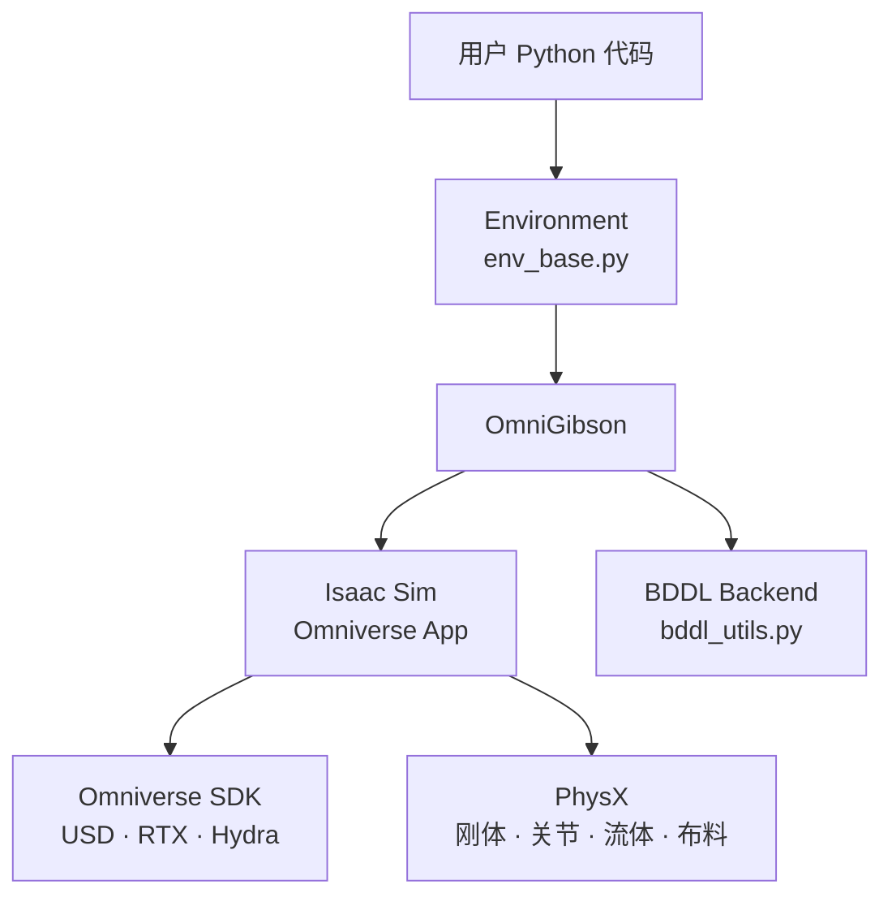

# OmniGibson 技术参考

> 源码根目录：[StanfordVL/BEHAVIOR-1K/OmniGibson](https://github.com/StanfordVL/BEHAVIOR-1K/tree/main/OmniGibson) · **本地快照**：[`../code/BEHAVIOR-1K-main/OmniGibson/`](../code/BEHAVIOR-1K-main/OmniGibson/)  
> 官方文档：[OmniGibson Docs](https://behavior.stanford.edu/omnigibson/) · [Important Concepts](https://github.com/StanfordVL/BEHAVIOR-1K/blob/main/docs/getting_started/important_concepts.md)  
> 同目录：[介绍.md](介绍.md) · [基本使用流程.md](基本使用流程.md) · [BDDL与任务体系.md](BDDL与任务体系.md)

---

## 1. 技术栈关系



| 层 | 职责 | 官方依据 |
|----|------|----------|
| **Omniverse** | USD 场景、RTX 渲染 | [important_concepts.md L76–80](https://github.com/StanfordVL/BEHAVIOR-1K/blob/main/docs/getting_started/important_concepts.md#L76-L80) |
| **PhysX** | 物理步进：articulation、contact、particle fluid | [L84–88](https://github.com/StanfordVL/BEHAVIOR-1K/blob/main/docs/getting_started/important_concepts.md#L84-L88) |
| **Isaac Sim** | 机器人 Omniverse app；library 式 step | [L90–94](https://github.com/StanfordVL/BEHAVIOR-1K/blob/main/docs/getting_started/important_concepts.md#L90-L94) |
| **OmniGibson** | 封装 Isaac；Scene/Object/Robot/Task | [L96–105](https://github.com/StanfordVL/BEHAVIOR-1K/blob/main/docs/getting_started/important_concepts.md#L96-L105) |

用户 **不直接** 调用 NVIDIA API；通过 `import omnigibson as og` 与 config dict/YAML 工作。

---

## 2. 核心类层次

| 概念 | 说明 | 源码 |
|------|------|------|
| **Environment** | Gymnasium 兼容；聚合 scene + robot(s) + task | [env_base.py L38–41](../code/BEHAVIOR-1K-main/OmniGibson/omnigibson/envs/env_base.py#L38-L41) |
| **Scene** | `InteractiveTraversableScene` 等 | [interactive_traversable_scene.py L14](../code/BEHAVIOR-1K-main/OmniGibson/omnigibson/scenes/interactive_traversable_scene.py#L14) |
| **DatasetObject** | BEHAVIOR 加密 USD 物体 | [dataset_object.py](https://github.com/StanfordVL/BEHAVIOR-1K/blob/main/OmniGibson/omnigibson/objects/dataset_object.py) |
| **Robot** | StatefulObject + controllers + sensors | [robot.py](https://github.com/StanfordVL/BEHAVIOR-1K/blob/main/OmniGibson/omnigibson/robots/robot.py) |
| **Task** | `BehaviorTask` 等 | [behavior_task.py L35](../code/BEHAVIOR-1K-main/OmniGibson/omnigibson/tasks/behavior_task.py#L35) |
| **Prim** | 封装 `UsdPrim`（Rigid / Cloth / Joint） | [prims/](https://github.com/StanfordVL/BEHAVIOR-1K/tree/main/OmniGibson/omnigibson/prims) |

`Environment.__init__` 解析 config → `og.launch()` → `load()` → `og.sim.play()`（[env_base.py L98–129](../code/BEHAVIOR-1K-main/OmniGibson/omnigibson/envs/env_base.py#L98-L129)）。

---

## 3. Environment 与注册表模式

OmniGibson 通过 config `"type"` 字符串动态实例化类（Quickstart 说明：[quickstart.md L29](https://github.com/StanfordVL/BEHAVIOR-1K/blob/main/docs/getting_started/quickstart.md)）：

```python
cfg["scene"] = {"type": "InteractiveTraversableScene", "scene_model": "Rs_int"}
cfg["robots"] = [{"type": "Fetch", ...}]
cfg["task"] = {"type": "BehaviorTask", "activity_name": "turning_on_radio", ...}
```

注册表：

| Registry | 路径 |
|----------|------|
| `REGISTERED_SCENES` | [scenes/__init__.py](https://github.com/StanfordVL/BEHAVIOR-1K/blob/main/OmniGibson/omnigibson/scenes/__init__.py) |
| `REGISTERED_ROBOTS` | 扫描 `data/*/models/*/*.yaml`（[robots/__init__.py L7–9](../code/BEHAVIOR-1K-main/OmniGibson/omnigibson/robots/__init__.py#L7-L9)） |
| `REGISTERED_TASKS` | [tasks/__init__.py](https://github.com/StanfordVL/BEHAVIOR-1K/blob/main/OmniGibson/omnigibson/tasks/__init__.py) |
| `REGISTERED_OBJECTS` | [objects/__init__.py](https://github.com/StanfordVL/BEHAVIOR-1K/blob/main/OmniGibson/omnigibson/objects/__init__.py) |

---

## 4. 机器人

### 4.1 类型与 Challenge 机器人

| 类型 | 能力 | 典型型号 |
|------|------|----------|
| **LocomotionRobot** | 仅导航 | Turtlebot |
| **ManipulationRobot** | 固定基座臂 | — |
| **MobileManipulationRobot** | 基座 + 臂 + 夹爪 | **Fetch**（经典 demo） |
| **Challenge** | 双臂 + 移动基座 | **R1Pro**（2025 Challenge） |

Fetch 配置见 [`configs/robots/fetch.yaml`](../code/BEHAVIOR-1K-main/OmniGibson/omnigibson/configs/robots/fetch.yaml)。

Challenge **R1Pro** action 空间（[eval_utils.py L49–58](../code/BEHAVIOR-1K-main/OmniGibson/omnigibson/learning/utils/eval_utils.py#L49-L58)）：

| 子系统 | action 索引 |
|--------|-------------|
| base | 0:3 |
| torso | 3:7 |
| left_arm / gripper | 7:15 |
| right_arm / gripper | 15:23 |

### 4.2 Fetch YAML 片段

[`configs/turtlebot_nav.yaml`](../code/BEHAVIOR-1K-main/OmniGibson/omnigibson/configs/turtlebot_nav.yaml) / fetch 类似结构：

```yaml
robots:
  - type: Fetch
    obs_modalities: [scan, rgb, depth]
    action_normalize: true
    controller_config:
      base:
        name: DifferentialDriveController
      arm_0:
        name: InverseKinematicsController
        kv: 2.0
      gripper_0:
        name: MultiFingerGripperController
        mode: binary
```

机器人是 **StatefulObject**：与场景物体共享 Object States API。

---

## 5. 控制器（Controllers）

模块化多控制器；action space 为各子空间拼接。源码：[`controllers/`](https://github.com/StanfordVL/BEHAVIOR-1K/tree/main/OmniGibson/omnigibson/controllers)

| 控制器 | 用途 | 源码 |
|--------|------|------|
| **JointController** | 关节 pos/vel/torque | [joint_controller.py](https://github.com/StanfordVL/BEHAVIOR-1K/blob/main/OmniGibson/omnigibson/controllers/joint_controller.py) |
| **InverseKinematicsController** | 末端位姿 → 关节 | [ik_controller.py](https://github.com/StanfordVL/BEHAVIOR-1K/blob/main/OmniGibson/omnigibson/controllers/ik_controller.py) |
| **OperationalSpaceController** | OSC | [osc_controller.py](https://github.com/StanfordVL/BEHAVIOR-1K/blob/main/OmniGibson/omnigibson/controllers/osc_controller.py) |
| **DifferentialDriveController** | 差速底盘 | [dd_controller.py L5–12](../code/BEHAVIOR-1K-main/OmniGibson/omnigibson/controllers/dd_controller.py#L5-L12) |
| **MultiFingerGripperController** | 夹爪 | [multi_finger_gripper_controller.py](https://github.com/StanfordVL/BEHAVIOR-1K/blob/main/OmniGibson/omnigibson/controllers/multi_finger_gripper_controller.py) |

`DifferentialDriveController` 将 `(lin_vel, ang_vel)` 转为左右轮速（[dd_controller.py L64–68](../code/BEHAVIOR-1K-main/OmniGibson/omnigibson/controllers/dd_controller.py#L64-L68)）。

YAML 模板：[`configs/controllers/`](https://github.com/StanfordVL/BEHAVIOR-1K/tree/main/OmniGibson/omnigibson/configs/controllers)

`action_normalize: true` 将 action 映射到 `[-1, 1]`。

---

## 6. 传感器

通过 `obs_modalities` 与 `sensor_config` 启用。实现：[`sensors/`](https://github.com/StanfordVL/BEHAVIOR-1K/tree/main/OmniGibson/omnigibson/sensors)

| Modality | 类 | 说明 |
|----------|-----|------|
| `rgb` | VisionSensor | RTX 渲染 |
| `depth` | VisionSensor | 深度 |
| `scan` | ScanSensor | 2D LiDAR |
| `seg` | VisionSensor | 实例/语义分割（Challenge Standard） |

Challenge 相机命名（[eval_utils.py L6–16](../code/BEHAVIOR-1K-main/OmniGibson/omnigibson/learning/utils/eval_utils.py#L6-L16)）：

```python
ROBOT_CAMERA_NAMES = {
    "R1Pro": {
        "left_wrist": "robot_r1::robot_r1:left_realsense_link:Camera:0",
        "right_wrist": "robot_r1::robot_r1:right_realsense_link:Camera:0",
        "head": "robot_r1::robot_r1:zed_link:Camera:0",
    },
}
```

---

## 7. Object States 与 Abilities

物体通过 **`abilities` dict** 声明状态机。工厂：[`object_states/factory.py`](../code/BEHAVIOR-1K-main/OmniGibson/omnigibson/object_states/factory.py)

基类层次（[object_state_base.py](../code/BEHAVIOR-1K-main/OmniGibson/omnigibson/object_states/object_state_base.py)）：

- `AbsoluteObjectState` / `RelativeObjectState` / `IntrinsicObjectState`  
- `BooleanStateMixin` — 布尔谓词  

### 7.1 常见状态（源码文件）

| State | 文件 | BDDL 相关 |
|-------|------|-----------|
| **OnTop / Inside / NextTo** | `on_top.py`, `inside.py`, `next_to.py` | 空间谓词 |
| **Open** | `open.py` | `open` / `closed` |
| **ToggledOn** | `toggled_on.py` | `toggled_on` |
| **Temperature** | [temperature.py L19](../code/BEHAVIOR-1K-main/OmniGibson/omnigibson/object_states/temperature.py#L19) | 热效应 |
| **Filled / Covered / Contains** | `filled.py`, `covered.py`, `contains.py` | 流体/粒子 |
| **Cooked / Heated / Burnt** | `cooked.py`, `heated.py`, `burnt.py` | Transition Rules |
| **Folded / Draped / Overlaid** | cloth 相关 | 布料任务 |

`BehaviorTask` 要求 `gm.ENABLE_OBJECT_STATES=True`（[behavior_task.py L85–86](../code/BEHAVIOR-1K-main/OmniGibson/omnigibson/tasks/behavior_task.py#L85-L86)）。

### 7.2 布料（ClothPrim）

- Mesh → **particle-based cloth**  
- `ClothMixin` 状态：`Folded`、`Draped` 等  
- 源码：[`object_states/cloth_mixin.py`](../code/BEHAVIOR-1K-main/OmniGibson/omnigibson/object_states/cloth_mixin.py)

---

## 8. 场景加载（InteractiveTraversableScene）

[`interactive_traversable_scene.py`](../code/BEHAVIOR-1K-main/OmniGibson/omnigibson/scenes/interactive_traversable_scene.py) 构造函数（L21–38）：

| 参数 | 说明 |
|------|------|
| `scene_model` | 场景名（BEHAVIOR 50 场景或 `Rs_int`） |
| `scene_instance` | 预采样 JSON 实例 |
| `load_object_categories` | 按 category 过滤，降低内存 |
| `load_room_types` / `load_room_instances` | 按房间过滤 |
| `load_task_relevant_only` | 仅加载任务相关物体 + 建筑结构 |
| `trav_map_resolution` | traversability 地图分辨率（默认 0.1 m） |

内部使用 [`SegmentationMap`](../code/BEHAVIOR-1K-main/OmniGibson/omnigibson/maps/segmentation_map.py) 提供房间语义分割（L79–80）。

### 8.1 性能优化

- **Partial scene load**：Challenge 默认  
- 省略 clutter 物体（官方 dataset 说明）  
- Headless + `OMNIGIBSON_GPU_ID`  
- 评测时 `gm.USE_GPU_DYNAMICS = False`（[eval.py L53](../code/BEHAVIOR-1K-main/OmniGibson/omnigibson/learning/eval.py#L53)）

---

## 9. BehaviorTask 集成

### 9.1 生命周期

| 阶段 | 行为 | 源码 |
|------|------|------|
| `__init__` | 校验 activity_name；初始化 sampler 占位 | L70–129 |
| `reset()` | 加载/采样 instance；满足 BDDL `:init` | |
| `step()` | 物理步进；更新 states & transition rules | |
| **Termination** | `Timeout` 或 `PredicateGoal` 全满足 | [predicate_goal.py](../code/BEHAVIOR-1K-main/OmniGibson/omnigibson/termination_conditions/predicate_goal.py) |
| **Reward** | 常为 sparse；可用 `PotentialReward` | [reward_functions/](../code/BEHAVIOR-1K-main/OmniGibson/omnigibson/reward_functions/) |

### 9.2 配置示例

```python
"task": {
    "type": "BehaviorTask",
    "activity_name": "turning_on_radio",
    "activity_definition_id": 0,
    "activity_instance_id": 0,
    "online_object_sampling": False,
    "use_presampled_robot_pose": True,
}
```

Goal 检查与 Challenge **primary metric** 一致（通过 `TaskMetric`）。

---

## 10. Transition Rules

[`transition_rules.py`](../code/BEHAVIOR-1K-main/OmniGibson/omnigibson/transition_rules.py)（2600+ 行）实现 BDDL 定义的复杂变换：

- 导入 `CookingRecipe`、`MixingRecipe` 等（L33）  
- 与 Object States（`Cooked`、`Saturated`、`SlicerActive`…）联动  
- 默认 `MELTING_TEMPERATURE = 100.0`（L52–53）  

启用：`gm.ENABLE_TRANSITION_RULES = True`

JoyLo / eval 可禁用部分规则：`DISABLED_TRANSITION_RULES`（[og_teleop_cfg.py](../code/BEHAVIOR-1K-main/joylo/gello/utils/og_teleop_cfg.py)）。

---

## 11. 向量环境与 RL

| 组件 | 说明 | 源码 |
|------|------|------|
| `VectorEnvironment` | 多副本同场景 | [vec_env_base.py](../code/BEHAVIOR-1K-main/OmniGibson/omnigibson/envs/vec_env_base.py) |
| `Sb3VecEnvWrapper` | Stable-Baselines3 | [sb3_vec_env.py](../code/BEHAVIOR-1K-main/OmniGibson/omnigibson/envs/sb3_vec_env.py) |
| Data collection | HDF5 / LeRobot | [hdf5_data_wrapper.py](../code/BEHAVIOR-1K-main/OmniGibson/omnigibson/envs/hdf5_data_wrapper.py), [lerobot_data_wrapper.py](../code/BEHAVIOR-1K-main/OmniGibson/omnigibson/envs/lerobot_data_wrapper.py) |

单 env 显存占用已高，向量数需按 GPU 调整。

---

## 12. Challenge 评测栈

| 文件 | 作用 |
|------|------|
| [`learning/eval.py`](../code/BEHAVIOR-1K-main/OmniGibson/omnigibson/learning/eval.py) | Hydra 入口；`Evaluator` 类 |
| [`learning/utils/eval_utils.py`](../code/BEHAVIOR-1K-main/OmniGibson/omnigibson/learning/utils/eval_utils.py) | 环境 config 生成、相机/proprio 索引 |
| [`metrics/task_metric.py`](../code/BEHAVIOR-1K-main/OmniGibson/omnigibson/metrics/task_metric.py) | q_score、仿真时间 |
| [`metrics/agent_metric.py`](../code/BEHAVIOR-1K-main/OmniGibson/omnigibson/metrics/agent_metric.py) | 导航距离、手部位移 |

```bash
python OmniGibson/omnigibson/learning/eval.py \
  policy=websocket task.name=turning_on_radio log_path=$LOG_PATH
```

---

## 13. 示例脚本索引

| 命令 | 源码 |
|------|------|
| `python -m omnigibson.examples.robots.robot_control_example --quickstart` | [robot_control_example.py](https://github.com/StanfordVL/BEHAVIOR-1K/blob/main/OmniGibson/omnigibson/examples/robots/robot_control_example.py) |
| `python -m omnigibson.examples.scenes.scene_selector` | [scene_selector.py](https://github.com/StanfordVL/BEHAVIOR-1K/blob/main/OmniGibson/omnigibson/examples/scenes/scene_selector.py) |
| Behavior 任务 demo | [examples/tasks/](https://github.com/StanfordVL/BEHAVIOR-1K/tree/main/OmniGibson/omnigibson/examples/tasks) |
| Motion primitives | [action_primitives/](https://github.com/StanfordVL/BEHAVIOR-1K/tree/main/OmniGibson/omnigibson/action_primitives) |

---

## 14. 宏与调试

```python
from omnigibson.macros import gm

gm.HEADLESS = True
gm.ENABLE_OBJECT_STATES = True
gm.ENABLE_TRANSITION_RULES = True
gm.USE_GPU_DYNAMICS = False   # eval 默认
```

```bash
export OMNIGIBSON_GPU_ID=0
```

宏定义：[macros.py](https://github.com/StanfordVL/BEHAVIOR-1K/blob/main/OmniGibson/omnigibson/macros.py)

---

## 15. 与 iGibson 的 API 对照

| iGibson | OmniGibson（本地） |
|---------|-------------------|
| PyBullet | Isaac Sim / PhysX |
| `iGibsonEnv` + YAML | [`Environment(cfg)`](../code/BEHAVIOR-1K-main/OmniGibson/omnigibson/envs/env_base.py) |
| `InteractiveIndoorScene` | [`InteractiveTraversableScene`](../code/BEHAVIOR-1K-main/OmniGibson/omnigibson/scenes/interactive_traversable_scene.py) |
| 有限 object states | 完整 BDDL + 流体/布料 + transition rules |
| 无原生 BDDL | **BehaviorTask** 一等公民 |

详见 [../igibson/介绍.md §11](../igibson/介绍.md)。

---

## 16. 官方仓库索引

| 用途 | 路径 |
|------|------|
| Environment | [env_base.py](https://github.com/StanfordVL/BEHAVIOR-1K/blob/main/OmniGibson/omnigibson/envs/env_base.py) |
| BehaviorTask | [behavior_task.py](https://github.com/StanfordVL/BEHAVIOR-1K/blob/main/OmniGibson/omnigibson/tasks/behavior_task.py) |
| BDDL backend | [bddl_utils.py](https://github.com/StanfordVL/BEHAVIOR-1K/blob/main/OmniGibson/omnigibson/utils/bddl_utils.py) |
| Controllers | [controllers/](https://github.com/StanfordVL/BEHAVIOR-1K/tree/main/OmniGibson/omnigibson/controllers) |
| Object States | [object_states/](https://github.com/StanfordVL/BEHAVIOR-1K/tree/main/OmniGibson/omnigibson/object_states) |
| Transition Rules | [transition_rules.py](https://github.com/StanfordVL/BEHAVIOR-1K/blob/main/OmniGibson/omnigibson/transition_rules.py) |
| Challenge eval | [learning/eval.py](https://github.com/StanfordVL/BEHAVIOR-1K/blob/main/OmniGibson/omnigibson/learning/eval.py) |
| 本地快照 | [`../code/BEHAVIOR-1K-main/OmniGibson/`](../code/BEHAVIOR-1K-main/OmniGibson/) |

---

*基于本地 BEHAVIOR-1K / OmniGibson 快照编写。*
