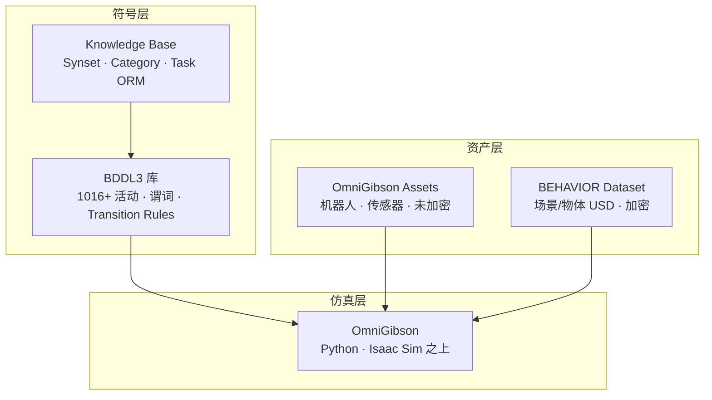
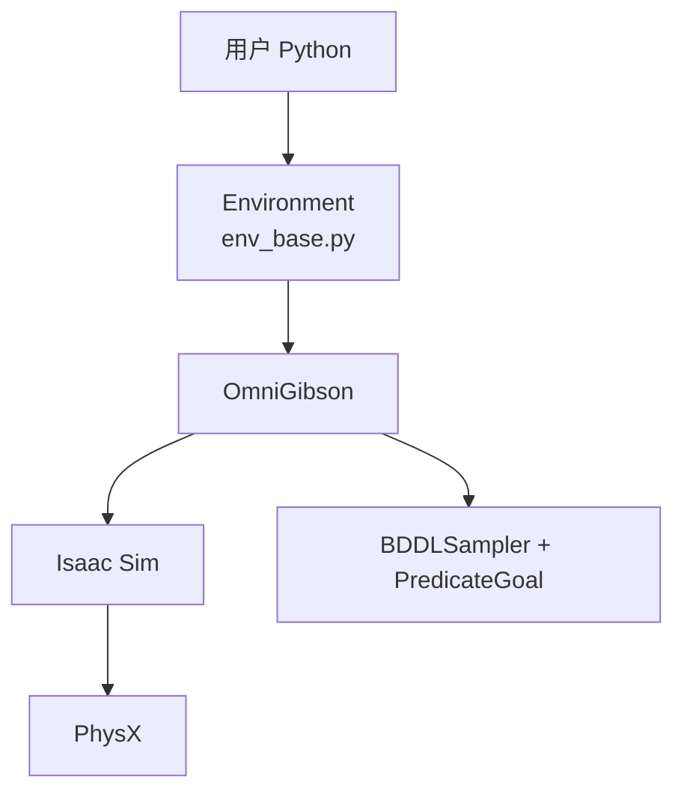

# BEHAVIOR-1K 技术介绍

> **Stanford Vision and Learning Lab** 等 · **OmniGibson**（NVIDIA Isaac Sim）· 1000 项人类中心家务 benchmark  
> 官网：[behavior.stanford.edu](https://behavior.stanford.edu/) · 仓库：[StanfordVL/BEHAVIOR-1K](https://github.com/StanfordVL/BEHAVIOR-1K) · 最新稳定版：**v3.7.2**（2025-12）  
> **本地源码**：`embodied-platforms/code/BEHAVIOR-1K-main/`（与官方 monorepo 同步；下文链接默认指向 GitHub，本地路径可对照引用）

## 1. 概述

**BEHAVIOR-1K**（Benchmark for Everyday Household Activities in Virtual, Interactive, and Realistic Environments）是首个 **以真实人类需求为 grounding** 的大规模 embodied AI benchmark。团队通过调查「**你希望机器人帮你做什么？**」，从人类时间使用与偏好研究中筛选出 **1000 种** 日常家务活动，并在 **50 个 fully interactive 场景**、**9000+ 物体** 中实例化。

OmniGibson [README](https://github.com/StanfordVL/BEHAVIOR-1K/blob/main/OmniGibson/README.md) 概括仿真平台能力：

- 照片级渲染与物理 realism  
- **流体与软体**（cloth、particle fluid）  
- 大规模场景/物体 + **动态语义 Object States**  
- 移动操作机器人 + 模块化控制器  
- **Gymnasium** 接口  

与 Habitat（极速导航）、AI2-THOR（Unity 离散状态）不同，BEHAVIOR-1K 强调：

- **长 horizon**：单任务常需 **数分钟** 仿真时间、**多房间** 探索、**序列化** 多物体操作  
- **物理 realism**：**流体、布料、可变形体、透明度、热效应**（OmniGibson + PhysX）  
- **符号—物理统一**：任务用 **BDDL**（一阶逻辑）定义初始/目标条件，仿真器自动 **采样实例** 与 **谓词评测**  
- **人类中心**：活动类别覆盖 rearrangement、cooking、cleaning、installation、laundry 等  

论文：[BEHAVIOR-1K (arXiv:2403.09227)](https://arxiv.org/abs/2403.09227)

---

## 2. Monorepo 结构

本地快照 `code/BEHAVIOR-1K-main/` 核心目录：

| 路径 | 作用 | GitHub |
|------|------|--------|
| [`OmniGibson/omnigibson/`](https://github.com/StanfordVL/BEHAVIOR-1K/tree/main/OmniGibson/omnigibson) | 仿真器：Environment、Scene、Robot、Task | 核心 Python 包 |
| [`OmniGibson/omnigibson/envs/env_base.py`](../code/BEHAVIOR-1K-main/OmniGibson/omnigibson/envs/env_base.py) | **`Environment`**：Gymnasium 接口 | L38 |
| [`OmniGibson/omnigibson/tasks/behavior_task.py`](../code/BEHAVIOR-1K-main/OmniGibson/omnigibson/tasks/behavior_task.py) | **`BehaviorTask`**：BDDL 采样与 goal 检查 | L35 |
| [`OmniGibson/omnigibson/utils/bddl_utils.py`](../code/BEHAVIOR-1K-main/OmniGibson/omnigibson/utils/bddl_utils.py) | **`BDDLSampler`**、活动列表、谓词 backend | L465 |
| [`OmniGibson/omnigibson/transition_rules.py`](../code/BEHAVIOR-1K-main/OmniGibson/omnigibson/transition_rules.py) | 切片、烹饪、洗涤等 **Transition Rules** | L1+ |
| [`OmniGibson/omnigibson/learning/eval.py`](../code/BEHAVIOR-1K-main/OmniGibson/omnigibson/learning/eval.py) | **Challenge 评测**（Hydra + policy） | L66 |
| [`bddl3/bddl/`](https://github.com/StanfordVL/BEHAVIOR-1K/tree/main/bddl3/bddl) | BDDL3 解析器、谓词类、知识库 | |
| [`bddl3/bddl/predicates.py`](../code/BEHAVIOR-1K-main/bddl3/bddl/predicates.py) | 谓词 AST 叶子节点（`OnTop`、`Cooked` 等） | L31 |
| [`bddl3/bddl/activity_definitions/`](https://github.com/StanfordVL/BEHAVIOR-1K/tree/main/bddl3/bddl/activity_definitions) | **1016** 个 `problem0.bddl` 活动定义 | |
| [`joylo/`](https://github.com/StanfordVL/BEHAVIOR-1K/tree/main/joylo) | **JoyLo** 遥操作 + 演示采集 | |
| [`setup.sh`](../code/BEHAVIOR-1K-main/setup.sh) | 模块化安装脚本 | L61–86 |
| [`docs/getting_started/`](https://github.com/StanfordVL/BEHAVIOR-1K/tree/main/docs/getting_started) | 安装、Quickstart、Important Concepts | |
| [`asset_pipeline/`](https://github.com/StanfordVL/BEHAVIOR-1K/tree/main/asset_pipeline) | 3D 资产管线（DVC、metadata） | |
| [`knowledgebase/`](https://github.com/StanfordVL/BEHAVIOR-1K/tree/main/knowledgebase) | Knowledge Base Web ORM | |

统一安装：`./setup.sh --new-env --omnigibson --bddl --dataset`（[setup.sh L83](https://github.com/StanfordVL/BEHAVIOR-1K/blob/main/setup.sh#L83)）。

---

## 3. 生态系统四大组件

官方 [Important Concepts](https://github.com/StanfordVL/BEHAVIOR-1K/blob/main/docs/getting_started/important_concepts.md) 将 BEHAVIOR 生态拆为：



| 组件 | 路径 | 作用 | 官方依据 |
|------|------|------|----------|
| **BDDL3** | `bddl3/` | 任务定义、谓词、采样器、知识库 | [important_concepts.md L42–51](https://github.com/StanfordVL/BEHAVIOR-1K/blob/main/docs/getting_started/important_concepts.md#L42-L51) |
| **OmniGibson** | `OmniGibson/` | 仿真器；**iGibson 继任者** | [L55–57](https://github.com/StanfordVL/BEHAVIOR-1K/blob/main/docs/getting_started/important_concepts.md#L55-L57) |
| **JoyLo** | `joylo/` | Challenge 遥操作数据采集 | [joylo/README.md](https://github.com/StanfordVL/BEHAVIOR-1K/blob/main/joylo/README.md) |
| **Eval / Learning** | `omnigibson/learning/` | Challenge 评测、baseline 对接 | [eval.py](https://github.com/StanfordVL/BEHAVIOR-1K/blob/main/OmniGibson/omnigibson/learning/eval.py) |
| **BEHAVIOR 数据集** | 下载 bundle | 50 场景 + 9000+ 物体 USD（**加密**） | [L63–69](https://github.com/StanfordVL/BEHAVIOR-1K/blob/main/docs/getting_started/important_concepts.md#L63-L69) |

OmniGibson **完全封装** Isaac Sim，提供 familiar scene/object/robot/task 接口（[important_concepts.md L100](https://github.com/StanfordVL/BEHAVIOR-1K/blob/main/docs/getting_started/important_concepts.md#L100)），并实现 BDDL 采样器与谓词 checker。

---

## 4. 核心概念（BEHAVIOR 数据模型）

### 4.1 Tasks 与 Task Instances

| 概念 | 说明 | 源码 |
|------|------|------|
| **Task** | BDDL 文件：object scope + `:init` + `:goal` | [`activity_definitions/*/problem0.bddl`](../code/BEHAVIOR-1K-main/bddl3/bddl/activity_definitions/assembling_gift_baskets/problem0.bddl) |
| **Task instance** | 符号任务 ground 到具体场景/物体布局 | `BehaviorTask.activity_instance_id` |
| **Activity** | 人类可读活动名（snake_case） | `get_behavior_activities()` |

`get_behavior_activities()` 从 Knowledge Base 读取全部活动名（[bddl_utils.py L276–277](../code/BEHAVIOR-1K-main/OmniGibson/omnigibson/utils/bddl_utils.py#L276-L277)）。

### 4.2 Synsets · Categories · Objects

| 层级 | 说明 | 示例 |
|------|------|------|
| **Synset** | WordNet 扩展 DAG；BDDL object scope | `apple.n.01`, `faucet.n.01` |
| **Category** | 连接 synset 与 3D 模型；功能/外形不同不可互换 randomize | `wall_mounted_sink` vs `standing_sink` |
| **Object** | 唯一 **6 字符 ID** USD 模型 | 水龙头标注出水口 |

官方说明（[important_concepts.md L17–23](https://github.com/StanfordVL/BEHAVIOR-1K/blob/main/docs/getting_started/important_concepts.md#L17-L23)）：Category 是 synset 与 OmniGibson 物体之间的桥梁；Object 含 articulation 与 metadata（如 fluid source 位置）。

### 4.3 Scenes · Substances · Transition Rules

- **50 base scenes**：JSON state dump + traversability map（[L25–27](https://github.com/StanfordVL/BEHAVIOR-1K/blob/main/docs/getting_started/important_concepts.md#L25-L27)）  
- **Substance synsets**：映射为 scene-level **particle system**（水、污渍等）  
- **Transition Rules**：Omniverse 原生不支持的变换（切片、烹饪、recipe）由 [`transition_rules.py`](../code/BEHAVIOR-1K-main/OmniGibson/omnigibson/transition_rules.py) 实现  

详见 [BDDL与任务体系.md](BDDL与任务体系.md)。

---

## 5. OmniGibson 仿真器

### 5.1 技术栈



| 层 | 职责 |
|----|------|
| **Isaac Sim** | Omniverse app；MDP 式逐步 step |
| **PhysX** | 刚体、关节、particle fluid、cloth |
| **OmniGibson** | 封装 Isaac；BDDL backend；BEHAVIOR 数据集工具 |

### 5.2 Environment API

`Environment` 继承 `gym.Env`，构造时调用 `og.launch()` 启动 Isaac Sim（[env_base.py L98–107](../code/BEHAVIOR-1K-main/OmniGibson/omnigibson/envs/env_base.py#L98-L107)），按 config dict 注册 Scene / Robot / Task。

```python
import omnigibson as og

cfg = {
    "scene": {
        "type": "InteractiveTraversableScene",
        "scene_model": "Rs_int",
    },
    "robots": [{
        "type": "Fetch",
        "obs_modalities": ["rgb", "depth", "scan"],
        "action_normalize": True,
    }],
    "task": {
        "type": "BehaviorTask",
        "activity_name": "assembling_gift_baskets",
        "activity_definition_id": 0,
        "activity_instance_id": 0,
    },
}

env = og.Environment(cfg)
obs, info = env.reset()
obs, reward, terminated, truncated, info = env.step(env.action_space.sample())
env.close()
og.shutdown()
```

官方 Quickstart 逐步构建 scene / objects / robots / task，见 [docs/getting_started/quickstart.md](https://github.com/StanfordVL/BEHAVIOR-1K/blob/main/docs/getting_started/quickstart.md)。

### 5.3 BehaviorTask 要点

`BehaviorTask` 构造时 **必须** `gm.ENABLE_OBJECT_STATES=True`（[behavior_task.py L85–86](../code/BEHAVIOR-1K-main/OmniGibson/omnigibson/tasks/behavior_task.py#L85-L86)），终止条件为 **`Timeout` + `PredicateGoal`**（[predicate_goal.py L4–15](../code/BEHAVIOR-1K-main/OmniGibson/omnigibson/termination_conditions/predicate_goal.py#L4-L15)）。

| 字段 | 说明 |
|------|------|
| `activity_name` | BDDL 活动名（须在 `get_behavior_activities()` 中） |
| `activity_definition_id` | 同一活动的不同 BDDL 变体 |
| `activity_instance_id` | 预采样场景/物体布局 ID |
| `online_object_sampling` | 运行时在线采样（与 presampled robot pose 互斥） |

深度 API 见 [OmniGibson技术参考.md](OmniGibson技术参考.md)。

---

## 6. BDDL 任务示例（源码）

本地 [`assembling_gift_baskets/problem0.bddl`](../code/BEHAVIOR-1K-main/bddl3/bddl/activity_definitions/assembling_gift_baskets/problem0.bddl) 片段：

```lisp
(:init
    (ontop candle.n.01_1 table.n.02_1)
    (inroom table.n.02_1 living_room)
    (ontop agent.n.01_1 floor.n.01_1)
)
(:goal
    (and
        (forpairs (?wicker_basket.n.01 - wicker_basket.n.01)
                  (?candle.n.01 - candle.n.01)
                  (inside ?candle.n.01 ?wicker_basket.n.01))
        ...
    )
)
```

Challenge **部分成功**（q_score）由 `TaskMetric` 计算：统计 goal 谓词从未满足到满足的比例（[task_metric.py L34–46](../code/BEHAVIOR-1K-main/OmniGibson/omnigibson/metrics/task_metric.py#L34-L46)）。

---

## 7. 2025 BEHAVIOR Challenge

| 项目 | 内容 |
|------|------|
| **赛事** | NeurIPS 2025 · Foundation Models Meet Embodied Agents |
| **任务** | 50 个 full-length 家务任务 |
| **训练数据** | **10,000** teleop 演示（**1200+ 小时**，JoyLo 采集） |
| **提交** | 2025-11-16 AoE 截止 |

### 7.1 评测轨道

| Track | 观测 |
|-------|------|
| **Standard** | onboard RGB + depth + **instance segmentation** + proprioception |
| **Privileged** | 可查询仿真器任意信息 |

Challenge 机器人主要为 **R1Pro**（7-DoF 双臂 + 基座）；相机与 proprio 索引见 [eval_utils.py L6–59](../code/BEHAVIOR-1K-main/OmniGibson/omnigibson/learning/utils/eval_utils.py#L6-L59)。

### 7.2 评测入口

[`eval.py`](https://github.com/StanfordVL/BEHAVIOR-1K/blob/main/OmniGibson/omnigibson/learning/eval.py) 中 `Evaluator` 类管理 policy rollout 与指标（L66–73）：

```bash
conda activate behavior
python OmniGibson/omnigibson/learning/eval.py \
  policy=websocket task.name=turning_on_radio log_path=$LOG_PATH
```

Baseline：[StanfordVL/b1k-baselines](https://github.com/StanfordVL/b1k-baselines)

---

## 8. 系统要求

| 项目 | 要求 | 官方依据 |
|------|------|----------|
| **OS** | Ubuntu 20.04+ / Windows 10+ | [installation.md](https://github.com/StanfordVL/BEHAVIOR-1K/blob/main/docs/getting_started/installation.md) |
| **RAM** | **32GB+** | 同上 |
| **GPU** | NVIDIA **RTX 2070+** | 同上 |
| **VRAM** | **8GB+** | 同上 |
| **CUDA** | 默认 **12.8**（可 `--cuda-version`） | [setup.sh L16](https://github.com/StanfordVL/BEHAVIOR-1K/blob/main/setup.sh#L16) |

Headless：`OMNIGIBSON_GPU_ID` 指定 GPU。

---

## 9. 与相关项目对比

| 维度 | BEHAVIOR-1K | Habitat 2/3 | AI2-THOR | iGibson |
|------|-------------|-------------|----------|---------|
| 任务规模 | **1000** BDDL | ReplicaCAD 技能 | 200+ actions | 15 interactive |
| 流体/布料 | ✅ OmniGibson | 有限 | 有限 | 有限 |
| 引擎 | Isaac Sim | Habitat-Sim | Unity | Bullet |
| 任务定义 | **BDDL 逻辑** | YAML/代码 | 脚本/API | 代码 |
| 数据许可 | 加密 bundle | 多数据集 | 开放 build | 填表下载 |

BEHAVIOR-1K 是 **NVIDIA Isaac 生态上的顶级家务 benchmark**；OmniGibson 即 Isaac Sim 之上的高层封装（见 [../igibson/介绍.md §11](../igibson/介绍.md) 对照 iGibson）。

---

## 10. 演进时间线

| 阶段 | 内容 |
|------|------|
| **BEHAVIOR-100** | 100 活动 predecessor |
| **iGibson 2** | Stanford 交互室内仿真 |
| **BEHAVIOR-1K 论文** | 2024 arXiv — 1000 活动 + OmniGibson |
| **BDDL3** | v3.7.x monorepo 迁移 |
| **2025 Challenge** | NeurIPS；v3.7.2 |
| **PyPI** | `omnigibson`、`bddl`、`joylo` 即将发布 |

---

## 11. 本地文档索引

| 文档 | 内容 |
|------|------|
| [基本使用流程.md](基本使用流程.md) | setup.sh、conda、demo、评测、Challenge |
| [BDDL与任务体系.md](BDDL与任务体系.md) | 谓词、采样、Transition Rules、自定义活动 |
| [OmniGibson技术参考.md](OmniGibson技术参考.md) | 机器人、控制器、Object States、场景 |

---

## 12. 官方仓库索引

| 用途 | 路径 |
|------|------|
| 项目说明 | [OmniGibson/README.md](https://github.com/StanfordVL/BEHAVIOR-1K/blob/main/OmniGibson/README.md) |
| 安装脚本 | [setup.sh](https://github.com/StanfordVL/BEHAVIOR-1K/blob/main/setup.sh) |
| Environment | [env_base.py](https://github.com/StanfordVL/BEHAVIOR-1K/blob/main/OmniGibson/omnigibson/envs/env_base.py) |
| BehaviorTask | [behavior_task.py](https://github.com/StanfordVL/BEHAVIOR-1K/blob/main/OmniGibson/omnigibson/tasks/behavior_task.py) |
| BDDL 活动 | [bddl3/bddl/activity_definitions/](https://github.com/StanfordVL/BEHAVIOR-1K/tree/main/bddl3/bddl/activity_definitions) |
| Challenge eval | [learning/eval.py](https://github.com/StanfordVL/BEHAVIOR-1K/blob/main/OmniGibson/omnigibson/learning/eval.py) |
| JoyLo 遥操作 | [joylo/README.md](https://github.com/StanfordVL/BEHAVIOR-1K/blob/main/joylo/README.md) |
| Quickstart | [docs/getting_started/quickstart.md](https://github.com/StanfordVL/BEHAVIOR-1K/blob/main/docs/getting_started/quickstart.md) |
| 本地快照 | [`../code/BEHAVIOR-1K-main/`](../code/BEHAVIOR-1K-main/) |

---

## 13. 资源与引用

| 资源 | URL |
|------|-----|
| 主站 | https://behavior.stanford.edu/ |
| Challenge | https://behavior.stanford.edu/challenge/ |
| GitHub | https://github.com/StanfordVL/BEHAVIOR-1K |
| Baselines | https://github.com/StanfordVL/b1k-baselines |
| Discord | https://discord.gg/bccR5vGFEx |

```bibtex
@article{li2024behavior,
  title={Behavior-1k: A human-centered, embodied ai benchmark with 1,000 everyday activities and realistic simulation},
  author={Li, Chengshu and Zhang, Ruohan and Wong, Josiah and Gokmen, Cem and others},
  journal={arXiv preprint arXiv:2403.09227},
  year={2024}
}
```

---

*基于本地 BEHAVIOR-1K 快照与官方仓库编写。*
