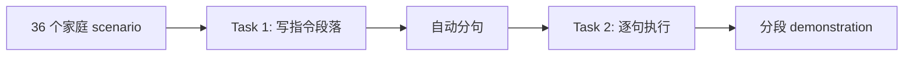

# CHAI 语料与评测

> 论文：[Mapping Instructions to Actions in 3D Environments with Visual Goal Prediction](https://arxiv.org/abs/1809.00786)（Misra et al., **EMNLP 2018**）  
> 数据：[Misra-EMNLP-2018](http://clic.nlp.cornell.edu/resources/Misra-EMNLP-2018/) · 代码：[CIFF](../code/CIFF-main/) · 仿真器：[CHALET](../code/CHALET-main/)  
> 平台介绍：[介绍.md](介绍.md)

## 1. CHAI 与 CHALET 的关系

| 组件 | 角色 | 源码 |
|------|------|------|
| **CHALET** | 3D 仿真器（Unity） | [CHALET-main/src/Assets/Scripts/](../code/CHALET-main/src/Assets/Scripts/) |
| **CHAI** | 在 CHALET 中采集的 **自然语言指令 + 人类 demonstration** | [dataset_parser.py](../code/CIFF-main/src/dataset_agreement_house/dataset_parser.py) |
| **LANI** | 同论文的 **户外导航** 语料（独立 Unity 场景） | [dataset_agreement_nav_drone/](../code/CIFF-main/src/dataset_agreement_nav_drone/) |
| **CIFF** | 统一 Blocks / LANI / **CHAI** / Touchdown | [CIFF README.md](../code/CIFF-main/README.md) |

CHAI 是 **partially observed 3D 房屋** 上的 **navigation + manipulation** 指令跟随基准。

---

## 2. 语料规模

### 2.1 段落级（Misra EMNLP 2018, Table 1）

| 统计量 | LANI | **CHAI** |
|--------|------|----------|
| Instruction **paragraphs** | 6,000 | **1,596** |
| 平均每段 **句子数** | 4.7 | **7.70** |
| 平均每句 **动作数** | 24.6 | **54.5** |
| 平均每句 **token 数** | 12.1 | **8.4** |
| **词表**大小 | 2,292 | **1,018** |

### 2.2 单句指令

[CHALET README.md L15](../code/CHALET-main/README.md)：**12K+** 单句 instruction · **1.5K+** instruction paragraphs。

### 2.3 数据划分

- Paragraph 级：**70% / 15% / 15%** train / dev / test  
- 额外 **200** 条 dev 单句做语言学现象分析  

---

## 3. 采集流程

### 3.1 两阶段 AMT



| 阶段 | 内容 |
|------|------|
| **Task 1** | 给 worker **scenario**，探索环境并 **interact** 后写指令 |
| **分句** | 段落 **自动切分为句子** |
| **Task 2** | 逐句执行；完成一句再请求下一句 |

Demonstration 在 CHALET Standalone 中录制，由 `DataCollection` 序列化为 JSON（[DataCollection.cs](../code/CHALET-main/src/Assets/Scripts/Data%20Collection/DataCollection.cs)）。

### 3.2 与 LANI 采集的差异

| 维度 | LANI | CHAI |
|------|------|------|
| 环境 | 50×50 草地 + 地标 | CHALET **5 房屋** |
| 任务 | 纯导航 | 导航 + **manipulation** |
| 动作空间 | 4 动作 | 5 动作 + **INTERACT**（[action_space.py](../code/CIFF-main/src/dataset_agreement_house/action_space.py)） |

---

## 4. CHAI 仿真配置

| 参数 | 值 | 源码依据 |
|------|-----|----------|
| 使用房屋数 | **5** 套 | [test_stop.py L76](../code/CIFF-main/src/experiments_house/test_stop.py) |
| 每 room 物体 | 平均 **~30** | 论文 |
| Room 尺度 | 约 **6×6** | 论文 |
| `FORWARD` 步长 | **0.1** | `data/house/config.json` |
| 转向角 | **90°** | config |
| `INTERACT` | **32×32** 网格 | [action_space.py L14–16](../code/CIFF-main/src/dataset_agreement_house/action_space.py) |
| 图像尺寸 | config `image_height/width` | [validate_setup_house.py L10–11](../code/CIFF-main/src/setup_agreement_house/validate_setup_house.py) |
| Panorama | 6 张 128×128，60° FOV | [house_server.py L100–117](../code/CIFF-main/src/server_house/house_server.py) |

---

## 5. 语言现象（Table 2 抽样分析）

200 条 dev 单句中各类现象出现次数示例：

| 类别 | LANI | CHAI | 示例 |
|------|------|------|------|
| 空间关系 | 123 | 52 | *cup next to the bathtub* |
| 多地点 conjunction | 36 | 5 | *between mushroom and cone* |
| **时间/子目标协调** | 65 | **68** | *go back to kitchen and put glass in sink* |
| 轨迹形状约束 | 94 | 0 | *go past the house by the right side* |
| **指代 / co-reference** | 32 | 18 | *move through **it*** |

CHAI 强调 **多步子目标** 与 **回指**，单句模型难以处理 co-reference。

---

## 6. 评测指标

### 6.1 CHAI 主指标（Misra 2018）

Unity 经 socket 返回评测字段（[house_server.py L38–46、L63–70](../code/CIFF-main/src/server_house/house_server.py)）：

| 指标 | 缩写 | 说明 |
|------|------|------|
| **Stop distance** | SD | 最终位姿与标注终点的 **aerial 距离**（`distance-to-final-goal`，分 room 累加） |
| **Manipulation accuracy** | MA | `manipulation-accuracy` 字段（百分比） |

`halt_and_receive_feedback()` 在 STOP 时累计均值（L66–70）：

```python
self.sum_navigation_error += navigation_error
self.sum_manipulation_accuracy += manipulation_accuracy
mean_navigation_error = self.sum_navigation_error / float(self.num_examples_seen)
```

**Goal prediction**（LINGUNET）：预测目标像素/3D 位置，距真值 **≤ 1.0**（CHAI）视为正确。

### 6.2 CHALET 原论文指标（更细）

| 指标 | 说明 |
|------|------|
| **Navigation error** | 分 room 欧氏路径误差之和 |
| **Manipulation F1** | **有序** interaction 列表 F1；place 容差 **1.0 m** |

复现 EMNLP 2018 以 **SD + MA** 为准。

### 6.3 人类表现（开发集样本）

| 任务 | SD | 其他 |
|------|-----|------|
| LANI | ~5.2 | TC **63%** |
| CHAI | **1.34** | MA **100%** |

---

## 7. Baseline 结果（Dev / Test，Table 3–4 摘要）

### 7.1 CHAI Development

| 方法 | SD ↓ | MA ↑ |
|------|------|------|
| STOP | 2.99 | 37.53 |
| RANDOMWALK | 2.99 | 28.96 |
| MISRA17 | 2.99 | 32.25 |
| CHAPLOT18 | 2.99 | 37.53 |
| **LINGUNET (OA)** | **2.75** | **37.53** |
| OA + oracle goals | **2.19** | 41.07 |

对应 CIFF 脚本：[test_stop.py](../code/CIFF-main/src/experiments_house/test_stop.py) · [test_chaplot_baseline_house.py](../code/CIFF-main/src/experiments_house/test_chaplot_baseline_house.py)。

### 7.2 CHAI Test

| 方法 | SD | MA |
|------|-----|-----|
| MISRA17 | 3.59 | 36.84 |
| CHAPLOT18 | 3.59 | 39.76 |
| **OA (LINGUNET)** | **3.34** | **39.97** |

CHAI 上 **MA 普遍 ~30–40%**；manipulation + 规划极难。

---

## 8. 模型要点（LINGUNET / CIFF）

**分解**：Goal prediction（LINGUNET：语言条件 U-Net 在 panorama 上预测目标）+ Action generation（RNN + goal mask）。

CHAI 扩展（[house_decoupled_predictor_navigator_model.py](../code/CIFF-main/src/agents/house_decoupled_predictor_navigator_model.py)）：

1. **Intermediate goals**：预测 `NAVIGATION` vs `INTERACTION` 序列  
2. **INTERACT 目标**：`interact row col` 动作（L574–579）：

```python
act_name = "interact %r %r" % (row, col)
interact_action = self.action_space.get_action_index(act_name)
image, reward, metadata = self.server.send_action_receive_feedback(interact_action)
```

训练：goal 用 **监督学习**；action 用 **contextual bandit + policy gradient**。

模型实现：[models/incremental_module/tmp_house_incremental_misra_final.py](../code/CIFF-main/src/models/incremental_module/tmp_house_incremental_misra_final.py)（navigation + interaction 分支）。

---

## 9. 数据文件格式（CIFF）

[DatasetParser.parse](../code/CIFF-main/src/dataset_agreement_house/dataset_parser.py) 读取 JSON：

```python
data = json.load(open(file_name))
datapoints_json = data["Dataset"]
for datapoint_json in datapoints_json:
    instruction = datapoint_json["Instruction"]
    house = datapoint_json["House"]
    trajectory_merged = datapoint_json["Trajectory"]  # "#" 分隔的动作字符串
    datapoint_id = int(datapoint_json["ID"])
```

### 9.1 字段说明

| 字段 | 含义 | 源码 |
|------|------|------|
| `ID` | 段落唯一 ID | [dataset_parser.py L73](../code/CIFF-main/src/dataset_agreement_house/dataset_parser.py) |
| `Instruction` | 分句后的指令列表 | L68 |
| `House` | 房屋编号 | L71 |
| `Trajectory` | 金标准动作（`#` 分隔） | L72–76 |
| `num_tokens` | 每句 token 数 | Wiki |
| `start_x/z`, `end_x/z` | 每句起止位置 | Wiki |
| `path_file` | 轨迹细节 | Wiki |
| `config_file` | 场景配置 | Wiki |

### 9.2 轨迹动作字符串

完整 CHALET 低层动作验证列表（[dataset_parser.py L6–17](../code/CIFF-main/src/dataset_agreement_house/dataset_parser.py)）：

```python
actions = ["forward", "back", "slideleft", "slideright", "lookleft", "lookright", "stop"]
```

CHAI 训练时使用 CIFF config 中的 `action_names` + `interact row col` 扩展（[action_space.py](../code/CIFF-main/src/dataset_agreement_house/action_space.py)）。

### 9.3 DataPoint 对象

[datapoint.py](../code/CIFF-main/src/dataset_agreement_house/datapoint.py) 封装 `instruction`, `house`, `trajectory_indices`, `datapoint_id`，供 agent 与 server reset 使用（`ok-reset {id}` · [house_server.py L83](../code/CIFF-main/src/server_house/house_server.py)）。

---

## 10. CIFF house 实验脚本索引

| 脚本 | 用途 |
|------|------|
| [test_stop.py](../code/CIFF-main/src/experiments_house/test_stop.py) | STOP baseline |
| [test_randomwalk.py](../code/CIFF-main/src/experiments_house/test_randomwalk.py) | 随机游走 |
| [test_most_frequent.py](../code/CIFF-main/src/experiments_house/test_most_frequent.py) | 最高频动作 |
| [test_chaplot_baseline_house.py](../code/CIFF-main/src/experiments_house/test_chaplot_baseline_house.py) | Chaplot18 评测 |
| [train_chaplot_baseline_house.py](../code/CIFF-main/src/experiments_house/train_chaplot_baseline_house.py) | Chaplot18 训练 |
| [train_asynchronous_learning.py](../code/CIFF-main/src/experiments_house/train_asynchronous_learning.py) | A3C 异步 |
| [train_goal_prediction_from_disk.py](../code/CIFF-main/src/experiments_house/train_goal_prediction_from_disk.py) | Goal prediction |
| [debug_manual_control.py](../code/CIFF-main/src/experiments_house/debug_manual_control.py) | 手动调试 agent |
| [setup_agreement_house/validate_setup_house.py](../code/CIFF-main/src/setup_agreement_house/validate_setup_house.py) | 配置校验 |

---

## 11. 相关论文与延伸

| 工作 | 与 CHAI/CHALET 关系 |
|------|---------------------|
| Yan et al. **arXiv 2018** | CHALET 仿真器 · [介绍.md](介绍.md) |
| Misra et al. **EMNLP 2017** | RL instruction→action 前身 |
| Blukis et al. **CoRL 2018** | LANI + position visitation |
| Chen et al. **Touchdown CVPR 2019** | CIFF 第四域 · [experiments_streetview/](../code/CIFF-main/src/experiments_streetview/) |

---

## 12. 复现检查清单

- [ ] 下载 [Misra-EMNLP-2018](http://clic.nlp.cornell.edu/resources/Misra-EMNLP-2018/)（含 **simulators/**）  
- [ ] Clone [CIFF](https://github.com/lil-lab/ciff) 或使用 [../code/CIFF-main/](../code/CIFF-main/)  
- [ ] `export PYTHONPATH=$PYTHONPATH:./src/`  
- [ ] 运行 `src/experiments_house/test_stop.py` 验证环境  
- [ ] 动作空间：**5 离散 + 32×32 INTERACT**（[action_space.py](../code/CIFF-main/src/dataset_agreement_house/action_space.py)）  
- [ ] 指标：**SD + MA**（[house_server.py](../code/CIFF-main/src/server_house/house_server.py)）  
- [ ] 对比 dev/test 分割（70/15/15）  

---

## 13. 延伸阅读

| 主题 | 链接 |
|------|------|
| CHALET 仿真器 | [介绍.md](介绍.md) |
| 安装与 CIFF | [基本使用流程.md](基本使用流程.md) |
| CIFF Wiki | https://github.com/lil-lab/ciff/wiki |
| CHAI 论文 PDF | https://aclanthology.org/D18-1287.pdf |
| Socket 协议 | [house_server.py](../code/CIFF-main/src/server_house/house_server.py) |
| Unity 交互 | [Interact.cs](../code/CHALET-main/src/Assets/Scripts/Player/Interact.cs) |
