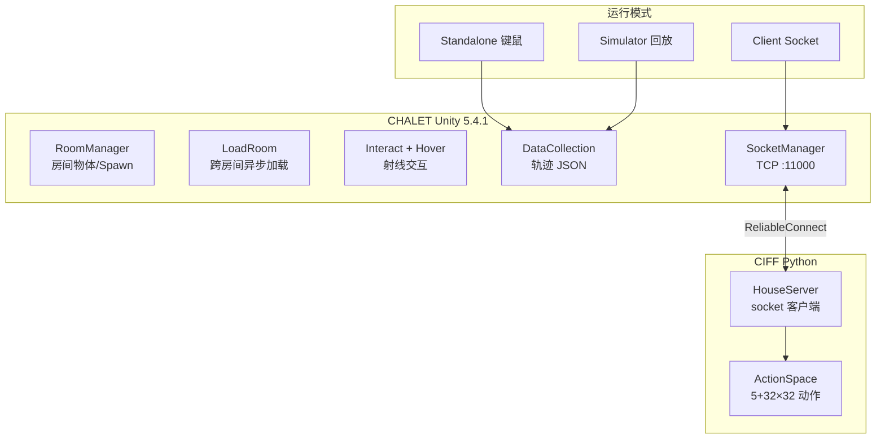
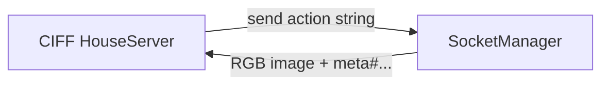

# CHALET 技术介绍

> **Cornell LIL 实验室**（Yoav Artzi 组）· Unity 3D · 模块化多房间房屋 + 语言规划  
> 官方仓库：[lil-lab/chalet](https://github.com/lil-lab/chalet) · 训练框架：[lil-lab/ciff](https://github.com/lil-lab/ciff)  
> 本地源码：`../code/CHALET-main/`（核心 C# 脚本）· `../code/CIFF-main/`（CHAI 训练/评测）  
> 论文：[arXiv:1801.07357](https://arxiv.org/abs/1801.07357) · 发布：**v0.1**  
> 同目录延伸阅读：[基本使用流程.md](基本使用流程.md) · [CHAI语料与评测.md](CHAI语料与评测.md)

## 1. 概述

**CHALET**（**C**ornell **H**ouse **A**gent **L**earning **E**nvironment**）是 2018 年发布的 **3D 家庭模拟器**，面向 **导航 + 物体操作 + 自然语言指令** 研究。与当时多数「单房间」仿真器不同，CHALET 强调：

- **多房间整屋布局**：58 个 room 模块 + **10 套默认房屋**（每屋 4–7 房间）  
- **丰富操作**：pick/place、开关电器、开关容器、容器内外取放  
- **部分可观测 + 记忆需求**：第一人称视角，仅见前方视野  
- **语言 grounding 友好**：同类型多实例物体，必须用空间关系消歧  

官方 README 将其定位为支持 navigation、manipulation、instruction following 与 interactive QA 的平台（[README.md L3](../code/CHALET-main/README.md)）。

**生态关系**

| 组件 | 角色 | 源码 |
|------|------|------|
| **CHALET** | Unity 3D 仿真器（Standalone / Simulator / Client） | [CHALET-main/src/Assets/Scripts/](../code/CHALET-main/src/Assets/Scripts/) |
| **CHAI** | 在 CHALET 中采集的 NL 指令 + 人类 demonstration | Misra EMNLP 2018 数据包 |
| **CIFF** | 统一 Blocks / LANI / **CHAI** / Touchdown 的训练与评测 | [CIFF-main/src/](../code/CIFF-main/src/) |

论文摘要：[CHALET: Cornell House Agent Learning Environment](https://arxiv.org/abs/1801.07357)

---

## 2. 核心架构



| 层级 | 职责 | 源码入口 |
|------|------|----------|
| **Player** | 第一人称移动、射线检测、pick/drop/toggle | [Player/Interact.cs](../code/CHALET-main/src/Assets/Scripts/Player/Interact.cs) · [Hover.cs](../code/CHALET-main/src/Assets/Scripts/Player/Hover.cs) |
| **SceneLoading** | 门触发 → 序列化 RoomData → 异步加载下一 room | [LoadRoom.cs](../code/CHALET-main/src/Assets/Scripts/SceneLoading/LoadRoom.cs) |
| **Managers** | 按 RoomData 放置/实例化物体、Spawn 玩家 | [RoomManager.cs](../code/CHALET-main/src/Assets/Scripts/Managers/RoomManager.cs) |
| **Scriptable Objects** | 房间 catalogue、Prefab 查找 | [RoomData.cs](../code/CHALET-main/src/Assets/Scripts/Scriptable%20Objects/RoomData.cs) · [PrefabDB.cs](../code/CHALET-main/src/Assets/Scripts/Scriptable%20Objects/PrefabDB.cs) |
| **API / Client** | Socket 服务、Bot 控制、reward 钩子 | [SocketManager.cs](../code/CHALET-main/src/Assets/Scripts/API%20stuff/SocketManager.cs) · [Actions.cs](../code/CHALET-main/src/Assets/Scripts/API%20stuff/Actions.cs) |
| **DataCollection** | 每秒 DIOS + 场景切换 → JSON | [DataCollection.cs](../code/CHALET-main/src/Assets/Scripts/Data%20Collection/DataCollection.cs) |
| **CIFF house** | Python 侧 socket 客户端、动作空间、实验脚本 | [server_house/house_server.py](../code/CIFF-main/src/server_house/house_server.py) |

---

## 3. 环境规模（论文数据）

| 维度 | 数量 / 说明 |
|------|-------------|
| **Rooms** | **58** 个可组合房间模块 |
| **Houses** | **10** 套默认布局；每屋 **4–7** 房间 |
| **Object types** | **150** 种 |
| **可操纵类型** | **71**：60 pick-and-place · 6 open/close 容器 · 5 toggle |
| **实例物体** | 330（同 type 不同 texture） |
| **每房间物体** | 平均 **~30** |
| **典型房间尺寸** | 约 **6×6**（CHAI 实验配置） |

### 3.1 10 套默认 House 映射

源码 [src/README.md](../code/CHALET-main/src/README.md)（内部称 Elmer Environments）：

| House | 房间组合 |
|-------|----------|
| house1 | Livingroom1, Kitchen3, Bedroom1, Bathroom1 |
| house2 | Livingroom2, Kitchen2, Bedroom2, Bathroom2 |
| house3 | Livingroom3, Kitchen1, Bedroom3, Bathroom3 |
| house4 | Livingroom6, Kitchen5, Bedroom4, Bathroom4, Guestroom1, Hallway1 |
| house5 | Livingroom5, Kitchen6, Bedroom5, Bathroom5, Guestroom3, Hallway3 |
| house6 | Livingroom4, Kitchen4, Bedroom6, Bathroom6, Guestroom2, Hallway2 |
| house7 | Livingroom7, Kitchen9, Bedroom10, Bathroom9, Guestroom5, Hallway5, Diningroom4 |
| house8 | Livingroom8, Kitchen8, Bedroom9, Bathroom10, Guestroom7, Hallway6, Diningroom2 |
| house9 | Livingroom9, Kitchen10, Bedroom7, Bathroom8, Guestroom4, Hallway4, Diningroom1 |
| house10 | Livingroom10, Kitchen7, Bedroom8, Bathroom7, Guestroom6, Hallway7, Diningroom3 |

CHAI 实验使用其中 **5 套**（[test_stop.py L76](../code/CIFF-main/src/experiments_house/test_stop.py)：`house_ids = [1, 2, 3, 4, 5]`）。

### 3.2 容器与嵌套操作

可 open/close 的物体为 **container**（洗碗机、橱柜、抽屉等）。`Interact.cs` 通过 tag 区分交互类型（[Interact.cs L96–114](../code/CHALET-main/src/Assets/Scripts/Player/Interact.cs)）：

| Tag 片段 | 行为 |
|----------|------|
| `object` + `openable` | 进入 `isPulling` 状态（拉抽屉/开门） |
| `object` + `effects` | 触发 toggle（电视、水龙头等） |
| `object`（普通） | `Freeze()` 拾取 → `isHolding` |

物体可 **跨房间携带**（`DDOL.cs` 保持 player 与所持物体）、**放入/取出容器**；支持简单 **collision + gravity** 物理（`Physics.Raycast`，距离 `rayDistance=2f`）。

---

## 4. 智能体与动作空间

### 4.1 观测

- **第一人称 RGB**；`Hover` 每帧向前 `Raycast` 2 单位检测可交互物体（[Hover.cs L12–31](../code/CHALET-main/src/Assets/Scripts/Player/Hover.cs)）  
- 位姿：**2D 位置 + 2D 朝向**  
- CIFF Client 模式：每步返回 `image` + `meta_data`（bot-position、navigation-error、manipulation-accuracy 等，[house_server.py L38–46](../code/CIFF-main/src/server_house/house_server.py)）  
- CHAI 训练：初始 **360° panorama**（6 张 128×128，`explore()` · [house_server.py L100–117](../code/CIFF-main/src/server_house/house_server.py)）

### 4.2 低层动作（CHALET 完整 API，论文 Table I）

| 动作 | 说明 |
|------|------|
| `move-forward` / `move-back` | 沿当前朝向前进/后退 |
| `strafe-right` / `strafe-left` | 侧向平移 |
| `look-left` / `look-right` / `look-up` / `look-down` | 视角；上下看可推 drawer/cabinet |
| `interact` | pick / drop / toggle / 开容器 |

轨迹 JSON 中记录为字符串动作（[dataset_parser.py L6](../code/CIFF-main/src/dataset_agreement_house/dataset_parser.py)：`forward`, `back`, `slideleft`, `slideright`, `lookleft`, `lookright`, `stop`）。

### 4.3 CHAI / CIFF 简化动作空间

CIFF 将 CHAI 动作编码为配置驱动的 **ActionSpace**（[action_space.py L6–21](../code/CIFF-main/src/dataset_agreement_house/action_space.py)）：

| 基础动作 | 参数 |
|----------|------|
| `FORWARD` | 步长 **0.1**（config） |
| `TURNLEFT` / `TURNRIGHT` | 转角 **90°** |
| `STOP` | 结束子目标 |
| `interact row col` | 视野 **32×32** 网格，共 **1024** 种 INTERACT 变体 |

```python
# action_space.py L12–16 — use_manipulation=True 时展开 interact 网格
for row in range(0, self.num_manipulation_row):
    for col in range(0, self.num_manipulation_col):
        self.act_names.append("interact %r %r" % (row, col))
```

配置键见 [validate_setup_house.py L3–11](../code/CIFF-main/src/setup_agreement_house/validate_setup_house.py)：`action_names`, `use_manipulation`, `num_manipulation_row/col`, `stop_action`, `image_height/width`。

**复现 EMNLP 2018 须用 CIFF 5 动作 + 32×32 INTERACT**，而非 Table I 九动作。

---

## 5. 三种运行模式

| 模式 | 用途 | 源码 |
|------|------|------|
| **Standalone** | 键鼠控制；轨迹存 JSON；WebGL + AMT 众包 | [DataCollection.cs](../code/CHALET-main/src/Assets/Scripts/Data%20Collection/DataCollection.cs) |
| **Simulator** | 从 JSON 回放 demonstration（Bot Elmer） | [LoadRoom.cs L44–52](../code/CHALET-main/src/Assets/Scripts/SceneLoading/LoadRoom.cs) · Bot Elmer 脚本 |
| **Client** | 外部进程经 **TCP socket** 发动作 | [SocketManager.cs L71–75](../code/CHALET-main/src/Assets/Scripts/API%20stuff/SocketManager.cs) 默认 **port 11000** |



Socket 反馈格式（[house_server.py L38–40](../code/CIFF-main/src/server_house/house_server.py)）：

```
reward#scene-name#action-success#bot-position#bot-angles#tracking#goal-screen#
distance-to-final-goal#distance-to-next-goal#goal-type#manipulation-accuracy
```

框架还提供 **reward API**（[Rewards.cs](../code/CHALET-main/src/Assets/Scripts/API%20stuff/Rewards.cs)）、运行时 **程序化改场景**（`PrefabDB` + surface annotation）。

---

## 6. 模块化房屋与跨房间状态

### 6.1 场景加载流程

`LoadRoom` 挂在门上，`OnTriggerEnter` 时（[LoadRoom.cs L28–37、L68–79](../code/CHALET-main/src/Assets/Scripts/SceneLoading/LoadRoom.cs)）：

1. 收集当前 room 所有 `object` tag 物体  
2. 写入 `RoomData` ScriptableObject（位置/旋转/scale）  
3. 激活 Loading Screen，**异步**加载下一 Unity scene  

### 6.2 RoomManager 与状态保持

`RoomManager.OnEnable`（[RoomManager.cs L28–44](../code/CHALET-main/src/Assets/Scripts/Managers/RoomManager.cs)）：

- 读取 `RoomIdentifier.lastRoom`，在对应 spawn point 放置玩家  
- `placeObjects(thisRoomData)` 恢复/实例化物体  
- `DeactivateRemoved()` 处理已移除物体  

`RoomData` 存储 catalogue（[RoomData.cs L14–21](../code/CHALET-main/src/Assets/Scripts/Scriptable%20Objects/RoomData.cs)）：`objsinRoom`, `objSpawns`, `deactivatedObjects` 等。

### 6.3 新建 Room 检查清单

[src/README.md](../code/CHALET-main/src/README.md) 要求每个 room 包含：

- [ ] `RoomManager`  
- [ ] Safety Net  
- [ ] Spawn Points（≥1）  
- [ ] FPS Screen  
- [ ] 至少一扇 `PRE_DOO_Main_door_02_05` 连接门  

---

## 7. 语言任务设计动机

| 挑战 | 示例 |
|------|------|
| **实例消歧** | 浴室多条毛巾 → *yellow towel left of the sink* |
| **名词短语 + 关系** | *glass **from the** cupboard* |
| **多容器探索** | 多个 cupboard 时须决定打开哪一个 |
| **部分可观测** | 需 memory 或历史观测 |

CHAI 段落级指令平均 **7.7 句/段**、**54.5 动作/句**（见 [CHAI语料与评测.md](CHAI语料与评测.md)）。

---

## 8. 评测指标

### 8.1 CHALET 原论文（Yan 2018）

| 指标 | 说明 |
|------|------|
| **Navigation error** | 分 room 欧氏路径误差之和 |
| **Manipulation F1** | 有序 interaction 列表 F1；place 容差 **1.0 m** |

### 8.2 CHAI / CIFF 主指标（Misra 2018）

Unity 通过 socket 返回 `navigation-error` 与 `manipulation-accuracy`（[house_server.py L44–46、L63–70](../code/CIFF-main/src/server_house/house_server.py)）：

| 指标 | 缩写 | 说明 |
|------|------|------|
| **Stop distance** | SD | 最终位姿与标注终点的 aerial 距离（分 room 累加） |
| **Manipulation accuracy** | MA | manipulation 动作集合对比（百分比） |

复现 EMNLP 2018 以 **SD + MA** 为准。

---

## 9. 实现技术栈

| 项目 | 说明 | 依据 |
|------|------|------|
| **引擎** | Unity **5.4.1** | Wiki / 论文 |
| **逻辑语言** | C# · namespace `Cyan` | [Interact.cs L4](../code/CHALET-main/src/Assets/Scripts/Player/Interact.cs) |
| **Client 通信** | TCP Socket · 默认 **11000** | [SocketManager.cs L71–75](../code/CHALET-main/src/Assets/Scripts/API%20stuff/SocketManager.cs) |
| **训练框架** | CIFF · **PyTorch** | [CIFF README.md](../code/CIFF-main/README.md) |
| **WebGL build** | 约 **386 MB** | [src/README.md L5–6](../code/CHALET-main/src/README.md) |
| **许可** | CHALET 代码 **CC BY 4.0** | [README.md](../code/CHALET-main/README.md) |

### 9.1 二进制 vs 源码

| 方式 | 说明 |
|------|------|
| **Released binary（推荐）** | [clic.nlp.cornell.edu/resources/CHALET/](http://clic.nlp.cornell.edu/resources/CHALET/) · **无需** Asset Store |
| **Source（不稳定）** | GitHub `src/` · 需 Nekobolt Home Interior Pack V3 + 邮件获取修改资产 |

源码 **不含** Asset Store 专有 mesh；[README.md L31–33](../code/CHALET-main/README.md) 要求联系 chalet-3d@googlegroups.com 获取修改版资源。

---

## 10. CIFF 训练栈（CHAI domain）

| 目录 | 作用 |
|------|------|
| [experiments_house/](../code/CIFF-main/src/experiments_house/) | 实验入口：`test_stop.py`, `train_chaplot_baseline_house.py` 等 |
| [server_house/](../code/CIFF-main/src/server_house/) | `HouseServer` · socket 协议 |
| [dataset_agreement_house/](../code/CIFF-main/src/dataset_agreement_house/) | JSON 解析 · ActionSpace |
| [baselines/chaplot_baseline_house.py](../code/CIFF-main/src/baselines/chaplot_baseline_house.py) | Chaplot18 baseline |
| [agents/house_decoupled_predictor_navigator_model.py](../code/CIFF-main/src/agents/house_decoupled_predictor_navigator_model.py) | LINGUNET 两阶段 agent |

CIFF 四域对照（[CIFF README.md L14–18](../code/CIFF-main/README.md)）：Blocks · LANI · **CHAI (house)** · Touchdown。

---

## 11. 与同类平台对比

| 维度 | CHALET | AI2-THOR (2018) | VirtualHome | Habitat |
|------|--------|-----------------|-------------|---------|
| 环境数 | 58 rooms / 10 houses | 120 rooms | 固定场景 + 图 | HM3D 等 |
| 跨房间 | ✅ 整屋 | 当时单 room 为主 | ✅ | ✅ |
| Manipulation | pick/place/toggle/container | 离散 API | 程序级高层动作 | Rearrange 有限 |
| 原生 NL 数据 | **CHAI** | 较少 | Activity KB | 较少 |
| 维护活跃度 | **低**（2018） | **高** | 中 | **高** |
| ML 接口 | CIFF socket | Python API | 程序执行器 | Gym |

CHALET 的历史地位：**最早强调 multi-room + manipulation + 真实众包 NL** 的 Unity 家庭仿真之一。

---

## 12. 演进与局限

| 项目 | 说明 |
|------|------|
| **版本** | 公开 **v0.1**；源码含 Elmer 内部迭代 |
| **Unity** | 5.4.1 较旧，现代系统可能需虚拟机 |
| **物理** | 简单 Raycast + collision，非精确操作仿真 |
| **CIFF 状态** | README 标注 **unstable**；见 [ciff issues](https://github.com/lil-lab/ciff/issues) |
| **后续** | Touchdown、LANI+CHAI 同一 CIFF 生态 |

---

## 13. 官方仓库索引

| 用途 | CHALET (Unity) | CIFF (Python) |
|------|----------------|---------------|
| 项目说明 | [README.md](../code/CHALET-main/README.md) | [README.md](../code/CIFF-main/README.md) |
| Unity 工程说明 | [src/README.md](../code/CHALET-main/src/README.md) | — |
| 玩家交互 | [Player/Interact.cs](../code/CHALET-main/src/Assets/Scripts/Player/Interact.cs) | — |
| 跨房间加载 | [LoadRoom.cs](../code/CHALET-main/src/Assets/Scripts/SceneLoading/LoadRoom.cs) | — |
| 房间管理 | [RoomManager.cs](../code/CHALET-main/src/Assets/Scripts/Managers/RoomManager.cs) | — |
| Socket Client | [SocketManager.cs](../code/CHALET-main/src/Assets/Scripts/API%20stuff/SocketManager.cs) | [house_server.py](../code/CIFF-main/src/server_house/house_server.py) |
| 轨迹采集 | [DataCollection.cs](../code/CHALET-main/src/Assets/Scripts/Data%20Collection/DataCollection.cs) | [dataset_parser.py](../code/CIFF-main/src/dataset_agreement_house/dataset_parser.py) |
| 动作空间 | — | [action_space.py](../code/CIFF-main/src/dataset_agreement_house/action_space.py) |
| STOP baseline | — | [test_stop.py](../code/CIFF-main/src/experiments_house/test_stop.py) |
| Chaplot baseline | — | [test_chaplot_baseline_house.py](../code/CIFF-main/src/experiments_house/test_chaplot_baseline_house.py) |
| Binary 下载 | [clic CHALET](http://clic.nlp.cornell.edu/resources/CHALET/) | [Misra-EMNLP-2018](http://clic.nlp.cornell.edu/resources/Misra-EMNLP-2018/) |

---

## 14. 本地文档索引

| 文档 | 内容 |
|------|------|
| [基本使用流程.md](基本使用流程.md) | 下载 binary、WebGL、CIFF 实验、源码构建 |
| [CHAI语料与评测.md](CHAI语料与评测.md) | 数据集格式、采集流程、指标、baseline |

---

## 15. 资源与引用

| 资源 | URL |
|------|-----|
| GitHub CHALET | https://github.com/lil-lab/chalet |
| GitHub CIFF | https://github.com/lil-lab/ciff |
| Wiki | https://github.com/lil-lab/chalet/wiki |
| CHALET 下载 | http://clic.nlp.cornell.edu/resources/CHALET/ |
| CHAI/LANI 数据 | http://clic.nlp.cornell.edu/resources/Misra-EMNLP-2018/ |
| CHALET 论文 | https://arxiv.org/abs/1801.07357 |
| CHAI 论文 | https://arxiv.org/abs/1809.00786 |

```bibtex
@article{yan2018chalet,
  title={CHALET: Cornell House Agent Learning Environment},
  author={Yan, Claudia and Misra, Dipendra and Bennett, Andrew and Walsman, Aaron and Bisk, Yonatan and Artzi, Yoav},
  journal={arXiv preprint arXiv:1801.07357},
  year={2018}
}

@inproceedings{misra2018mapping,
  title={Mapping Instructions to Actions in 3D Environments with Visual Goal Prediction},
  author={Misra, Dipendra and Bennett, Andrew and Blukis, Valts and Niklasson, Eyvind and Shatkin, Max and Artzi, Yoav},
  booktitle={EMNLP},
  year={2018}
}
```

---

*基于本地源码 `code/CHALET-main` · `code/CIFF-main` 与官方文档编写。*
