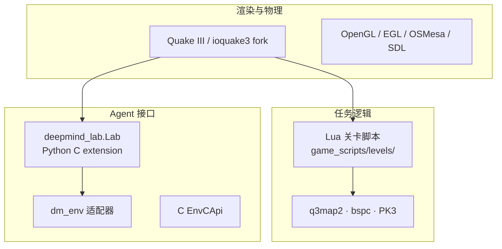

# DeepMind Lab 技术介绍

> **Google DeepMind** · 基于 Quake III / ioquake3 · 第一人称 3D RL 测试床  
> 仓库：[google-deepmind/lab](https://github.com/google-deepmind/lab) · 论文：[arXiv:1612.03801](https://arxiv.org/abs/1612.03801) · 许可：**Apache-2.0**  
> **本地源码**：`embodied-platforms/code/lab-master/`（与官方 master 同步；下文链接默认指向 GitHub，代码块引用本地路径）

## 1. 概述

**DeepMind Lab**（常简称 **DMLab**）是 2016 年开源的 **可定制 3D 学习平台**，用于 **深度强化学习** 与 AGI 研究。Agent 以 **浮球 + 摄像头**（无显式 body mesh）在科幻风格 3D 关卡中 **环视、移动、跳跃、射击、收集物品、解迷宫**。

设计目标（论文与 [官方博客](https://deepmind.google/blog/open-sourcing-deepmind-lab/)）：

- **纯像素输入**：默认无 GPS/地图特权，考察 **3D 视觉、导航、运动控制**  
- **程序化关卡**：Lua 配置 + Quake 地图管线，支持 **每 episode 随机布局**  
- **认知能力谱系**：从迷宫导航到 **Psychlab** 心理学范式、**DMLab-30** 多任务基准  
- **可扩展**：新关卡 = 新 Lua + 可选 BSP；无需改 C++ 核心即可定义 reward/observation  

作为 **早期第一视角 RL benchmark**，它影响了 IMPALA、DMLab-30、Psychlab 及后续 **Habitat**、**DeepMind Lab2** 等方向；Today 仍用于 **from-pixels navigation** 与 **记忆/探索** 经典基线。

---

## 2. 仓库结构

本地快照：`code/lab-master/`（1600+ 文件）。核心分层：**ioquake3 引擎 fork** + **DeepMind 钩子层** + **Lua 关卡** + **Python/C RL API**。

| 路径 | 作用 | GitHub |
|------|------|--------|
| [`public/dmlab.h`](https://github.com/google-deepmind/lab/blob/master/public/dmlab.h) | **`dmlab_connect()`**：进程级 RL 入口，导出 `EnvCApi` | C API |
| [`engine/code/deepmind/dmlab_connect.c`](https://github.com/google-deepmind/lab/blob/master/engine/code/deepmind/dmlab_connect.c) | 动作/观测名、帧率换算、Quake 主循环与 step 桥接 | 核心 |
| [`deepmind/include/deepmind_context.h`](https://github.com/google-deepmind/lab/blob/master/deepmind/include/deepmind_context.h) | **`DeepmindContext`**：引擎 hooks ↔ Lua VM | |
| [`deepmind/engine/`](https://github.com/google-deepmind/lab/tree/master/deepmind/engine) | C++ Lua 绑定：迷宫生成、pickup、事件、观测装饰 | |
| [`game_scripts/levels/`](https://github.com/google-deepmind/lab/tree/master/game_scripts/levels) | **关卡 Lua**（153 个 `.lua`）；含 `contributed/dmlab30/` | 任务定义 |
| [`game_scripts/factories/`](https://github.com/google-deepmind/lab/tree/master/game_scripts/factories) | 可复用 factory：`random_goal_factory`、`explore/*` | 程序化 |
| [`python/dmlab_module.c`](https://github.com/google-deepmind/lab/blob/master/python/dmlab_module.c) | **`deepmind_lab.Lab`** Python 扩展 | |
| [`python/random_agent.py`](https://github.com/google-deepmind/lab/blob/master/python/random_agent.py) | 官方 random / spring agent 示例 | |
| [`python/dmenv_module.py`](https://github.com/google-deepmind/lab/blob/master/python/dmenv_module.py) | `dm_env.Environment` 适配器 | |
| [`python/pip_package/`](https://github.com/google-deepmind/lab/tree/master/python/pip_package) | 自包含 wheel 打包脚本 | 部署 |
| [`python/tests/`](https://github.com/google-deepmind/lab/tree/master/python/tests) | 39 个集成测试（level_cache、maze、determinism…） | |
| [`BUILD`](https://github.com/google-deepmind/lab/blob/master/BUILD) | Bazel 目标：`//:deepmind_lab.so`、`:game`、`:python_random_agent` | 构建 |
| [`docs/`](https://github.com/google-deepmind/lab/tree/master/docs) | 用户/开发者文档：actions、levels、Lua API | |
| [`third_party/rl_api/`](https://github.com/google-deepmind/lab/tree/master/third_party/rl_api) | 通用 **`EnvCApi`** 强化学习接口 | |

[`README.md`](https://github.com/google-deepmind/lab/blob/master/README.md) 说明上游依赖：**ioquake3**、**q3map2**、**bspc**；地图 bug 应优先在上游修复再合并。

---

## 3. 技术栈



| 层级 | 说明 |
|------|------|
| **引擎** | [ioquake3](https://github.com/ioquake/ioq3) fork（源自 id **Quake III Arena**） |
| **关卡** | **Lua** 定义任务、reward、episode；[levels 目录](https://github.com/google-deepmind/lab/tree/master/game_scripts/levels) |
| **地图** | q3map2、bspc 编译；程序化关卡可 **运行时生成 PK3** |
| **构建** | [Bazel](https://bazel.build/)（C99 + **C++17**，2022 起） |
| **Python** | `deepmind_lab.so` / PIP wheel；[python_api.md](https://github.com/google-deepmind/lab/blob/master/docs/users/python_api.md) |
| **RL 抽象** | 可选 [dm_env](https://github.com/deepmind/dm_env) 绑定 |

上游 bug 优先在 **ioquake3 / 第三方** 修复再合并（见 README）。

### 3.1 RL 连接层（C → Python）

`dmlab_connect()` 启动 Quake 实例并导出标准 **`EnvCApi`**；Python 侧通过 `deepmind_lab.so` 包装为 `Lab` 类：

```61:73:embodied-platforms/code/lab-master/public/dmlab.h
// Starts an instance of DeepMind Lab and exports the single-player RL
// Environment API to *env_c_api. This function may be called at most once
// per process unless called via dmlab_so_loader. (DeepMind Lab is not
// modular and reusable.)
//
// 'params' must be dereferenceable; the DeepMindLabLaunchParams that it
// points to is owned by the caller.
//
// Returns 0 on success and non-zero otherwise.
int dmlab_connect(
    const DeepMindLabLaunchParams* params,
    EnvCApi* env_c_api,
    void** context);
```

引擎修改后的 **DeepmindContext** 持有 Lua VM，通过 hooks 在 Quake 帧循环中回调关卡逻辑：

```37:42:embodied-platforms/code/lab-master/deepmind/include/deepmind_context.h
struct DeepmindContext_s {
  DeepmindCalls calls;  // Calls from context to engine provided by engine.
  void* context;        // Calls may require context to be called with.
  DeepmindHooks hooks;  // Calls from engine to context provided by context.
  void* userdata;       // Hooks require userdata to be called with.
};
```

动作名在 C 层硬编码为 7 维（与文档 `actions.md` 一致），由 `dmlab_connect.c` 映射到 Quake 输入：

```74:92:embodied-platforms/code/lab-master/engine/code/deepmind/dmlab_connect.c
enum ActionsEnum {
  kActions_LookLeftRight,
  kActions_LookDownUp,
  kActions_StrafeLeftRight,
  kActions_MoveBackForward,
  kActions_Fire,
  kActions_Jump,
  kActions_Crouch,
};

const char* const kActionNames[] = {
    "LOOK_LEFT_RIGHT_PIXELS_PER_FRAME",  // Angular velocity.
    "LOOK_DOWN_UP_PIXELS_PER_FRAME",     // Angular velocity.
    "STRAFE_LEFT_RIGHT",
    "MOVE_BACK_FORWARD",
    "FIRE",
    "JUMP",
    "CROUCH",
};
```

---

## 4. Agent 形态与能力

| 特性 | 说明 |
|------|------|
| **Avatar** | 浮球 + 第一人称相机（非人形机器人） |
| **感知** | 以 **RGB** 为主；可请求 depth、velocity、debug pose、**INSTR** 语言串等 |
| **无特权导航** | 不提供 top-down map（除非关卡自定义 observation） |
| **episode** | 默认 `episodeLengthSeconds=90`；关卡可重启 sub-level |

博客示例任务：收集水果、**Laser Tag**、launch pad 弹跳、**随机地图记忆**（explore_goal_locations）等。

---

## 5. 动作空间

标准 **7 维整数/离散混合** 动作（[actions.md](https://github.com/google-deepmind/lab/blob/master/docs/users/actions.md)）：

| 动作名 | 范围 | 说明 |
|--------|------|------|
| `LOOK_LEFT_RIGHT_PIXELS_PER_FRAME` | [-512, 512] | 水平视角角速度（像素/帧，640×480@60fps 标定） |
| `LOOK_DOWN_UP_PIXELS_PER_FRAME` | [-512, 512] | 垂直视角 |
| `STRAFE_LEFT_RIGHT` | [-1, 1] | 平移 |
| `MOVE_BACK_FORWARD` | [-1, 1] | 前后 |
| `FIRE` | [0, 1] | 射击（Laser Tag 等） |
| `JUMP` | [0, 1] | 跳跃（部分关卡禁用） |
| `CROUCH` | [0, 1] | 下蹲 |

`action_spec()` 返回各维 min/max/name。`step(action, num_steps=N)` 在 **N 帧内重复同一动作**。

可选（`gadgetSelect` / `gadgetSwitch`）：`SELECT_GADGET`、`SWITCH_GADGET`。

**典型前进向量**（PIP README 示例）：`np.array([0,0,0,1,0,0,0], dtype=np.intc)` → 仅 `MOVE_BACK_FORWARD=1`。

---

## 6. 观测空间

在 `Lab(level, observations=[...])` 中按名请求；`observation_spec()` 列出全部可用项。

| 观测名 | 类型 | 说明 |
|--------|------|------|
| `RGB_INTERLEAVED` | uint8 H×W×3 | 最常用；通道交错 |
| `RGB` / `BGR` | uint8 3×H×W | 平面格式 |
| `RGBD` / `RGBD_INTERLEAVED` | + depth 通道 | DMLab-30 常用 |
| `VEL.TRANS` / `VEL.ROT` | float64 (3,) | 线/角速度 |
| `INSTR` | string | 语言指令（language 关卡） |
| `DEBUG.POS.TRANS` / `DEBUG.POS.ROT` | float64 | 调试位姿（训练分析用） |
| `MAP_FRAME_NUMBER` | float64 | 帧计数 |

默认分辨率由 `config` 控制：`width=320`, `height=240`, `fps=60`（可改为 84×84 等 RL 常用尺寸）。

---

## 7. 关卡体系概览

关卡 = Lua 文件名（路径相对 `game_scripts/levels/`）。详见 [关卡与任务参考.md](关卡与任务参考.md)。

### 7.1 关卡 = Lua + Factory 模式

典型导航关卡仅数十行：ASCII **`entityLayer`** 描述迷宫拓扑，再交给 factory 生成 API：

```18:39:embodied-platforms/code/lab-master/game_scripts/levels/nav_maze_random_goal_01.lua
local factory = require 'factories.random_goal_factory'

local entityLayer = [[
*********************
*   *   *           *
* * * ***** ***** * *
...
]]

return factory.createLevelApi{
    mapName = 'nav_maze_random_goal_01',
    entityLayer = entityLayer,
    episodeLengthSeconds = 60,
    camera = {500, 250, 600}
}
```

[`random_goal_factory.lua`](https://github.com/google-deepmind/lab/blob/master/game_scripts/factories/random_goal_factory.lua) 在 `api:start(episode, seed, params)` 中 **按 seed 随机 goal 格点**，并调用 `maze_generation` / `map_maker` 运行时编译 BSP（可经 **level_cache** 缓存 PK3）。

DMLab-30 的 explore 系列更薄，仅一行 factory 调用：

```18:20:embodied-platforms/code/lab-master/game_scripts/levels/contributed/dmlab30/explore_goal_locations_small.lua
local factory = require 'factories.explore.goal_locations_factory'

return factory.createLevelApi()
```

### 7.2 内置核心关卡（`game_scripts/levels/`）

| 前缀 | 能力 |
|------|------|
| `nav_maze_static_*` | 固定迷宫导航 |
| `nav_maze_random_goal_*` | **程序化迷宫** + 随机目标 |
| `lt_chasm` / `lt_hallway_slope` / `lt_horseshoe_color` | 通道、坡度、颜色 cue |
| `lt_space_bounce_hard` | 低重力弹跳 |
| `seekavoid_arena_01` | 追逐/躲避 |
| `stairway_to_melon` | 收集目标物体 |
| `demos/*` | 演示与测试 |

### 7.3 DMLab-30（`contributed/dmlab30/`）

**30 个环境**，覆盖 **Rooms、Language、LaserTag、NatLab、SkyMaze、PsychLab、Explore** 七大类，用于 **multi-task RL** 与 zero-shot transfer 研究（[README](https://github.com/google-deepmind/lab/blob/master/game_scripts/levels/contributed/dmlab30/README.md)）。

### 7.4 Psychlab

将 **心理学实验** 操作化为 RL 任务（[Psychlab 论文 arXiv:1801.08116](https://arxiv.org/abs/1801.08116)）：

- `psychlab_continuous_recognition` — 连续识别 / 熟悉度记忆  
- `psychlab_sequential_comparison` — 序列比较  
- `psychlab_visual_search` — 视觉搜索  
- `psychlab_arbitrary_visuomotor_mapping` — 任意视动映射  

扩展记忆套件：`contributed/psychlab/memory_suite_01/`（含 explore_goal_locations 的 train/holdout/interpolate 变体）。

---

## 8. Python API 要点

官方 [`random_agent.py`](https://github.com/google-deepmind/lab/blob/master/python/random_agent.py) 展示完整 **reset → step 循环**；7 维离散动作与 C 层命名一一对应：

```37:49:embodied-platforms/code/lab-master/python/random_agent.py
  ACTIONS = {
      'look_left': _action(-20, 0, 0, 0, 0, 0, 0),
      'look_right': _action(20, 0, 0, 0, 0, 0, 0),
      ...
      'forward': _action(0, 0, 0, 1, 0, 0, 0),
      ...
  }
```

```python
import deepmind_lab
import numpy as np

env = deepmind_lab.Lab(
    level='nav_maze_random_goal_01',
    observations=['RGB_INTERLEAVED'],
    config={'width': '84', 'height': '84', 'fps': '30'},
    renderer='software',  # headless: software→OSMesa; hardware→EGL
)
env.reset(seed=42)

spec = env.action_spec()
action = np.zeros(len(spec), dtype=np.intc)
action[[name['name'] for name in spec].index('MOVE_BACK_FORWARD')] = 1

reward = env.step(action, num_steps=4)
rgb = env.observations()['RGB_INTERLEAVED']

while env.is_running():
    reward = env.step(action)
env.close()
```

| 方法 | 作用 |
|------|------|
| `reset(episode=-1, seed=None)` | 新 episode；`episode<0` 顺序加载 |
| `step(action, num_steps=1)` | 推进仿真，返回 **reward** |
| `is_running()` | episode 是否结束 |
| `events()` | 自上次 step/reset 以来的事件列表 |
| `num_steps()` | 自 reset 起帧数 |
| `close()` | 释放 Quake 实例 |

**Level cache**：程序化关卡（如 `explore_goal_locations_small`）每 episode 编译地图；`level_cache` 需实现 `fetch(key, pk3_path)` / `write(key, pk3_path)`（见 [`level_cache_types.h`](https://github.com/google-deepmind/lab/blob/master/public/level_cache_types.h) 与 [`level_cache_test.py`](https://github.com/google-deepmind/lab/blob/master/python/tests/level_cache_test.py)）。

**dm_env**：[`dmenv_module.py`](https://github.com/google-deepmind/lab/blob/master/python/dmenv_module.py) 将 `Lab` 包装为 `dm_env.Environment`：

```30:35:embodied-platforms/code/lab-master/python/dmenv_module.py
class Lab(dm_env.Environment):
  """Implements dm_env.Environent; forwards calls to deepmind_lab."""

  def __init__(self, level, observation_names, config):
    self._lab = deepmind_lab.Lab(level, observation_names, config)
    self._observation_names = observation_names
```

---

## 9. 全局配置选项

所有关卡共享（[levels.md](https://github.com/google-deepmind/lab/blob/master/docs/levels.md)）：

| Key | 默认 | 说明 |
|-----|------|------|
| `episodeLengthSeconds` | 90 | episode 最长秒数 |
| `gadgetSelect` / `gadgetSwitch` | false | 启用额外 gadget 动作 |
| `allowHoldOutLevels` | false | 允许 `test_only` hold-out 关卡 |
| `logLevel` | INFO | 日志 verbosity |

未识别 `config` 键会传入 Lua `api:init` 的 `kwargs.opts`（关卡专属参数，如 `lt_chasm` 的 `botCount`）。

---

## 10. 构建与部署概要

| 方式 | 说明 |
|------|------|
| **Bazel 开发** | `bazel build -c opt //:deepmind_lab.so` · `bazel run -c opt //:python_random_agent` |
| **PIP 包** | 先 Bazel 打 wheel，再 `pip install`（见 [基本使用流程.md](基本使用流程.md)） |
| **Headless** | 构建 `--define graphics=osmesa_or_egl` + `renderer='software'` |
| **可视化** | `--define graphics=sdl` 或 `hardware` + 观测含 `RGB*` |

依赖：Bazel、OpenGL/OSMesa/EGL、SDL2、Lua、NumPy 等（[build.md](https://github.com/google-deepmind/lab/blob/master/docs/users/build.md)）。

---

## 11. 研究定位

### 11.1 优势

| 点 | 说明 |
|----|------|
| **经典 RL 基准** | IMPALA、DMLab-30 等论文标配 |
| **程序化泛化** | 每 episode 新地图 → train/test 分离 |
| **任务多样性** | 导航 / 语言 / 射击 / 记忆 / 规划 |
| **轻量相对真实扫描** | 编译一次，batch 训练成熟 |

### 11.2 局限

| 点 | 说明 |
|----|------|
| **非真实室内** | 科幻/游戏美学，与 Habitat/ScanNet 分布差大 |
| **无精细操作** | 无抓取、开门等 embodied manipulation |
| **构建链老旧** | Bazel + Quake 工具链；macOS/ARM 支持弱 |
| **维护** | 有更新但活跃度低于 Habitat / Isaac |

### 11.3 相关项目

| 项目 | 关系 |
|------|------|
| [dm_memorytasks](https://github.com/deepmind/dm_memorytasks) | 13 项记忆任务扩展 |
| [DeepMind Lab2](https://github.com/deepmind/lab2) | 后继研究平台 |
| IMPALA / R2D2 | 在 DMLab 上验证分布式 RL |

---

## 12. 与同类平台对比

| 维度 | DeepMind Lab | Habitat 3 | VizDoom | TDW |
|------|--------------|-----------|---------|-----|
| 场景 | 程序化游戏关卡 | 真实/CAD 扫描 | DOOM 地图 | 通用 3D |
| 视角 | 第一人称 | 可配置 | 第一人称 | 可配置 |
| 语言任务 | DMLab-30 language | VLN 等 | 少 | 可定制 |
| Manipulation | ❌ | Rearrange | ❌ | ✅ |
| 安装 | Bazel 编译 | conda 较易 | 中等 | pip+build |
| 代表任务 | nav_maze, Psychlab | ObjectNav | 射击导航 | 物理+音频 |

---

## 13. 本地文档索引

| 文档 | 内容 |
|------|------|
| [基本使用流程.md](基本使用流程.md) | Bazel/PIP 构建、headless、random agent、dm_env |
| [关卡与任务参考.md](关卡与任务参考.md) | 核心关卡、DMLab-30 全表、Psychlab、Lua 扩展 |

---

## 14. 资源

| 资源 | URL |
|------|-----|
| GitHub | https://github.com/google-deepmind/lab |
| Python API | https://github.com/google-deepmind/lab/blob/master/docs/users/python_api.md |
| Actions | https://github.com/google-deepmind/lab/blob/master/docs/users/actions.md |
| Build | https://github.com/google-deepmind/lab/blob/master/docs/users/build.md |
| Levels | https://github.com/google-deepmind/lab/blob/master/docs/levels.md |
| DMLab-30 | https://github.com/google-deepmind/lab/tree/master/game_scripts/levels/contributed/dmlab30 |
| Lua API | https://github.com/google-deepmind/lab/blob/master/docs/developers/reference/lua_api.md |
| PIP 包 | https://github.com/google-deepmind/lab/tree/master/python/pip_package |
| dm_env | https://github.com/deepmind/dm_env |
| 博客 | https://deepmind.google/blog/open-sourcing-deepmind-lab/ |

### 引用

```bibtex
@article{beattie2016deepmind,
  title={DeepMind Lab},
  author={Beattie, Charles and Leibo, Joel Z and Teplyashin, Denis and others},
  journal={arXiv preprint arXiv:1612.03801},
  year={2016}
}
```
