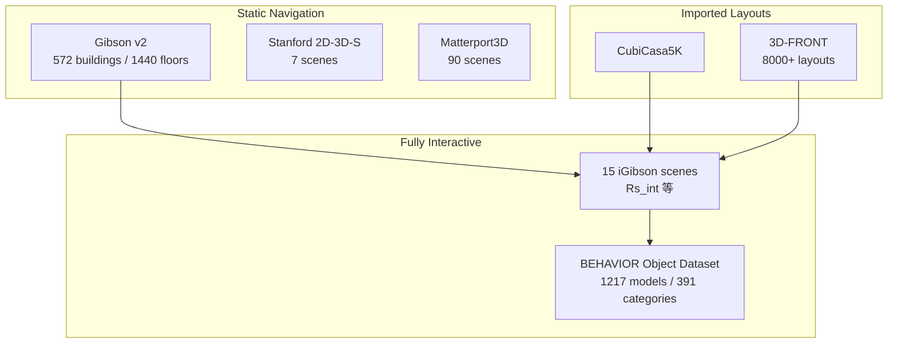
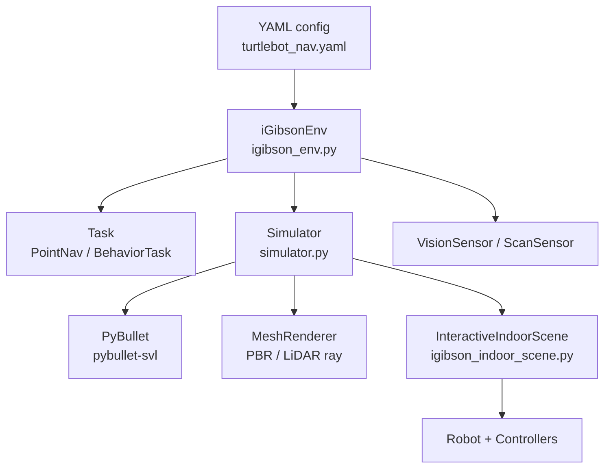

# iGibson 技术介绍

> **Stanford Vision and Learning Lab (SVL)** · PyBullet + PBR 渲染 · 真实扫描室内交互仿真  
> 官方仓库：[StanfordVL/iGibson](https://github.com/StanfordVL/iGibson) · 文档：[stanfordvl.github.io/iGibson](https://stanfordvl.github.io/iGibson/) · 许可：**MIT**  
> **本地源码**：`embodied-platforms/code/` 中**未**包含 iGibson 本体；可通过 [`repos/fetch_repos.sh`](../repos/fetch_repos.sh) 拉取。下文 GitHub 链接指向官方 `master`（2.0 分支）。  
> **继任者对照**：本地已有 [`code/BEHAVIOR-1K-main/OmniGibson/`](../code/BEHAVIOR-1K-main/OmniGibson/)（Isaac Sim 版），API 设计承袭 iGibson，见 §11。

## 1. 概述

**iGibson**（Interactive Gibson）在 **Gibson** 大规模真实室内重建之上，提供 **Bullet 物理 + 高质量视觉渲染** 的 **OpenAI Gym 风格** 仿真环境，用于 **视觉导航**、**移动操作** 与 **BEHAVIOR** 相关研究。

官方 [README.md](https://github.com/StanfordVL/iGibson/blob/master/README.md) 概括核心能力：

- **15 套 fully interactive** 高质量真实扫描户型 + **572+** Gibson 静态场景  
- 兼容 **CubiCasa5K**、**3D-FRONT**，可扩展至 **8000+** 交互布局  
- **PBR 渲染**、**1-beam / 16-beam LiDAR**、**域随机化**、运动规划与人类示教 / VR 接口  

与 predecessor **Gibson Env**（整栋 mesh 刚性、主要做导航）不同，iGibson 将 **15 套 fully interactive 真实户型** 与 **500+ / 1200+ 可交互物体** 引入同一栈，支持：

- 开门、开柜、**抓取/放置**、跨房间导航  
- **PBR 渲染**（RGB、depth、normal、segmentation、flow）  
- **1-beam / 16-beam LiDAR**  
- **域随机化**（材质、物体模型）  
- **运动规划** 与 **人类示教 / VR** 接口  

**iGibson 2.0**（2021）进一步加入 **物体状态**（温度、湿度、清洁度、toggled、sliced）与 **谓词逻辑**，为 BEHAVIOR-100/1K 铺路；当前家务长 horizon benchmark 已由 **[OmniGibson](../behavior_1k/介绍.md)**（Isaac Sim）承接，但 iGibson 仍是 **Bullet 生态下真实扫描 + 全物理交互** 的经典平台。

论文：[iGibson 1.0 (IROS 2021 / arXiv:2012.02924)](https://arxiv.org/abs/2012.02924) · [iGibson 2.0 (CoRL 2022 / arXiv:2108.03272)](https://arxiv.org/abs/2108.03272)

---

## 2. 版本演进

| 版本 | 时间 | 要点 | 官方依据 |
|------|------|------|----------|
| **Gibson Env** | 2018 | 572 栋扫描；**单 rigid mesh**；纯导航 | [GibsonEnv](http://github.com/StanfordVL/GibsonEnv/) |
| **iGibson 1.0** | 2020–2021 | **15 interactive scenes**（108 rooms）；PBR、LiDAR、域随机化 | [README L19–24](https://github.com/StanfordVL/iGibson/blob/master/README.md#L19-L24) |
| **iGibson 2.0** | 2021–2022 | 物体 **states + predicates**；**BehaviorRobot**；VR | [README L8–12](https://github.com/StanfordVL/iGibson/blob/master/README.md#L8-L12) |
| **OmniGibson** | 2024+ | Isaac Sim 继任；BDDL-1K | [important_concepts.md L55](https://github.com/StanfordVL/BEHAVIOR-1K/blob/main/docs/getting_started/important_concepts.md#L55) |

GitHub 默认分支为 **2.0**；iGibson 1.0 用 `1.0` 分支。

---

## 3. 仓库结构（Python 侧）

| 路径 | 作用 | GitHub |
|------|------|--------|
| [`igibson/envs/igibson_env.py`](https://github.com/StanfordVL/iGibson/blob/master/igibson/envs/igibson_env.py) | **`iGibsonEnv`**：Gym 接口、Task 分发、obs/action space | 主入口 |
| [`igibson/envs/env_base.py`](https://github.com/StanfordVL/iGibson/blob/master/igibson/envs/env_base.py) | **`BaseEnv`**：场景/机器人加载、reset/step 骨架 | |
| [`igibson/simulator.py`](https://github.com/StanfordVL/iGibson/blob/master/igibson/simulator.py) | **`Simulator`**：PyBullet + MeshRenderer 双栈同步 | |
| [`igibson/scenes/`](https://github.com/StanfordVL/iGibson/tree/master/igibson/scenes) | `StaticIndoorScene` / **`InteractiveIndoorScene`**（iGSDF） | |
| [`igibson/tasks/`](https://github.com/StanfordVL/iGibson/tree/master/igibson/tasks) | PointNav、InteractiveNav、**BehaviorTask** 等 | |
| [`igibson/robots/`](https://github.com/StanfordVL/iGibson/tree/master/igibson/robots) | Fetch、Turtlebot、BehaviorRobot 等 | |
| [`igibson/controllers/`](https://github.com/StanfordVL/iGibson/tree/master/igibson/controllers) | DD / IK / Joint / Gripper 模块化控制器 | |
| [`igibson/sensors/`](https://github.com/StanfordVL/iGibson/tree/master/igibson/sensors) | VisionSensor、ScanSensor、BumpSensor | |
| [`igibson/object_states/`](https://github.com/StanfordVL/iGibson/tree/master/igibson/object_states) | iGibson 2.0 物体状态机（Temperature 等） | |
| [`igibson/render/`](https://github.com/StanfordVL/iGibson/tree/master/igibson/render) | 开源 **PBR** MeshRenderer（CPU / G2G tensor） | |
| [`igibson/configs/`](https://github.com/StanfordVL/iGibson/tree/master/igibson/configs) | YAML 任务配置（`turtlebot_nav.yaml` 等） | |
| [`igibson/examples/`](https://github.com/StanfordVL/iGibson/tree/master/igibson/examples) | 环境、场景、机器人、物体示例脚本 | |
| [`igibson/global_config.yaml`](https://github.com/StanfordVL/iGibson/blob/master/igibson/global_config.yaml) | 数据集路径、`igibson.key` 位置 | |
| [`igibson/utils/data_utils/ext_scene/`](https://github.com/StanfordVL/iGibson/tree/master/igibson/utils/data_utils/ext_scene) | CubiCasa5K / 3D-FRONT 导入工具 | |

---

## 4. 数据集体系



### 4.1 规模对照

| 数据集 | 规模 | 交互 | 用途 |
|--------|------|------|------|
| **Gibson v2** | 572 scenes, 1440 floors | ❌ 单 mesh | 大规模 **PointNav**、复杂度 metadata |
| **iGibson 1.0/2.0 scenes** | **15** homes, **108** rooms | ✅ 全物体可推/抓/关节 | 交互 nav + manipulation |
| **BEHAVIOR Objects** | 1217 models, 391 categories | ✅ URDF + encrypted mesh | 物体替换、BEHAVIOR 任务 |
| **CubiCasa5K / 3D-FRONT** | **8000–12000+** layouts | ✅（较稀疏家具） | 布局泛化 |
| **Rs（demo）** | 1 栋非交互 | ❌ | 快速测试 `env_nonint_example` |

路径由 [`global_config.yaml`](https://github.com/StanfordVL/iGibson/blob/master/igibson/global_config.yaml) 配置：`ig_dataset_path`、`g_dataset_path`、`cubicasa_dataset_path`、`threedfront_dataset_path`。

### 4.2 十五套交互场景 ID

| # | scene_id | # | scene_id |
|---|----------|---|----------|
| 1 | `Beechwood_0_int` | 9 | `Merom_1_int` |
| 2 | `Beechwood_1_int` | 10 | `Pomaria_0_int` |
| 3 | `Benevolence_0_int` | 11 | `Pomaria_1_int` |
| 4 | `Benevolence_1_int` | 12 | `Pomaria_2_int` |
| 5 | `Benevolence_2_int` | 13 | **`Rs_int`**（sim2real 常用） |
| 6 | `Ihlen_0_int` | 14 | `Wainscott_0_int` |
| 7 | `Ihlen_1_int` | 15 | `Wainscott_1_int` |
| 8 | `Merom_0_int` | | |

`Rs_int` 有 **真实世界对应户型**，论文中用于 **零样本 LiDAR 策略迁移**（Fig. 5）。OmniGibson 仍保留同名场景模型（见本地 [`turtlebot_nav.yaml` L16](../code/BEHAVIOR-1K-main/OmniGibson/omnigibson/configs/turtlebot_nav.yaml#L16)）。

### 4.3 许可与下载

| 数据 | 方式 |
|------|------|
| **iGibson scenes + BEHAVIOR objects** | [表单](https://forms.gle/36TW9uVpjrE1Mkf9A) → `igibson.key` → ~20GB tar |
| **Gibson v2 / 2D-3D-S** | 同上 Stanford [form](https://forms.gle/36TW9uVpjrE1Mkf9A) |
| **Matterport3D** | 单独 TOS → `matterport3d@googlegroups.com` |

---

## 5. 技术架构



| 层 | 说明 | 官方代码 |
|----|------|----------|
| **iGibsonEnv** | Gym `reset`/`step`；按 config `task` 实例化 Task | [`igibson_env.py`](https://github.com/StanfordVL/iGibson/blob/master/igibson/envs/igibson_env.py) |
| **Simulator** | 自定义 **pybullet-svl** fork；Bullet 步进 + 渲染同步 | [`simulator.py L44–46`](https://github.com/StanfordVL/iGibson/blob/master/igibson/simulator.py#L44-L46) |
| **MeshRenderer** | 开源 **PBR**（metallic/roughness/normal maps） | [`igibson/render/mesh_renderer/`](https://github.com/StanfordVL/iGibson/tree/master/igibson/render/mesh_renderer) |
| **Scene** | `StaticIndoorScene`（Gibson mesh）vs **`InteractiveIndoorScene`**（iGSDF） | [`igibson_indoor_scene.py L37–44`](https://github.com/StanfordVL/iGibson/blob/master/igibson/scenes/igibson_indoor_scene.py#L37-L44) |
| **Task** | PointNav、InteractiveNav、Rearrangement、**BehaviorTask** 等 | [`igibson_env.py L76–100`](https://github.com/StanfordVL/iGibson/blob/master/igibson/envs/igibson_env.py#L76-L100) |

`Simulator` 类文档说明其职责（[simulator.py L44–46](https://github.com/StanfordVL/iGibson/blob/master/igibson/simulator.py#L44-L46)）：

> Simulator class is a wrapper of physics simulator (pybullet) and MeshRenderer, it loads objects into both pybullet and also MeshRenderer and syncs the pose of objects and robot parts.

iGibson 1.0 论文 Table I 强调：相对 Habitat（IBR、无操作）、AI2-THOR（PA 瞬时状态）、VirtualHome（PA），iGibson 使用 **RBP（Rigid Body Physics）** 连续仿真，利于 sim2real。

---

## 6. 核心能力

### 6.1 渲染与传感

`iGibsonEnv.load_observation_space()` 按 config `output` 列表构建 Gym Dict（[igibson_env.py L118–200](https://github.com/StanfordVL/iGibson/blob/master/igibson/envs/igibson_env.py#L118-L200)）：

| 模态 | config 键 | 说明 |
|------|-----------|------|
| RGB / Depth / Normal / Seg / Flow | `rgb`, `depth`, `normal`, `seg`, `optical_flow`… | PBR；Mac 上 PBR 受限 |
| LiDAR | `scan`, `scan_rear` | 1-beam 或 16-beam；**scan_noise_rate** |
| 占据栅格 | `occupancy_grid` | 由 ScanSensor 生成 |
| 任务 / 本体 | `task_obs`, `proprioception`, `bump` | Task.get_task_obs / 机器人状态 |

默认导航配置 [`turtlebot_nav.yaml`](https://github.com/StanfordVL/iGibson/blob/master/igibson/configs/turtlebot_nav.yaml) 使用 ASUS Xtion 相机参数与 Hokuyo 风格 228-ray LiDAR（L69–88）。

### 6.2 交互场景（InteractiveIndoorScene）

[`InteractiveIndoorScene`](https://github.com/StanfordVL/iGibson/blob/master/igibson/scenes/igibson_indoor_scene.py) 基于 **iGSDF**（URDF 扩展：缩放、嵌套、随机化），继承 `StaticIndoorScene` 的 traversability graph：

| 功能 | API / 配置 | 源码 |
|------|------------|------|
| **Traversability graph** | `get_shortest_path`、geodesic distance | 继承 `StaticIndoorScene` |
| **按房间采样** | `get_random_point_by_room_type("living_room")` | [L957+](https://github.com/StanfordVL/iGibson/blob/master/igibson/scenes/igibson_indoor_scene.py#L957) |
| **材质随机化** | `texture_randomization_freq` → `randomize_texture()` | [L552+](https://github.com/StanfordVL/iGibson/blob/master/igibson/scenes/igibson_indoor_scene.py#L552) |
| **物体模型随机化** | `object_randomization_freq`；`object_randomization_idx=0–9` | 构造函数 L60–61 |
| **部分加载** | `load_object_categories`、`load_room_types` | 构造函数 L89–92 |
| **开门 reset** | `should_open_all_doors: true` | 构造函数 L62 |
| **外部场景源** | `scene_source`: `IG` / `CUBICASA` / `THREEDFRONT` | [L33](https://github.com/StanfordVL/iGibson/blob/master/igibson/scenes/igibson_indoor_scene.py#L33) |

### 6.3 iGibson 2.0 物体状态

`Simulator._non_physics_step()` 按拓扑序更新所有 object states（[simulator.py L318–327](https://github.com/StanfordVL/iGibson/blob/master/igibson/simulator.py#L318-L327)）：

| 状态 | 说明 |
|------|------|
| Temperature | 热效应、烹饪 |
| Wetness / Cleanliness | 湿度、清洁 |
| Toggled / Sliced | 开关、切片 |
| **Predicates** | 映射到 Cooked、Soaked 等逻辑谓词（BEHAVIOR 前身） |

物体 **metadata.json** 标注 stable poses、toggle 按钮、热源等；材质含 `DIFFUSE_Cooked.png` 等状态贴图。OmniGibson 中对应实现见本地 [`temperature.py`](../code/BEHAVIOR-1K-main/OmniGibson/omnigibson/object_states/temperature.py)。

### 6.4 机器人与规划

| 机器人 | 类型 | 典型用途 |
|--------|------|----------|
| **Fetch** | 移动操作 | Nav + arm IK + gripper |
| **Turtlebot / Locobot / Freight** | 差速 | PointNav |
| **JackRabbot** | 移动臂 | 斯坦福项目 |
| **BehaviorRobot** | VR 化身 | BEHAVIOR 挑战 / 遥操作 |

控制器：`JointController`、`DifferentialDriveController`、`InverseKinematicsController` 等（[`igibson/controllers/`](https://github.com/StanfordVL/iGibson/tree/master/igibson/controllers)）。集成 **采样运动规划**（[`motion_planning_example`](https://github.com/StanfordVL/iGibson/blob/master/igibson/examples/robots/motion_planning_example.py)）。

### 6.5 域随机化

`iGibsonEnv.randomize_domain()` 在 episode 边界触发（[igibson_env.py L399–408](https://github.com/StanfordVL/iGibson/blob/master/igibson/envs/igibson_env.py#L399-L408)）：

- **texture**：`simulator.scene.randomize_texture()`  
- **object**：`reload_model_object_randomization()`（同 category 换模型）

---

## 7. 内置 Task 与 Env 分发

`iGibsonEnv.load_task_setup()` 根据 config `task` 字符串实例化 Task（[igibson_env.py L76–100](https://github.com/StanfordVL/iGibson/blob/master/igibson/envs/igibson_env.py#L76-L100)）：

| config `task` | 类 |
|---------------|-----|
| `point_nav_fixed` / `point_nav_random` | PointNavFixedTask / PointNavRandomTask |
| `interactive_nav_random` | InteractiveNavRandomTask |
| `dynamic_nav_random` | DynamicNavRandomTask |
| `reaching_random` | ReachingRandomTask |
| `room_rearrangement` | RoomRearrangementTask |
| BDDL activity 名 | **BehaviorTask**（需 `bddl` 包） |

Reward / Termination 模块化：`PointGoalReward`、`PotentialReward`、`CollisionReward` 等（[`igibson/reward_functions/`](https://github.com/StanfordVL/iGibson/tree/master/igibson/reward_functions)）。

---

## 8. Python API 概览

官方交互示例 [`env_int_example.py`](https://github.com/StanfordVL/iGibson/blob/master/igibson/examples/environments/env_int_example.py)：

```python
import yaml
import igibson
from igibson.envs.igibson_env import iGibsonEnv

config_path = igibson.configs_path + "/turtlebot_nav.yaml"
with open(config_path) as f:
    config = yaml.safe_load(f)

config["scene_id"] = "Rs_int"
config["should_open_all_doors"] = True
config["enable_pbr"] = True

env = iGibsonEnv(config_file=config, mode="headless")
obs = env.reset()

for _ in range(500):
    action = env.action_space.sample()
    obs, reward, done, info = env.step(action)
    if done:
        obs = env.reset()

env.close()
```

`step()` 流程（[igibson_env.py L318–343](https://github.com/StanfordVL/iGibson/blob/master/igibson/envs/igibson_env.py#L318-L343)）：`apply_action` → PyBullet 步进 → `get_state()` → Task reward/termination → `task.step()`。

也可绕过 Env，直接使用 **`Simulator` + `InteractiveIndoorScene`**（见 [`igibson/examples/scenes/`](https://github.com/StanfordVL/iGibson/tree/master/igibson/examples/scenes)）。

---

## 9. 研究亮点（论文实验摘要）

| 实验 | 结论 |
|------|------|
| **域随机化 + LiDAR PointNav** | 800k steps + randomization → held-out scenes **SR ~45%**；**Rs_int 真实机器人零样本** |
| **人类示教 IL** | pick-place **98%**；移动操作 demo **70%** |
| **交互场景预训练** | 视觉表征加速 downstream manipulation |

---

## 10. 与同类平台对比

| 维度 | iGibson | Habitat 3 | AI2-THOR | BEHAVIOR/OmniGibson |
|------|---------|-----------|----------|---------------------|
| 真实扫描规模 | **572+** + 15 交互 | HM3D/MP3D | Artist/ProcTHOR | 50 BEHAVIOR 房屋 |
| 物理 | **Bullet RBP** | Bullet | Unity 状态机 | **PhysX** + 流体/布料 |
| 交互粒度 | 门/抓/推 | Rearrange | 丰富离散 API | BDDL 1000 任务 |
| 速度 | 较快 | **极快** | 中 | 重（Isaac） |
| 维护 | 较慢 | **活跃** | **活跃** | **活跃** |
| 许可 | MIT + 数据表单 | 多数据集 TOS | 开放 build | 加密 bundle |

---

## 11. 与 OmniGibson 的演进关系

BEHAVIOR 官方文档明确 OmniGibson 为 iGibson 继任者（[important_concepts.md L55、L100](https://github.com/StanfordVL/BEHAVIOR-1K/blob/main/docs/getting_started/important_concepts.md#L55)）：

> …successor of the BEHAVIOR team's previous well known simulator, **iGibson**… providing a familiar scene/object/robot/task interface **similar to those introduced in iGibson**.

| 概念 | iGibson | OmniGibson（本地源码） |
|------|---------|------------------------|
| 环境入口 | `iGibsonEnv(config_file=…)` | [`Environment(cfg)`](code/BEHAVIOR-1K-main/OmniGibson/omnigibson/envs/env_base.py) L38 |
| 交互场景 | `InteractiveIndoorScene` | [`InteractiveTraversableScene`](code/BEHAVIOR-1K-main/OmniGibson/omnigibson/scenes/interactive_traversable_scene.py) L14 |
| 导航配置 | `turtlebot_nav.yaml` | [`omnigibson/configs/turtlebot_nav.yaml`](code/BEHAVIOR-1K-main/OmniGibson/omnigibson/configs/turtlebot_nav.yaml) |
| BEHAVIOR 任务 | `BehaviorTask` + bddl | [`BehaviorTask`](code/BEHAVIOR-1K-main/OmniGibson/omnigibson/tasks/behavior_task.py) L35 + BDDL3 |
| 物理后端 | PyBullet | Isaac Sim + PhysX |

新家务 benchmark 建议直接读 [BEHAVIOR-1K 文档](../behavior_1k/介绍.md)；iGibson 仍适合 **Bullet + 真实扫描 + 经典 PointNav** 研究。

---

## 12. 本地文档索引

| 文档 | 内容 |
|------|------|
| [基本使用流程.md](基本使用流程.md) | pip/源码/Docker、数据下载、config、示例 |
| [场景任务与API参考.md](场景任务与API参考.md) | 场景类、Task/Reward、机器人、YAML 字段 |

---

## 13. 官方仓库索引

| 用途 | 路径 |
|------|------|
| 项目说明 | [README.md](https://github.com/StanfordVL/iGibson/blob/master/README.md) |
| Gym 环境 | [igibson/envs/igibson_env.py](https://github.com/StanfordVL/iGibson/blob/master/igibson/envs/igibson_env.py) |
| 仿真核心 | [igibson/simulator.py](https://github.com/StanfordVL/iGibson/blob/master/igibson/simulator.py) |
| 交互场景 | [igibson/scenes/igibson_indoor_scene.py](https://github.com/StanfordVL/iGibson/blob/master/igibson/scenes/igibson_indoor_scene.py) |
| 导航配置 | [igibson/configs/turtlebot_nav.yaml](https://github.com/StanfordVL/iGibson/blob/master/igibson/configs/turtlebot_nav.yaml) |
| 交互示例 | [examples/environments/env_int_example.py](https://github.com/StanfordVL/iGibson/blob/master/igibson/examples/environments/env_int_example.py) |
| 数据路径 | [igibson/global_config.yaml](https://github.com/StanfordVL/iGibson/blob/master/igibson/global_config.yaml) |
| 外部场景 | [utils/data_utils/ext_scene/](https://github.com/StanfordVL/iGibson/tree/master/igibson/utils/data_utils/ext_scene) |
| 本地拉取 | [`repos/fetch_repos.sh`](../repos/fetch_repos.sh) → `repos/igibson/` |
| 继任者 | [BEHAVIOR-1K / OmniGibson](../behavior_1k/介绍.md) |

---

## 14. 相关项目

| 项目 | 关系 |
|------|------|
| [Gibson Env](http://github.com/StanfordVL/GibsonEnv/) | 前身，纯导航 |
| [BEHAVIOR-1K / OmniGibson](../behavior_1k/介绍.md) | 继任家务 benchmark |
| [PartNet](https://cs.stanford.edu/~kaichun/partnet/) | 铰接物体来源 |

---

## 15. 资源与引用

| 资源 | URL |
|------|-----|
| GitHub | https://github.com/StanfordVL/iGibson |
| 文档 | https://stanfordvl.github.io/iGibson/ |
| 项目页 | https://svl.stanford.edu/igibson/ |
| 数据集 | https://stanfordvl.github.io/iGibson/dataset.html |
| 安装 | https://stanfordvl.github.io/iGibson/installation.html |
| Issues | https://github.com/StanfordVL/iGibson/issues |

```bibtex
@inproceedings{li2022igibson,
  title={iGibson 2.0: Object-Centric Simulation for Robot Learning of Everyday Household Tasks},
  author={Li, Chengshu and others},
  booktitle={CoRL},
  year={2022}
}

@inproceedings{shen2021igibson,
  title={iGibson 1.0: a Simulation Environment for Interactive Tasks in Large Realistic Scenes},
  author={Shen, Bokui and others},
  booktitle={IROS},
  year={2021}
}
```

---

*基于 StanfordVL/iGibson 官方仓库编写；OmniGibson 对照引用本地 BEHAVIOR-1K 快照。*
