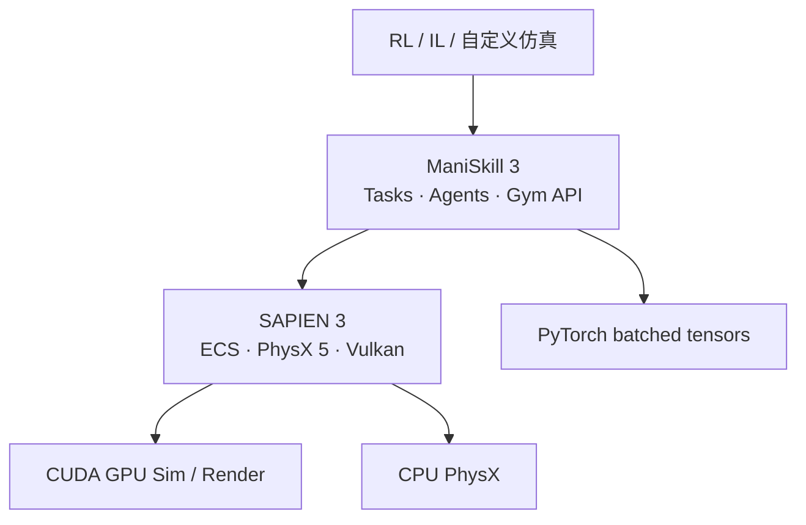

# SAPIEN 与 ManiSkill 技术介绍

> **UCSD · Stanford · SFU**（SAPIEN）· **haosulab**（ManiSkill）  
> 官方仓库：[haosulab/SAPIEN](https://github.com/haosulab/SAPIEN) · [haosulab/ManiSkill](https://github.com/haosulab/ManiSkill)  
> 本地源码：`../code/SAPIEN-master/` · `../code/ManiSkill-main/`  
> SAPIEN：[sapien.ucsd.edu](https://sapien.ucsd.edu/) · ManiSkill：[maniskill.readthedocs.io](https://maniskill.readthedocs.io/)  
> 同目录延伸阅读：[基本使用流程.md](基本使用流程.md) · [ManiSkill任务与API参考.md](ManiSkill任务与API参考.md)

## 1. 概述

**SAPIEN**（**SimulAted Part-based Interactive ENvironment**）是面向 **机器人视觉与交互** 的物理仿真引擎，继承 **ShapeNet / PartNet** 资产与 part-level 语义，强调 **铰接物体**（抽屉、门、水龙头）与 **PhysX** 刚体/关节仿真（见 [SAPIEN readme.md L2–6](../code/SAPIEN-master/readme.md)）。

**ManiSkill** 构建于 SAPIEN 之上，提供 **Gymnasium 标准接口**、统一 **操作技能 benchmark** 与 **GPU 大规模并行** 训练栈（见 [ManiSkill README.md L13–20](../code/ManiSkill-main/README.md)）。ManiSkill 3（Beta，`mani_skill>=3.0.0`）在单卡 **RTX 4090** 上可达：

| 模式 | 吞吐（官方 benchmark） |
|------|------------------------|
| **State 仿真** | **200,000+ FPS** |
| **RGBD + Segmentation 采集** | **30,000+ FPS** |

适合 **RL / IL 高吞吐合成数据**、**sim2real 评测**（Real2Sim 环境）、**异构 domain randomization**（每 env 不同场景/物体）。

**论文**

| 工作 | 会议 / 期刊 |
|------|-------------|
| SAPIEN | [CVPR 2020](https://sapien.ucsd.edu/) |
| ManiSkill2 | [ICLR 2023](https://arxiv.org/abs/2302.04659) |
| ManiSkill3 | [RSS 2025](https://arxiv.org/abs/2410.00425) |

---

## 2. 技术栈关系



| 层 | 职责 | 源码入口 |
|----|------|----------|
| **ManiSkill** | 任务定义、reward、obs_mode、control_mode、baseline、资产下载 | [mani_skill/envs/sapien_env.py](../code/ManiSkill-main/mani_skill/envs/sapien_env.py) · [mani_skill/utils/registration.py](../code/ManiSkill-main/mani_skill/utils/registration.py) |
| **SAPIEN 3** | Entity-Component、Articulation、**SapienRenderer**（光追）、GPU depth | [src/scene.cpp](../code/SAPIEN-master/src/scene.cpp) · [include/sapien/physx/physx_system.h](../code/SAPIEN-master/include/sapien/physx/physx_system.h) · [src/sapien_renderer/](../code/SAPIEN-master/src/sapien_renderer/) |
| **PhysX 5** | CPU / **GPU** 并行刚体（`num_envs > 1` 自动 GPU） | `PhysxSystemCpu` / `PhysxSystemGpu` · [physx_system.h L100–171](../code/SAPIEN-master/include/sapien/physx/physx_system.h) |
| **Vulkan** | 渲染必需（Linux NVIDIA 最佳） | [batched_render_system.cpp](../code/SAPIEN-master/src/sapien_renderer/batched_render_system.cpp) |

**分工**：SAPIEN 提供**仿真后端**（场景、物理、渲染、传感器）；ManiSkill 在其上封装 **Gymnasium 环境、任务库与训练 baseline**，类似 Isaac Sim / Isaac Lab 的分工（见 [§10 与 Isaac 对比](#10-与同类平台对比)）。

---

## 3. SAPIEN 3 核心架构

### 3.1 Entity-Component-System（ECS）

SAPIEN 3 将 SAPIEN 2 的 **Actor** 重构为 **Entity + Components**（[readme.md Change Log 3.0](../code/SAPIEN-master/readme.md)）：

| 概念 | SAPIEN 2 | SAPIEN 3 | 源码 |
|------|----------|----------|------|
| 基本单元 | Actor | **Entity** + **Components** | [entity.cpp L27–55](../code/SAPIEN-master/src/entity.cpp) |
| 物理 | 内嵌于 Actor | `PhysxRigidDynamicComponent` 等 | [physx_system.h](../code/SAPIEN-master/include/sapien/physx/physx_system.h) |
| 渲染 | VulkanRenderer | **SapienRenderer**（+ RT shader） | [sapien_renderer_system.cpp](../code/SAPIEN-master/src/sapien_renderer/sapien_renderer_system.cpp) |
| 场景管理 | Scene | Scene + 多 **System** 注册 | [scene.cpp L29–64](../code/SAPIEN-master/src/scene.cpp) |

`Scene` 通过 `addSystem` 挂载子系统，并提供统一入口：

```cpp
// scene.cpp L55–64
std::shared_ptr<physx::PhysxSystem> Scene::getPhysxSystem() const;
std::shared_ptr<sapien_renderer::SapienRendererSystem> Scene::getSapienRendererSystem() const;
void Scene::step() { getPhysxSystem()->step(); }
void Scene::updateRender() { getSapienRendererSystem()->step(); }
```

Entity 通过 `addComponent` 挂载物理/渲染组件，pose 变更会同步到所有组件（[entity.cpp L34–55](../code/SAPIEN-master/src/entity.cpp)）。

**Builder API 兼容**：Actor Builder / Articulation Builder **大体不变**；visual 的 `color`/`material` 统一为 `material`（[readme.md L59–61](../code/SAPIEN-master/readme.md)）。

### 3.2 PhysX 5 CPU / GPU 仿真

| 类 | 后端 | 关键能力 |
|----|------|----------|
| `PhysxSystemCpu` | CPU | 单 env 射线检测、刚体步进 · [physx_system.h L100–120](../code/SAPIEN-master/include/sapien/physx/physx_system.h) |
| `PhysxSystemGpu` | CUDA | 批量 pose/qpos buffer、CUDA stream 同步 · [physx_system.h L149–219](../code/SAPIEN-master/include/sapien/physx/physx_system.h) |

GPU 系统暴露 `gpuGetArticulationQposCudaHandle()` 等 CUDA 数组句柄，供 Python 侧（ManiSkill）零拷贝读取仿真状态。`isGpu()` 区分后端（[physx_system.h L120、L171](../code/SAPIEN-master/include/sapien/physx/physx_system.h)）。

### 3.3 SapienRenderer 与批量渲染

SAPIEN 2.2 起 `VulkanRenderer` 重命名为 **SapienRenderer**，支持 **ray tracing**、**GPU 立体深度**、**Render Server**（[readme.md L69–73](../code/SAPIEN-master/readme.md)）。

批量相机渲染通过 `BatchedCamera` 实现：多路相机共享分辨率，输出经 **Vulkan-CUDA interop** 写入 `CudaArray`（[batched_render_system.cpp L32–80](../code/SAPIEN-master/src/sapien_renderer/batched_render_system.cpp)）。这是 ManiSkill 3 在 4090 上达到 30k+ FPS 视觉采集的底层基础。

### 3.4 最小仿真示例

官方 `hello_world` 展示 Scene → ActorBuilder → step/render 循环（[hello_world.py L33–61](../code/SAPIEN-master/python/py_package/example/hello_world.py)）：

```python
scene = sapien.Scene()
scene.set_timestep(1 / 100.0)
scene.add_ground(altitude=0)
actor_builder = scene.create_actor_builder()
actor_builder.add_box_collision(half_size=[0.5, 0.5, 0.5])
actor_builder.add_box_visual(half_size=[0.5, 0.5, 0.5], material=[1.0, 0.0, 0.0])
box = actor_builder.build(name="box")
# ...
while not viewer.closed:
    scene.step()
    scene.update_render()
    viewer.render()
```

验证安装：`python -m sapien.exapmle.hello_world`（[readme.md L17–18](../code/SAPIEN-master/readme.md)）。

### 3.5 版本演进

| 版本 | 要点 |
|------|------|
| **SAPIEN 1.x** | PartNet 铰接数据集；CVPR 2020 平台 |
| **SAPIEN 2.x** | Vulkan 渲染；Actor/Articulation Builder |
| **SAPIEN 3** | **ECS**；PhysX 5 **GPU**；[sapien-sim.github.io/docs](https://sapien-sim.github.io/docs/) |

### 3.6 设计定位

SAPIEN 聚焦 **桌面/厨房操作（manipulation）**，**非** 足式 locomotion 主战场（ManiSkill 含四足/人形任务，但引擎优势在 **Franka/Fetch + 铰接场景**）。

---

## 4. ManiSkill 3 架构

### 4.1 仓库结构

| 目录 | 作用 | 代表文件 |
|------|------|----------|
| [mani_skill/envs/](../code/ManiSkill-main/mani_skill/envs/) | 任务环境、`BaseEnv` | [sapien_env.py](../code/ManiSkill-main/mani_skill/envs/sapien_env.py) · [tasks/tabletop/pick_cube.py](../code/ManiSkill-main/mani_skill/envs/tasks/tabletop/pick_cube.py) |
| [mani_skill/agents/](../code/ManiSkill-main/mani_skill/agents/) | 机器人 URDF、控制器 | [agents/robots/panda/panda.py](../code/ManiSkill-main/mani_skill/agents/robots/panda/panda.py) |
| [mani_skill/sensors/](../code/ManiSkill-main/mani_skill/sensors/) | 相机、立体深度 | [camera.py](../code/ManiSkill-main/mani_skill/sensors/camera.py) · [depth_camera.py](../code/ManiSkill-main/mani_skill/sensors/depth_camera.py) |
| [mani_skill/utils/](../code/ManiSkill-main/mani_skill/utils/) | 注册、structs、场景构建 | [registration.py](../code/ManiSkill-main/mani_skill/utils/registration.py) · [structs/](../code/ManiSkill-main/mani_skill/utils/structs/) |
| [examples/baselines/](../code/ManiSkill-main/examples/baselines/) | PPO、ACT、TD-MPC2 等 | [ppo/ppo.py](../code/ManiSkill-main/examples/baselines/ppo/ppo.py) |
| [examples/benchmarking/](../code/ManiSkill-main/mani_skill/examples/benchmarking/) | GPU 吞吐测试 | [gpu_sim.py](../code/ManiSkill-main/mani_skill/examples/benchmarking/gpu_sim.py) |

### 4.2 BaseEnv 与 GPU 并行

`BaseEnv` 是全部任务的基类，继承 `gymnasium.Env`。核心构造参数（[sapien_env.py L45–118](../code/ManiSkill-main/mani_skill/envs/sapien_env.py)）：

| 参数 | 行为 | 源码依据 |
|------|------|----------|
| `num_envs` | `>1` 启用 GPU PhysX；`=1` 默认 CPU | L49–51 |
| `sim_backend` | `"auto"` → 按 `num_envs` 选 CPU/GPU；可强制 `physx_cuda:n` | L95–99 |
| `render_backend` | 默认 GPU 渲染；`"none"` 禁用 | L102–109 |
| `obs_mode` | 自动配置传感器组合 | L53–55 |
| `reconfiguration_freq` | 周期性重建场景（异构 mesh） | L91–93 |

`ManiSkillScene` 管理多个 `sapien.Scene` 子场景，在 GPU 模式下将 API 调用广播到全部 sub-scene，并维护 GPU 状态 buffer（[scene.py L40–69](../code/ManiSkill-main/mani_skill/envs/scene.py)）：

```python
# scene.py L61–69
self.px = self.sub_scenes[0].physx_system
self.gpu_sim_enabled = isinstance(self.px, physx.PhysxGpuSystem)
```

Backend 解析逻辑见 [backend.py L52–107](../code/ManiSkill-main/mani_skill/envs/utils/system/backend.py)：`physx_cuda` → `sapien.Device("cuda")` + `torch.device("cuda")`。

### 4.3 任务注册与典型任务

任务通过 `@register_env` 装饰器注册到 Gymnasium（[registration.py L192–212](../code/ManiSkill-main/mani_skill/utils/registration.py)）。以 `PickCube-v1` 为例（[pick_cube.py L33–44](../code/ManiSkill-main/mani_skill/envs/tasks/tabletop/pick_cube.py)）：

```python
@register_env("PickCube-v1", max_episode_steps=50)
class PickCubeEnv(BaseEnv):
    SUPPORTED_ROBOTS = ["panda", "fetch", "xarm6_robotiq", "so100", "widowxai"]
```

任务需实现 `_load_scene`、`_initialize_episode`、`_get_obs_extra`、`_compute_dense_reward` 等钩子；详见 [ManiSkill任务与API参考.md](ManiSkill任务与API参考.md)。

### 4.4 Gymnasium 接口

```python
import gymnasium as gym
import mani_skill.envs

env = gym.make(
    "PickCube-v1",
    num_envs=16,                    # >1 → GPU 仿真
    obs_mode="rgbd",
    control_mode="pd_ee_delta_pose",
    sim_backend="physx_cuda:0",
)
obs, info = env.reset()
obs, reward, terminated, truncated, info = env.step(env.action_space.sample())
```

`reset` / `step` 返回 **batched torch.Tensor**（CUDA 或 CPU 取决于 backend）。

### 4.5 观测模式（obs_mode）

| 模式 | 说明 |
|------|------|
| `state` | 扁平 privileged 状态（关节、任务 extra） |
| `state_dict` | 分层 dict：`agent` / `extra` |
| `sensor_data` | 原始相机（Color、PositionSegmentation） |
| `rgb` / `depth` / `segmentation` | 可组合，如 `rgb+depth+segmentation` |
| `pointcloud` | 多相机融合点云 |
| `state+rgb` 等 | 任意 modality 组合 |

详见 [Observation 文档](https://maniskill.readthedocs.io/en/latest/user_guide/concepts/observation.html) 与 [sapien_env.py SUPPORTED_OBS_MODES L124](../code/ManiSkill-main/mani_skill/envs/sapien_env.py)。

### 4.6 控制模式（control_mode）

基于 **PD 控制器** + 归一化 action `[-1, 1]`，例如：

| 模式 | 维度 | 说明 |
|------|------|------|
| `pd_joint_delta_pos` | 7 | 关节增量 |
| `pd_ee_delta_pose` | 6 | 末端 **delta 位姿**（轴角旋转） |
| `pd_ee_delta_pos` | 3 | 仅位置 |
| `pd_ee_target_delta_pose` | 6 | 目标位姿累加 |

`control_mode="*"` 注册全部控制器 → action 为 dict。

### 4.7 GPU 并行与异构仿真

| 特性 | 说明 | 源码 |
|------|------|------|
| **num_envs** | 同场景批量并行 | [scene.py](../code/ManiSkill-main/mani_skill/envs/scene.py) |
| **异构 env** | 每 env **不同物体/布局** | `reconfiguration_freq` · [sapien_env.py L91–93](../code/ManiSkill-main/mani_skill/envs/sapien_env.py) |
| **GPUMemoryConfig** | 接触缓冲、collision stack 防 OOM | ManiSkill 文档 GPU Simulation |
| **Benchmark** | `python -m mani_skill.examples.benchmarking.gpu_sim --num-envs=1024` | [gpu_sim.py L19–67](../code/ManiSkill-main/mani_skill/examples/benchmarking/gpu_sim.py) |

### 4.8 Real2Sim / Sim2Real

- **Real2Sim 评测环境**：GPU 上 **100×** 加速真实策略评测（[README.md L19](../code/ManiSkill-main/README.md)）  
- **视觉 sim2real**：domain randomization + 标准视觉任务（PushCube 等）  
- **遥操作 / 演示**：teleop 与 motion planning 示例 · `examples/`  

### 4.9 强化学习 Baseline

| 算法 | 路径 |
|------|------|
| **PPO** | [examples/baselines/ppo/ppo.py](../code/ManiSkill-main/examples/baselines/ppo/ppo.py)（默认 `sim_backend="physx_cuda"`、`num_envs=512`） |
| **ACT / BC** | [examples/baselines/act/](../code/ManiSkill-main/examples/baselines/act/) |
| **TD-MPC2 / SAC** | [examples/baselines/rfcl/](../code/ManiSkill-main/examples/baselines/rfcl/) |
| **Stable-Baselines3** | [examples/baselines/stable_baselines3/example.py](../code/ManiSkill-main/examples/baselines/stable_baselines3/example.py) |

---

## 5. 任务与 Benchmark 概览

ManiSkill2 提出 **Generalizable Manipulation Skills** 统一 benchmark（ICLR 2023）。ManiSkill3 扩展任务族、GPU 栈与 **RoboCasa / ReplicaCAD** 场景。

### 5.1 桌面操作（Tabletop）

| env_id（示例） | 技能 | 源码 |
|----------------|------|------|
| `PickCube-v1` | 抓取立方体 | [pick_cube.py](../code/ManiSkill-main/mani_skill/envs/tasks/tabletop/pick_cube.py) |
| `PushCube-v1` / `PullCube-v1` | 推/拉 | [tasks/tabletop/](../code/ManiSkill-main/mani_skill/envs/tasks/tabletop/) |
| `StackCube-v1` | 堆叠 | 同上 |
| `PegInsertionSide-v1` | 侧向插 peg | 同上 |
| `PlugChargerEnv` | 插充电器 | 同上 |
| `TurnFaucet-v1` | 旋转水龙头 | 同上 |
| `AssemblingKits-v1` | 套件组装 | 同上 |

### 5.2 移动操作（Mobile Manipulation）

| env_id | 说明 |
|--------|------|
| `OpenCabinetDoor-v1` / `OpenCabinetDrawer-v1` | Fetch 开柜 |
| `RoboCasaKitchen-v1` | RoboCasa 厨房布局 |

### 5.3 灵巧 / 多指 / 双臂

| env_id | 说明 |
|--------|------|
| `RotateSingleObjectInHand-v1` | Allegro 手内旋转 |
| `TwoRobotPickCube-v1` | 双臂协作 |
| `SO100GraspCube-v1` | 低成本 SO100 臂 |

### 5.4 运动 / 四足 / 人形

| env_id | 说明 |
|--------|------|
| `UnitreeH1Stand-v1` / `HumanoidRun-v1` | 人形 · [tasks/humanoid/](../code/ManiSkill-main/mani_skill/envs/tasks/humanoid/) |
| `AnymalC-Reach-v1` | 四足 |

### 5.5 场景级操作

| env_id | 说明 |
|--------|------|
| `SceneManipulation-v1` | **ReplicaCAD** 等 scene builder · [scenes/base_env.py](../code/ManiSkill-main/mani_skill/envs/scenes/base_env.py) |

完整列表见 [ManiSkill任务与API参考.md](ManiSkill任务与API参考.md) 与 [API envs](https://maniskill.readthedocs.io/en/latest/api/mani_skill/envs/index.html)。

---

## 6. 支持的机器人（Agents）

代码目录：[mani_skill/agents/robots/](../code/ManiSkill-main/mani_skill/agents/robots/)

| 机器人 | 典型任务 | 源码 |
|--------|----------|------|
| **Panda** / PandaWristCam | 桌面操作 benchmark 默认 | [panda/panda.py](../code/ManiSkill-main/mani_skill/agents/robots/panda/panda.py) |
| **Fetch** | 移动操作、开柜 | [fetch/fetch.py](../code/ManiSkill-main/mani_skill/agents/robots/fetch/fetch.py) |
| **XArm6 + Robotiq** | PickCube 等 | [xarm6/](../code/ManiSkill-main/mani_skill/agents/robots/) |
| **SO100** | 低成本抓取 | [so100/](../code/ManiSkill-main/mani_skill/agents/robots/) |
| **Allegro / DClaw** | in-hand 操作 | [allegro/](../code/ManiSkill-main/mani_skill/agents/robots/) |
| **Unitree H1 / G1** | 人形 | [unitree/](../code/ManiSkill-main/mani_skill/agents/robots/) |
| **ANYmal-C** | 四足 | [anymal_c/](../code/ManiSkill-main/mani_skill/agents/robots/) |

```bash
python -m mani_skill.examples.demo_vis_textures -r panda
```

---

## 7. 系统支持

| 系统 / GPU | CPU Sim | GPU Sim | Rendering | 依据 |
|------------|---------|---------|-----------|------|
| **Linux + NVIDIA** | ✅ | ✅ | ✅ | [README.md L56–62](../code/ManiSkill-main/README.md) |
| Windows + NVIDIA | ✅ | ❌ | ✅ | 同上 |
| Windows + AMD | ✅ | ❌ | ✅ | 同上 |
| WSL | ✅ | ❌ | ❌ | 同上 |
| macOS | ✅ | ❌ | ✅ | [backend.py L73–78](../code/ManiSkill-main/mani_skill/envs/utils/system/backend.py) 强制 `sapien_cpu` |

**推荐**：Linux + NVIDIA GPU + Vulkan。GPU 仿真 **不支持 Windows**（SAPIEN 限制）。

---

## 8. 许可与构建

| 项目 | 许可 | 说明 |
|------|------|------|
| **SAPIEN 引擎** | **Apache-2.0** | [SAPIEN 源码 LICENSE](../code/SAPIEN-master/) |
| **ManiSkill 代码** | **Apache-2.0** | [README.md L90–92](../code/ManiSkill-main/README.md) |
| **ManiSkill 资产** | [CC BY-NC 4.0](https://creativecommons.org/licenses/by-nc/4.0/legalcode) | 任务 mesh、YCB 等 |

**从源码构建 SAPIEN**（一般用户 pip 即可）：

1. `git submodule update --init --recursive`（[readme.md L191](../code/SAPIEN-master/readme.md)）  
2. 推荐 Docker：`./scripts/docker_build_wheels.sh` · [docker/Dockerfile](../code/SAPIEN-master/docker/Dockerfile)  
3. PhysX 需预编译为静态库（clang-9）后再构建镜像  

**ManiSkill 源码安装**：`git clone` → `pip install -e .`（见 [基本使用流程.md](基本使用流程.md)）。

---

## 9. ManiSkill 2 vs 3

| 项目 | ManiSkill 2 | ManiSkill 3 |
|------|-------------|-------------|
| SAPIEN | 2.x | **3.x ECS + GPU PhysX** |
| 并行 | 有限 | **`num_envs` GPU 异构** |
| 接口 | Gym | **Gymnasium** |
| 旧代码 | [v0.5.3 tag](https://github.com/haosulab/ManiSkill/tree/v0.5.3) | main / pip `mani_skill` |

新研究 **优先 ManiSkill 3**；复现 ManiSkill2 论文用 v0.5.3。

---

## 10. 与同类平台对比

| 维度 | SAPIEN/ManiSkill | Isaac Lab | AI2-THOR | BEHAVIOR/OmniGibson |
|------|------------------|-----------|----------|---------------------|
| **吞吐** | **极高**（GPU batch） | 高 | 中 | 中低 |
| **铰接/PartNet** | ✅ 核心优势 | URDF/USD | Unity 状态 | USD 9000+ 物体 |
| **流体/布料** | 刚性为主 | PhysX 扩展 | 有限 | ✅ |
| **接口** | Gymnasium + Torch | Gym / Manager | 自定义 Controller | og.Environment |
| **开源** | Apache-2.0 | 部分 NVIDIA 依赖 | MIT | 数据集加密 |
| **定位** | **操作 RL benchmark** | 工业数字孪生 | 室内 AI | 1000 家务 BDDL |

`embodied-platforms/总体介绍.md` 将 ManiSkill 3 列为 **操作 RL 首选** 之一。

---

## 11. 官方仓库索引

| 用途 | SAPIEN | ManiSkill |
|------|--------|-----------|
| 项目说明 | [readme.md](../code/SAPIEN-master/readme.md) | [README.md](../code/ManiSkill-main/README.md) |
| 入门示例 | [hello_world.py](../code/SAPIEN-master/python/py_package/example/hello_world.py) | [examples/tutorials/1_quickstart.ipynb](https://colab.research.google.com/github/haosulab/ManiSkill/blob/main/examples/tutorials/1_quickstart.ipynb) |
| 环境基类 | [scene.cpp](../code/SAPIEN-master/src/scene.cpp) | [sapien_env.py](../code/ManiSkill-main/mani_skill/envs/sapien_env.py) |
| GPU 物理 | [physx_system.h](../code/SAPIEN-master/include/sapien/physx/physx_system.h) | [scene.py](../code/ManiSkill-main/mani_skill/envs/scene.py) |
| GPU 渲染 | [batched_render_system.cpp](../code/SAPIEN-master/src/sapien_renderer/batched_render_system.cpp) | [sensors/camera.py](../code/ManiSkill-main/mani_skill/sensors/camera.py) |
| 任务注册 | — | [registration.py](../code/ManiSkill-main/mani_skill/utils/registration.py) |
| 自定义任务模板 | — | [envs/template.py](../code/ManiSkill-main/mani_skill/envs/template.py) |
| GPU Benchmark | — | [gpu_sim.py](../code/ManiSkill-main/mani_skill/examples/benchmarking/gpu_sim.py) |
| PPO Baseline | — | [baselines/ppo/ppo.py](../code/ManiSkill-main/examples/baselines/ppo/ppo.py) |
| Docker 构建 | [docker/Dockerfile](../code/SAPIEN-master/docker/Dockerfile) | [maniskill/base](https://hub.docker.com/r/maniskill/base) |
| 在线文档 | [sapien-sim.github.io/docs](https://sapien-sim.github.io/docs/) | [maniskill.readthedocs.io](https://maniskill.readthedocs.io/) |

---

## 12. 本地文档索引

| 文档 | 内容 |
|------|------|
| [基本使用流程.md](基本使用流程.md) | pip、Vulkan、资产、GPU benchmark、RL baseline |
| [ManiSkill任务与API参考.md](ManiSkill任务与API参考.md) | 任务表、obs/control、SAPIEN 3 API、自定义任务 |

---

## 13. 资源与引用

| 资源 | URL |
|------|-----|
| SAPIEN 官网 | https://sapien.ucsd.edu/ |
| SAPIEN 3 文档 | https://sapien-sim.github.io/docs/ |
| ManiSkill 文档 | https://maniskill.readthedocs.io/ |
| Quickstart | https://maniskill.readthedocs.io/en/latest/user_guide/getting_started/quickstart.html |
| Colab 教程 | [1_quickstart.ipynb](https://colab.research.google.com/github/haosulab/ManiSkill/blob/main/examples/tutorials/1_quickstart.ipynb) |
| WandB baselines | ManiSkill 文档 RL 章节 |
| Docker | `maniskill/base` |

```bibtex
@article{taomaniskill3,
  title={ManiSkill3: GPU Parallelized Robotics Simulation and Rendering for Generalizable Embodied AI},
  author={Stone Tao and Fanbo Xiang and others},
  journal={Robotics: Science and Systems},
  year={2025}
}

@inproceedings{gu2023maniskill2,
  title={ManiSkill2: A Unified Benchmark for Generalizable Manipulation Skills},
  author={Gu, Jiayuan and others},
  booktitle={ICLR},
  year={2023}
}

@inproceedings{xiang2020sapien,
  title={SAPIEN: A SimulAted Part-based Interactive ENvironment},
  author={Xiang, Fanbo and others},
  booktitle={CVPR},
  year={2020}
}
```

---

*基于本地源码 `code/SAPIEN-master` · `code/ManiSkill-main` 与官方文档编写。*
