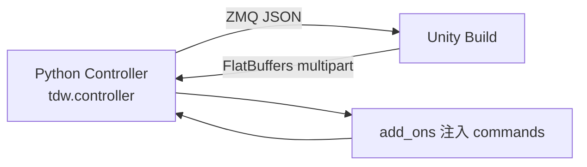

# ThreeDWorld (TDW) 技术介绍

> **MIT**（CBBM、McDermott Lab 等）· Unity Build + Python Controller · 多模态物理仿真  
> 官网：[threedworld.org](https://www.threedworld.org/) · 仓库：[threedworld-mit/tdw](https://github.com/threedworld-mit/tdw) · 许可：**MIT**  
> **本地源码**：`embodied-platforms/code/tdw-master/`（与官方 master 同步；下文链接默认指向 GitHub）

## 1. 概述

**ThreeDWorld (TDW)** 是 NeurIPS 2021 **Datasets & Benchmarks** 发布的 **通用多模态物理仿真平台**，可在丰富 3D 环境中模拟 **移动 agent 与物体** 的高保真 **视觉 + 音频 + 物理** 交互。

| 维度 | TDW 特点 |
|------|----------|
| **跨模态同等地位** | 视觉与听觉均为一等公民；**Clatter** 物理驱动 impact/scrape 音效 |
| **材质物理 breadth** | PhysX 刚体 + **NVIDIA Flex** 软体/布料/流体 + **Obi** 粒子流体 |
| **API 粒度** | 200+ **命令式** JSON 指令 + **Add-on** 高层封装 |
| **人类被试** | VR（Oculus Touch / Leap Motion）、键盘鼠标 FirstPersonAvatar |
| **程序化场景** | Floorplan、**ProcGenKitchen**、室外场景、Asset Bundle 资产库 |

论文：[ThreeDWorld (NeurIPS 2021 D&B)](https://openreview.net/forum?id=db1InWAwW2T) · [arXiv:2007.04954](https://arxiv.org/abs/2007.04954)

> **维护状态**：官方仓库已进入 **LTS** 模式（[PR #709](https://github.com/threedworld-mit/tdw/pull/709)），仅 minor 更新与 bug fix。

---

## 2. 仓库结构（Python 侧）

本地快照：`code/tdw-master/`（1200+ 文件）。Build 为 Unity 编译产物，由 `pip install tdw` 自动下载；**Controller 与 Add-on 源码** 在 `Python/tdw/`：

| 路径 | 作用 | GitHub |
|------|------|--------|
| [`Python/tdw/controller.py`](https://github.com/threedworld-mit/tdw/blob/master/Python/tdw/controller.py) | **`Controller`**：ZMQ socket、Build 启动、`communicate()` | 核心 |
| [`Python/tdw/tdw_utils.py`](https://github.com/threedworld-mit/tdw/blob/master/Python/tdw/tdw_utils.py) | `create_empty_room`、`save_images`、spawn 辅助 | |
| [`Python/tdw/add_ons/`](https://github.com/threedworld-mit/tdw/tree/master/Python/tdw/add_ons) | 40+ Add-on：`Replicant`、`Clatter`、`Floorplan`、`ImageCapture`… | |
| [`Python/tdw/replicant/actions/`](https://github.com/threedworld-mit/tdw/tree/master/Python/tdw/replicant/actions) | `MoveBy`、`Grasp`、`ReachFor` 等 action 状态机 | |
| [`Python/tdw/output_data/`](https://github.com/threedworld-mit/tdw/tree/master/Python/tdw/output_data) | FlatBuffers 反序列化：`Images`、`Transforms`、`Rigidbodies` | |
| [`Python/tdw/librarian.py`](https://github.com/threedworld-mit/tdw/blob/master/Python/tdw/librarian.py) | `ModelLibrarian`、`SceneLibrarian` 资产查询 | |
| [`Python/tdw/physics_audio/`](https://github.com/threedworld-mit/tdw/tree/master/Python/tdw/physics_audio) | Clatter 材质、`ClatterObject`、`ImpactMaterial` | |
| [`Python/example_controllers/`](https://github.com/threedworld-mit/tdw/tree/master/Python/example_controllers) | 按主题分类的示例控制器 | |
| [`Documentation/lessons/`](https://github.com/threedworld-mit/tdw/tree/master/Documentation/lessons) | 官方教程树 | |
| [`Documentation/api/command_api.md`](https://github.com/threedworld-mit/tdw/blob/master/Documentation/api/command_api.md) | 200+ 命令全文 | |

[`setup.py`](https://github.com/threedworld-mit/tdw/blob/master/Python/setup.py) 依赖：`pyzmq`、`numpy`、`scipy`、`pillow`、`boto3`（Build 下载）、`ikpy`（Replicant IK）等。

---

## 3. 系统架构：Build + Controller



### 3.1 Controller 初始化

默认 **端口 1071**；`launch_build=True` 时通过 [`Update.check_for_update`](https://github.com/threedworld-mit/tdw/blob/master/Python/tdw/backend/update.py) 下载/启动匹配版本 Build：

```47:74:embodied-platforms/code/tdw-master/Python/tdw/controller.py
    def __init__(self, port: int = 1071, check_version: bool = True, launch_build: bool = True):
        self.add_ons: List[AddOn] = list()
        if check_version:
            can_launch_build = Update.check_for_update(download_build=launch_build)
        # ...
        if launch_build and can_launch_build:
            Controller.launch_build(port=port)
        context = zmq.Context()
        self.socket = context.socket(zmq.REP)
        self.socket.bind('tcp://*:' + str(port))
```

首帧 `communicate` 加载 `ProcGenScene` 并 `send_version` 校验 **Python 模块版本 = Build 版本**。

### 3.2 `communicate()` 与 Add-on

每帧流程（[`controller.py` L98–136](https://github.com/threedworld-mit/tdw/blob/master/Python/tdw/controller.py)）：

1. 未初始化 add-on → 追加 `get_initialization_commands()`  
2. 已初始化 add-on → 追加 `m.commands`（由上一帧 `on_send(resp)` 产生）  
3. `before_send(commands)` 钩子  
4. `json.dumps(commands)` → ZMQ `send_multipart`  
5. 接收 FlatBuffers `resp`；遇 `ftre`（FailedToReceive）自动重发（最多 1000 次）

**Add-on 设计**（[`add_on.py`](https://github.com/threedworld-mit/tdw/blob/master/Python/tdw/add_ons/add_on.py)）：等价于 Command API 的常用封装——**无 add-on 做不到的事**，但降低样板代码。

### 3.3 命令与 Output 模型

- **Command**：`{"$type": "set_screen_size", "width": 1024, ...}`  
- **Output**：默认仅帧号；需 `send_images` / `send_transforms` 等显式订阅  
- 类型识别：`OutputData.get_data_type_id(resp[i])` → `"imag"` / `"tran"` / `"rigi"` 等

---

## 4. 核心能力

### 4.1 视觉

PBR + HDRI、`InteriorSceneLighting`；pass：`_img`、`_id`、`_category`、`_depth`、`_flow`、`_normals`、`_albedo`、`_mask`。  
大规模合成：[alters-mit/tdw_image_dataset](https://github.com/alters-mit/tdw_image_dataset)（默认 130 万 train 图）。

### 4.2 音频（Clatter）

[`Clatter`](https://github.com/threedworld-mit/tdw/blob/master/Python/tdw/add_ons/clatter.py) Add-on 封装 McDermott Lab 感知驱动 **impact / scrape / roll** 合成：

```13:16:embodied-platforms/code/tdw-master/Python/tdw/add_ons/clatter.py
class Clatter(AddOn):
    """
    Initialize [Clatter](../../lessons/clatter/overview.md) in TDW.
    """
```

关键参数：`simulation_amp`、`min_collision_speed`、`scrape_angle`、`resonance_audio`（空间化）。论文 TDW-Sound：Sound-20K 材质分类 **0.34 → 0.66**（TDW 预训练后）。

### 4.3 物理栈

| 引擎 | 用途 |
|------|------|
| **PhysX** | 刚体、Robot 关节、Replicant 碰撞推动 |
| **NVIDIA Flex** | 软体/布/流体（Linux 需高端 NVIDIA GPU；已停更） |
| **Obi** | 流体/风/布替代路径 |

高级物理数据集：[alters-mit/tdw_physics](https://github.com/alters-mit/tdw_physics) → `.hdf5` trial。

### 4.4 语义状态

**无 AI2-THOR 式内置 FSM**；需 `Raycast` / `Overlap` / `ContainerManager` / `TriggerCollisionManager` + 自定义阈值（见 [openness 教程](https://github.com/threedworld-mit/tdw/tree/master/Documentation/lessons/semantic_states)）。

---

## 5. Agent 与交互

### 5.1 Replicant

[`Replicant`](https://github.com/threedworld-mit/tdw/blob/master/Python/tdw/add_ons/replicant.py) 类文档：

> A Replicant is an able-bodied human-like agent … **pseudo-physics** … movements are driven by **non-physics animation** … can walk, turn, reach, grasp, drop, turn its head.

初始化注入 `add_replicant_rigidbody` + IK 空物体（L33–44）。**非 avatar**，不可用 avatar 相机命令。

| 方法 | 对应 action 类 |
|------|----------------|
| `move_by` / `move_to` | [`MoveBy`](https://github.com/threedworld-mit/tdw/blob/master/Python/tdw/replicant/actions/move_by.py) |
| `grasp` / `drop` | `Grasp` / `Drop` |
| `reach_for` | `ReachFor` / `ReachForWithPlan` |

动作仅 **启动**；须循环 `communicate([])` 直至 `ActionStatus` 非 `ongoing`（见 [基本使用流程.md](基本使用流程.md) §6）。

### 5.2 其他 Agent

| 类型 | 源码 / 仓库 |
|------|-------------|
| **Robot / RobotArm** | [`add_ons/robot.py`](https://github.com/threedworld-mit/tdw/blob/master/Python/tdw/add_ons/robot.py) |
| **Magnebot** | [alters-mit/magnebot](https://github.com/alters-mit/magnebot) |
| **Vehicle / Drone** | `add_ons/vehicle.py`、`drone.py` |
| **VR** | `add_ons/vr.py`、`oculus_touch.py` |

---

## 6. 场景与资产

| 方式 | Add-on / API |
|------|--------------|
| 空房间 | `TDWUtils.create_empty_room(w, l)` → `create_exterior_walls` |
| Floorplan | [`Floorplan.init_scene(scene, layout)`](https://github.com/threedworld-mit/tdw/blob/master/Python/tdw/add_ons/floorplan.py) — `1a–5c` × layout `0–2` |
| ProcGenKitchen | [`ProcGenKitchen`](https://github.com/threedworld-mit/tdw/blob/master/Python/tdw/add_ons/proc_gen_kitchen.py) |
| 流式场景 | `add_scene` + `SceneLibrarian` |
| 自定义 | Asset Bundle Creator；ShapeNet / URDF composite |

资产托管 S3；`ModelLibrarian` 读取 `models_core.json` / `models_full.json` / `models_flex.json`。

---

## 7. 官方数据集

| 数据集 | 规模 | 工具 |
|--------|------|------|
| **TDW-Image** | 130 万 train + 5 万 val | [tdw_image_dataset](https://github.com/alters-mit/tdw_image_dataset) |
| **TDW-Sound** | 5 材质 × 多物体 × 多 drop 高度 | Clatter 录制 |
| **TDW-Physics / Physion** | 刚体/软体/布/流体 + RGB/depth/audio | [tdw_physics](https://github.com/alters-mit/tdw_physics) |

论文 Table 2：TDW-Image 预训练 ResNet-50 细粒度 **0.76**，接近 ImageNet **0.78**。

---

## 8. 与同类平台对比

| 维度 | TDW | AI2-THOR | Habitat | ManiSkill |
|------|-----|----------|---------|-----------|
| 物理驱动音频 | ✅ Clatter | ❌ | ❌ | ❌ |
| 流体/布料 | ✅ Flex/Obi | 有限 | 有限 | 刚体为主 |
| 语义状态机 | 需自建 | ✅ | 任务定义 | reward |
| API | JSON + add-on | step(action) | habitat.Env | Gymnasium |
| RL 吞吐 | 中等 | 中等 | **极高** | **GPU 极高** |
| 维护 | **LTS** | 活跃 | 活跃 | 活跃 |

**选型**：视听联合 / 材质从声音推断 → **TDW**；大规模操作 RL → ManiSkill / Isaac；开冰箱烹饪状态 → AI2-THOR / BEHAVIOR。

---

## 9. 相关仓库

| 仓库 | 用途 |
|------|------|
| [threedworld-mit/tdw](https://github.com/threedworld-mit/tdw) | 主平台 |
| [alters-mit/tdw_image_dataset](https://github.com/alters-mit/tdw_image_dataset) | TDW-Image |
| [alters-mit/tdw_physics](https://github.com/alters-mit/tdw_physics) | Physion / HDF5 |
| [alters-mit/magnebot](https://github.com/alters-mit/magnebot) | Magnebot |
| [alters-mit/clatter](https://github.com/alters-mit/clatter) | Clatter C# 库 |

---

## 10. 文档导航（本站）

| 文档 | 内容 |
|------|------|
| [基本使用流程.md](基本使用流程.md) | pip、首跑、图像、Floorplan、Replicant、远程 Build、FAQ |
| [多模态感知与数据集参考.md](多模态感知与数据集参考.md) | Command/Output、Clatter、Replicant 状态机、tdw_physics、Add-on 索引 |

**官方**：[Documentation/lessons](https://github.com/threedworld-mit/tdw/tree/master/Documentation/lessons) · [example_controllers](https://github.com/threedworld-mit/tdw/tree/master/Python/example_controllers)
