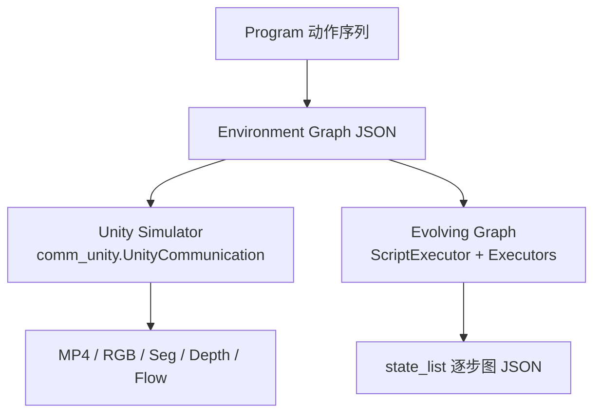

# VirtualHome 技术介绍

> **MIT · Stanford HCI · NVIDIA 等** · Unity + 符号环境图 · 家庭活动程序仿真  
> 官方：[xavierpuigf/virtualhome](https://github.com/xavierpuigf/virtualhome) · [virtual-home.org](http://virtual-home.org) · 许可：**MIT**  
> **本地源码**：`embodied-platforms/code/virtualhome-master/`（与官方 master 同步；下文链接默认指向 GitHub）

## 1. 概述

**VirtualHome** 用 **程序（Program）** + **环境图（Environment Graph）** 表示家庭活动，在 3D 公寓中模拟 **行走、抓取、开关电器、开容器、放入/取出** 等 long-horizon 交互，并支持 **多智能体并行** 与人类协作 benchmark。

官方 README 概括三大组件（见 [`README.md`](https://github.com/xavierpuigf/virtualhome/blob/master/README.md)）：

| 组件 | 含义 |
|------|------|
| **Agents** | NavMesh + FinalIK 人形 avatar，可多 agent 同场景 |
| **Programs** | 动作序列：`<char0> [Action] <object> (id)`，`|` 分隔并行 |
| **Environment** | 图 JSON：节点属性/状态 + 边关系 |

与 **ManiSkill / Isaac** 等低层连续控制不同，VirtualHome 核心是 **活动级符号抽象**：

```
<char0> [walk] <microwave> (23)
<char0> [open] <microwave> (23)
<char0> [putin] <salmon> (45) <microwave> (23)
```

Unity 侧渲染动画；**Evolving Graph** 侧在纯 Python 中传播图状态（更快，动作集更全）。

| 维度 | VirtualHome 特点 |
|------|------------------|
| **Program + Graph** | 活动 = 动作序列 + 初始/演化环境 JSON |
| **双模拟器** | Unity（视频/GT）+ Evolving Graph（图轨迹/规划） |
| **多 agent** | `\|` 同行并行；VH-Social / WAH |
| **RL 接口** | `UnityEnvironment`（Gym 风格）；`skip_animation` 加速 |
| **v2.3** | **50** 场景 + 程序化生成；昼夜、室外、可选 gravity |

论文：[CVPR 2018](https://arxiv.org/abs/1806.07011) · [Watch-And-Help](https://arxiv.org/abs/2010.09890) · [Activity Sketches CVPR 2019](https://openaccess.thecvf.com/content_CVPR_2019/papers/Liao_Synthesizing_Environment-Aware_Activities_via_Activity_Sketches_CVPR_2019_paper.pdf)

---

## 2. 仓库结构（Python 侧）

本地快照：`code/virtualhome-master/`（195+ 文件）。核心目录：

| 路径 | 作用 | GitHub |
|------|------|--------|
| [`simulation/unity_simulator/comm_unity.py`](https://github.com/xavierpuigf/virtualhome/blob/master/simulation/unity_simulator/comm_unity.py) | **`UnityCommunication`**：HTTP JSON → Unity 可执行文件 | 底层 API |
| [`simulation/unity_simulator/communication.py`](https://github.com/xavierpuigf/virtualhome/blob/master/simulation/unity_simulator/communication.py) | `UnityLauncher`：启动 executable、batchmode、X display | |
| [`simulation/environment/unity_environment.py`](https://github.com/xavierpuigf/virtualhome/blob/master/simulation/environment/unity_environment.py) | **`UnityEnvironment`**：Gym `reset`/`step`、离散 RL 动作 | |
| [`simulation/environment/utils.py`](https://github.com/xavierpuigf/virtualhome/blob/master/simulation/environment/utils.py) | `convert_action`、前置条件检查 `can_perform_action` | |
| [`simulation/evolving_graph/`](https://github.com/xavierpuigf/virtualhome/tree/master/simulation/evolving_graph) | 纯 Python 图模拟：`scripts.py`、`execution.py` | |
| [`simulation/evolving_graph/scripts.py`](https://github.com/xavierpuigf/virtualhome/blob/master/simulation/evolving_graph/scripts.py) | `Action` 枚举、程序解析 `read_script` | |
| [`simulation/evolving_graph/execution.py`](https://github.com/xavierpuigf/virtualhome/blob/master/simulation/evolving_graph/execution.py) | `WalkExecutor`、`GrabExecutor` 等 **40+ Executor** | |
| [`dataset_utils/`](https://github.com/xavierpuigf/virtualhome/tree/master/dataset_utils) | 数据集对齐、增广、`execute_script_utils` | |
| [`resources/`](https://github.com/xavierpuigf/virtualhome/tree/master/resources) | `properties_data*.json`、`class_name_equivalence.json` | |
| [`demo/`](https://github.com/xavierpuigf/virtualhome/tree/master/demo) | `unity_demo.ipynb`、`generate_video.py` | |
| [`helper_scripts/`](https://github.com/xavierpuigf/virtualhome/tree/master/helper_scripts) | `download_dataset.sh`、`startx.py` | |

Unity 可执行文件不在 git 内，需下载至 `simulation/unity_simulator/`（见 [基本使用流程.md](基本使用流程.md)）。

---

## 3. 双模拟器架构



| 模拟器 | 实现 | 输出 | 源码入口 |
|--------|------|------|----------|
| **Unity** | Unity Build + HTTP API | 视频、分割/深度/光流、姿态 | [`UnityCommunication`](https://github.com/xavierpuigf/virtualhome/blob/master/simulation/unity_simulator/comm_unity.py) |
| **Evolving Graph** | 纯 Python | 图序列、规划、数据集 `state_list` | [`ScriptExecutor`](https://github.com/xavierpuigf/virtualhome/blob/master/simulation/evolving_graph/execution.py) |

> **注意**：`scripts.Action` 枚举含 **Wash / Pour / Cut / Lie / PlugIn** 等（L9–58），部分 **仅在 Evolving Graph 完整实现**；Unity 为子集（见 [程序图谱与数据集参考.md](程序图谱与数据集参考.md) §3）。

标准 Unity 流程：

1. `comm.reset(scene_id)` — 加载场景  
2. （可选）`comm.expand_scene(graph)` — 写回修改后的图  
3. `comm.add_character(...)` — 添加 agent  
4. `comm.render_script(script, skip_animation=..., image_synthesis=...)` — 执行程序  

`UnityCommunication` 通过 `post_command` 向 `http://127.0.0.1:8080` 发送 JSON（`action`: `reset` / `render_script` / `expand_scene` 等）。

---

## 4. 核心概念

### 4.1 Program（程序）

- API 格式：`<char{id}> [action] <object_name> (object_id) [第二个物体...]`  
- 数据集 `.txt`：`[WALK] <glass> (1)`（无 char 前缀，执行前绑定 char0）  
- 示例脚本见 [`demo/example_scripts/example_script_1.txt`](https://github.com/xavierpuigf/virtualhome/blob/master/demo/example_scripts/example_script_1.txt)：

```1:8:embodied-platforms/code/virtualhome-master/demo/example_scripts/example_script_1.txt

[Find] <plate> (1)
[Grab] <plate> (1)
[Find] <microwave> (1)
[Open] <microwave> (1)
[PutIn] <plate> (1) <microwave> (1)
[SwitchOn] <microwave> (1)
```

Evolving Graph 用 `read_script()` 解析为 `ScriptLine`，每行绑定 `Action` 枚举成员（[`scripts.py`](https://github.com/xavierpuigf/virtualhome/blob/master/simulation/evolving_graph/scripts.py)）。

### 4.2 Environment Graph

JSON：`nodes[]`（`id`, `class_name`, `states`, `properties`, `bounding_box`…）+ `edges[]`（`ON`, `INSIDE`, `CLOSE`, `HOLDS_RH/LH`, `SITTING`…）。

读取/写入：

```python
success, graph = comm.environment_graph()
success, msg = comm.expand_scene(modified_graph)
```

### 4.3 Agent 与 RL

`UnityEnvironment` 默认 **2 agent**，离散动作表（源码 L52–62）：

```52:62:embodied-platforms/code/virtualhome-master/simulation/environment/unity_environment.py
        self.actions_available = [
            'turnleft',
            'walkforward',
            'turnright',
            'walktowards',
            'open',
            'close',
            'put',
            'grab',
            'no_action'
        ]
```

`step()` 将 `action_dict` 经 `convert_action` 转为 script 行，并 **`skip_animation=True`** 调用 `render_script`（RL 训练必开）：

```123:138:embodied-platforms/code/virtualhome-master/simulation/environment/unity_environment.py
    def step(self, action_dict):
        script_list = utils_environment.convert_action(action_dict)
        if len(script_list[0]) > 0:
            # ...
                success, message = self.comm.render_script(script_list,
                                                           recording=False,
                                                           gen_vid=False,
                                                           skip_animation=True)
```

`reward()` 默认为占位（返回 0），自定义任务需子类化。

---

## 5. 能力矩阵

### 5.1 动作层级

| 层级 | Unity 示例 | Graph 额外 |
|------|------------|------------|
| 导航 | Walk, Run, WalkTowards, TurnLeft/Right | Find |
| 操纵 | Grab, Open, Close, PutBack, PutIn, SwitchOn/Off | — |
| 姿态 | Sit, StandUp | Lie, Sleep, WakeUp |
| 家务扩展 | Drink, Touch | Wash, Pour, Cut, Eat, PlugIn, Move, Watch… |

Graph 侧 `Action` 枚举完整列表见 [`scripts.py` L9–59](https://github.com/xavierpuigf/virtualhome/blob/master/simulation/evolving_graph/scripts.py)。

### 5.2 感知与 Ground Truth

`camera_image(..., mode=...)` 支持：`normal`, `seg_inst`, `seg_class`, `depth`, `flow`, `albedo` 等（[`comm_unity.py` L320–326](https://github.com/xavierpuigf/virtualhome/blob/master/simulation/unity_simulator/comm_unity.py)）。

`render_script` 的 `image_synthesis` 参数可逐步输出多模态帧。

### 5.3 v2.3 环境

- 场景 **0–49** + 程序化生成  
- `set_time` / `activate_physics` / `remove_terrain`（API 见 `comm_unity.py`）

---

## 6. 数据集与 Benchmark

主包：`programs_processed_precond_nograb_morepreconds` — 一键 [`helper_scripts/download_dataset.sh`](https://github.com/xavierpuigf/virtualhome/blob/master/helper_scripts/download_dataset.sh)：

```bash
wget .../programs_processed_precond_nograb_morepreconds.zip
# 解压至 dataset/
```

目录结构见 [`README.md` § Dataset](https://github.com/xavierpuigf/virtualhome/blob/master/README.md) 与 [`dataset/README.md`](https://github.com/xavierpuigf/virtualhome/blob/master/dataset/README.md)。

**Watch-And-Help**：Alice 演示 + Bob 协作；250 step；指标 Success / Speedup / Reward R（详见 [程序图谱与数据集参考.md](程序图谱与数据集参考.md) §7）。

增广脚本：[`dataset_utils/augment_dataset_locations.py`](https://github.com/xavierpuigf/virtualhome/blob/master/dataset_utils/augment_dataset_locations.py)（KB-RealEnv）、[`augment_dataset_exceptions.py`](https://github.com/xavierpuigf/virtualhome/blob/master/dataset_utils/augment_dataset_exceptions.py)（KB-ExceptionHandler）。

---

## 7. 与同类平台对比

| 维度 | VirtualHome | AI2-THOR | CHALET | TDW |
|------|-------------|----------|--------|-----|
| 符号程序层 | ✅ 核心 | step(action) | 语言+规划 | JSON 命令 |
| 环境表示 | **显式 graph** | Object metadata | 房间图 | FlatBuffers |
| 多 agent | ✅ `\|` 语法 | multi-agent | CHAI | Replicant |
| 双后端 | Unity + Python Graph | Unity only | Unity | 自研 |

**选型**：程序/图规划/多 agent 协作 → VirtualHome；机械臂与物体状态 API → AI2-THOR / BEHAVIOR；视听物理 → TDW。

---

## 8. 版本与生态

| 版本 | 要点 |
|------|------|
| **v1.0** | CVPR 2018；`TrimmedTestScene1–7` |
| **VH-Social / v2.x** | 多 agent、`UnityEnvironment`、`skip_animation` |
| **v2.3** | 50 场景、proc-gen、昼夜、物理 |

- Unity 源码修改：[virtualhome_unity](https://github.com/xavierpuigf/virtualhome_unity)  
- Colab：[unity_demo.ipynb](https://colab.research.google.com/github/xavierpuigf/virtualhome/blob/master/demo/unity_demo.ipynb)

---

## 9. 文档导航（本站）

| 文档 | 内容 |
|------|------|
| [基本使用流程.md](基本使用流程.md) | pip/Build、`UnityCommunication`、`render_script`、Docker、RL env |
| [程序图谱与数据集参考.md](程序图谱与数据集参考.md) | 语法、Graph schema、Executor、数据集、WAH、resources |

**官方文档**：[Actions KB](http://virtual-home.org/documentation/master/kb/actions.html) · [simulation/README.md](https://github.com/xavierpuigf/virtualhome/blob/master/simulation/README.md)
