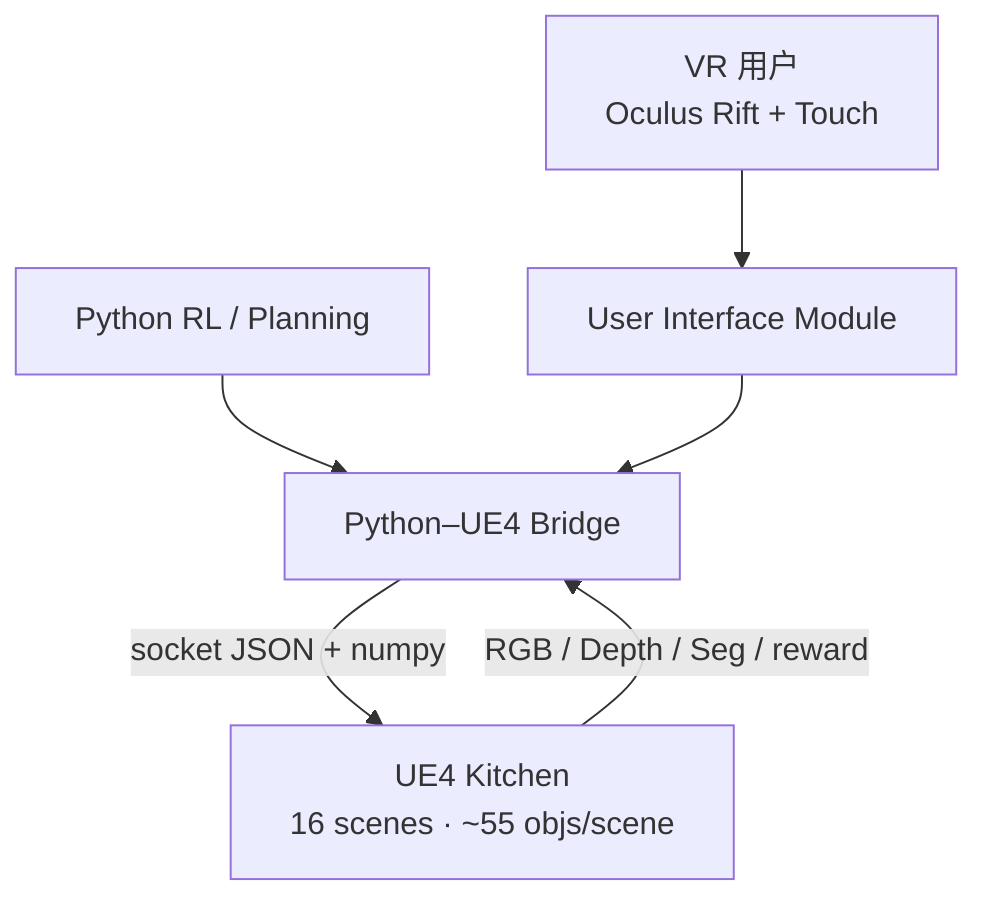

# VRKitchen 技术介绍

> **UCLA**（朱松纯组：Gao, Gong, Shu, Zhu 等）· UE4 物理 + VR 示教 · 烹饪组合任务  
> 官方：[项目站](https://sites.google.com/view/vr-kitchen/) · [GitHub xfgao/VRKitchen](https://github.com/xfgao/VRKitchen) · 论文：[arXiv:1903.05757](https://arxiv.org/abs/1903.05757)  
> **本地源码**：`embodied-platforms/code/VRKitchen-master/`（与官方 master 同步；链接默认指向 [GitHub](https://github.com/xfgao/VRKitchen)）

## 1. 概述

**VRKitchen** 是面向 **任务导向学习（task-oriented learning）** 的 **交互式 3D 虚拟厨房**：在 **照片级 UE4 渲染 + PhysX 物理** 下，支持 **连续手部工具操作** 与 **组合目标（compositional goals）备菜**，并通过 **VR 示教** 与 **Python API** 统一采集人类 demo 与训练 RL agent。

README 将任务分为两类（见 [`code/VRKitchen-master/README.md`](https://github.com/xfgao/VRKitchen/blob/master/README.md)）：

1. **Tool Use** — 连续控制双手使用工具（切胡萝卜、削 Kiwi、倒水等）  
2. **Preparing Dishes** — 按正确顺序执行原子动作，达成组合目标（果汁、炖菜、三明治等）

相对 AI2-THOR / VirtualHome 等平台的差异化：

| 维度 | VRKitchen |
|------|-----------|
| **连续状态变化** | 切菜、榨汁、倒水等 **几何/拓扑连续动画**，非仅离散前后态 |
| **部件级 affordance** | 咖啡机按钮、刀柄、容器盖等 **compositional 物体部件** |
| **双控制接口** | Oculus Rift + Touch **VR 遥操作** + **离散/连续 Python 控制** |
| **VR Chef Challenge** | 标准化 **Tool Use + Preparing Dishes** benchmark |
| **UCLA VR Chef Dataset** | 各任务 **20** 条人类示教（工具/备菜） |

论文 Table 1 自评：相对 Malmo、AI2-THOR、VirtualHome 等，VRKitchen 在 **Large-scale scenes、Physics、Realistic rendering、State changes、Manipulation、Avatar、Demonstration** 七项中均为 ✅（当年对比表语境下）。

---

## 2. 仓库结构（开源 Python 侧）

UE4 侧以 **打包二进制** 发布（`Binaries/`）；**可读的算法与 API 逻辑** 均在 `Script/`：

| 路径 | 作用 | 本地 / GitHub |
|------|------|----------------|
| [`Script/DiscreteAgent.py`](https://github.com/xfgao/VRKitchen/blob/master/Script/DiscreteAgent.py) | Python–UE4 桥：TCP、`send_tf`、低层 motor、`step_tool` | [GitHub](https://github.com/xfgao/VRKitchen/blob/master/Script/DiscreteAgent.py) |
| [`Script/api_dish.py`](https://github.com/xfgao/VRKitchen/blob/master/Script/api_dish.py) | 备菜高层 API：`GoTo`/`Take`/`Use`/`Open`、`ObjDict`、食材列表 | [GitHub](https://github.com/xfgao/VRKitchen/blob/master/Script/api_dish.py) |
| [`Script/task_tool.py`](https://github.com/xfgao/VRKitchen/blob/master/Script/task_tool.py) | Tool Use Gym 环境：`CutCarrot`、`PourWater` 等 | [GitHub](https://github.com/xfgao/VRKitchen/blob/master/Script/task_tool.py) |
| [`Script/task_dish/`](https://github.com/xfgao/VRKitchen/blob/master/Script/task_dish) | 备菜 RL 任务：`Juice`、`Stew`、`Sandwich`、`Cut` | [Juice.py](https://github.com/xfgao/VRKitchen/blob/master/Script/task_dish/Juice.py) |
| [`Script/example_tool.py`](https://github.com/xfgao/VRKitchen/blob/master/Script/example_tool.py) | Tool 连续 RL 入口（DDPG/PPO/A2C） | [GitHub](https://github.com/xfgao/VRKitchen/blob/master/Script/example_tool.py) |
| [`Script/example_dish.py`](https://github.com/xfgao/VRKitchen/blob/master/Script/example_dish.py) | 备菜离散 RL 入口（DQN/A2C/PPO） | [GitHub](https://github.com/xfgao/VRKitchen/blob/master/Script/example_dish.py) |
| [`Script/deep_rl/`](https://github.com/xfgao/VRKitchen/blob/master/Script/deep_rl) | DQN/A2C/PPO/DDPG 与 `NatureConvBody` | [network_bodies.py](https://github.com/xfgao/VRKitchen/blob/master/Script/deep_rl/network/network_bodies.py) |
| [`Script/tool_pos.py`](https://github.com/xfgao/VRKitchen/blob/master/Script/tool_pos.py) | 各场景 `PosList` 站点坐标（按 `scene` ID） | [GitHub](https://github.com/xfgao/VRKitchen/blob/master/Script/tool_pos.py) |
| [`Script/socketClient.py`](https://github.com/xfgao/VRKitchen/blob/master/Script/socketClient.py) / [`socketServer.py`](https://github.com/xfgao/VRKitchen/blob/master/Script/socketServer.py) | TCP 客户端/服务端 | — |
| [`Binaries/`](https://github.com/xfgao/VRKitchen/blob/master/Binaries) | UE4 打包（需单独下载 zip，见 [release v0.1.0](https://github.com/xfgao/VRKitchen/releases/download/v0.1.0/VRKitchen-v0.1.0.zip)） | `.gitignore` 占位 |

`DiscreteAgent` 构造时会按 `task_type` 选择 UE 可执行路径：

```31:31:embodied-platforms/code/VRKitchen-master/Script/DiscreteAgent.py
		self.execCmd = "./Binaries/"+task_type+"/VRInteractPlatform/Binaries/Linux/VRInteractPlatform"
```

即 **`PrepareDish`** 与 **`ToolUse`** 各对应 `Binaries/` 下不同子目录（备菜 vs 工具任务）。

---

## 3. 系统架构



| 模块 | 职责 | 源码入口 |
|------|------|----------|
| **Virtual Kitchen（UE4）** | PhysX 物理、PBR 厨房、16 套场景 | 二进制 `Binaries/` |
| **VR User Interface** | HMD + Touch 遥操作；记录手部 3D 位姿与抓取 | UE4 内嵌 |
| **Python–UE4 Bridge** | `DiscreteAgent` + socket；高层 API ↔ 低层 motor/FABRIK | [`DiscreteAgent.py`](https://github.com/xfgao/VRKitchen/blob/master/Script/DiscreteAgent.py) |
| **RL 栈** | `NatureConvBody` + DQN/A2C/PPO/DDPG | [`example_dish.py`](https://github.com/xfgao/VRKitchen/blob/master/Script/example_dish.py) · [`example_tool.py`](https://github.com/xfgao/VRKitchen/blob/master/Script/example_tool.py) |

### 3.1 通信协议（Python ↔ UE4）

| 端点 | 地址 | 角色 |
|------|------|------|
| **client** | `127.0.0.1:10120` | Python → UE4 发送 `rapidjson` 状态帧 |
| **server** | `127.0.0.1:10121` | UE4 → Python 回传观测 |

Python 侧 `send_tf()` 将 agent 姿态序列化为 JSON 发出；`receive_msg()` 按固定顺序读取多段 buffer（见 [`DiscreteAgent.py` L230–279](https://github.com/xfgao/VRKitchen/blob/master/Script/DiscreteAgent.py)）：

| 字段头 | 内容 |
|--------|------|
| `Objects` | 附近物体名列表 |
| `ObjectsGo` | 备菜任务可见导航点（仅 `PrepareDish`） |
| `RGB` / `Depth` / `object_mask` | 可选感知（numpy `.npy` 流） |
| `Reward` / `Done` / `Success` | RL 信号 |

连接失败时 `socketClient.connect()` 打印 `Can not connect to ('127.0.0.1', 10120)`（需先启动 UE4 二进制）。

**性能**（论文，Titan X Pascal + i7-7700K）：单步交互约 **0.066 s**（~**15 step/s**）；RL 默认 **84×84** RGB（`NatureConvBody` 输入）。

---

## 4. Agent 与场景

### 4.1 Humanoid Avatars

4 套 MakeHuman 人形（Female1/2、Male1/2）；胶囊碰撞 NavMesh 行走；idle 状态下 FABRIK IK 驱动双手与物体交互。

### 4.2 厨房场景

- **16** 套手工布局厨房（外观与户型多样）  
- 家具/电器源自 **SUNCG**，门柜等拆分为可开关部件  
- Python 侧通过 `"scene": "2"` 等字符串切换场景；各场景导航坐标见 [`tool_pos.py`](https://github.com/xfgao/VRKitchen/blob/master/Script/tool_pos.py)（如 `tool_pos["2"]["Fridge"]`）

### 4.3 物体与状态

**食材族**（7 类）：fruit、meat、vegetable、cold-cut、cheese、sauce、bread/dough。

**状态变换**（最多 4 种）：`cut`、`peel`、`cooked`、`juiced`——在 Python 侧映射为 `ObjDict` 布尔字段，由 `Use()` 内 motor 序列更新（例：Knife 分支设置 `Cut=True`，见 [`api_dish.py` L227–248](https://github.com/xfgao/VRKitchen/blob/master/Script/api_dish.py)）。

**工具与容器列表** 在 `api_dish.py` 顶部常量定义：`IngredList`、`ContList`、`CutableList`、`JuiceList` 等（L7–26）。

---

## 5. VR Chef Challenge

### 5.1 Tool Use（低层连续控制）

需 **持续控制右手**；每 episode 默认 **50 step**（`example_tool.py`）；连续 7 维动作经 `step_tool("ControlRightHand", ...)` 下发：

```60:63:embodied-platforms/code/VRKitchen-master/Script/task_tool.py
	def step(self, a):
		action = "ControlRightHand"
		a.resize((7))
		data = self.env.step_tool(action, scale=30, loc=a[0:3], rot=a[3:6], grab_strength=a[6], grab_actor="Knife", grab_comp="StaticMeshComponent0")
```

| 任务类 | 任务 | `grab_actor` / `scale` 差异 |
|--------|------|------------------------------|
| `CutCarrot` | 切胡萝卜 4 块 | `Knife`, scale=30 |
| `PourWater` | 满杯倒入空杯 >50% | `Cup2`, scale=10 |
| `GetWater` | 空杯接龙头 >50% | `Cup3`, scale=30 |
| `OpenCan` / `PeelKiwi` | 开罐 / 削皮 | 各自 init 位姿 + 工具 mesh |

论文 RL：**A2C / DDPG / PPO** 在 84×84 输入下 **多数难以收敛**。

入口：[`example_tool.py`](https://github.com/xfgao/VRKitchen/blob/master/Script/example_tool.py) · `TaskMap` 映射五任务 · 默认 `ddpg_pixel("CutCarrot", 50)`。

### 5.2 Preparing Dishes（离散原子动作 + 组合目标）

原子动作由 [`api_dish.py`](https://github.com/xfgao/VRKitchen/blob/master/Script/api_dish.py) 封装；RL 任务类将离散 ID 映射为 API 调用。以 **Juice**（Easy）为例，`action_dim=9`：

```75:99:embodied-platforms/code/VRKitchen-master/Script/task_dish/Juice.py
	def step(self, a, sub_goal=[], rollout=False):
		action = a
		if action == 0:
			data = GoTo("Fridge")
		elif action == 1:
			data = GoTo("Knife")
		elif action == 2:
			data = Open("Fridge")
		elif action == 3:
			data = Use("Knife")
		elif action == 4:
			data = Take("Tomato")
		# ... 5–8: 转身 / GoTo Juicer / Use Juicer
```

**五道菜** 目标（论文 Table 2）与代码 `TaskMap` 对应：

| 论文菜名 | 代码类 | `example_dish` 名 |
|----------|--------|-------------------|
| Fruit juice | `Juice` | `"Juice"` |
| Beef stew | `Stew` | `"Stew"` |
| Sandwich | `Sandwich` | `"Sandwich"` |
| — | `Cut` | `"Cut"` |

RL 入口：[`example_dish.py`](https://github.com/xfgao/VRKitchen/blob/master/Script/example_dish.py) — `TaskMap = {"Cut", "Sandwich", "Stew", "Juice"}`，默认 PPO 训练 Sandwich（`max_steps=1000`）。

网络：离散任务用 `CategoricalActorCriticNet` + [`NatureConvBody(in_channels=3)`](https://github.com/xfgao/VRKitchen/blob/master/Script/deep_rl/network/network_bodies.py)（DQN 用 `VanillaNet`）。

---

## 6. 观测与控制接口

| 模式 | 输入 | 输出 | 源码 |
|------|------|------|------|
| **VR 示教** | Touch 位姿 + Trigger | 手部轨迹 + 第一人称 RGB | UE4 二进制 |
| **离散 API** | `GoTo`/`Take`/`Use`/… | `ObjDict` + egocentric RGB | [`api_dish.py`](https://github.com/xfgao/VRKitchen/blob/master/Script/api_dish.py) |
| **Tool RL** | 7-D 连续 | 84×84 RGB + reward/done | [`task_tool.py`](https://github.com/xfgao/VRKitchen/blob/master/Script/task_tool.py) |
| **Dish RL** | 9-D 离散（Juice） | 84×84 RGB + `str(ObjDict)` 判别 | [`task_dish/Juice.py`](https://github.com/xfgao/VRKitchen/blob/master/Script/task_dish/Juice.py) |

`ObjDict` 由 `InitDict()` 初始化，跟踪各 ingredient 的 `Pos` 与 `Cut/Peel/Juice/Cook` flags：

```48:53:embodied-platforms/code/VRKitchen-master/Script/api_dish.py
def InitDict():
	for obj in IngredList:
		ObjDict[obj] = {"Pos": "Fridge", "Cut":False, "Peel":False, "Juice":False, "Cook":False}
	ObjDict['Sauce'] = {"Pos": "SauceBottle", "Cut":False, "Peel":False, "Juice":False, "Cook":False}
	ObjDict['Actor'] = {"Pos": "Orig"}
	ObjDict['Fridge'] = {"State": "Closed"}
```

---

## 7. 数据集

| 数据集 | 内容 | 获取 |
|--------|------|------|
| **UCLA VR Chef Dataset** | Tool：每任务 20 VR demo；Dish：每菜 20 demo（~25 步） | 论文 §6 · [项目站](https://sites.google.com/view/vr-kitchen/) |
| **Dish preparation 发布包** | 备菜任务数据 | [Google Drive](https://drive.google.com/file/d/1yahh4RGl7ofepoJin57n2mV1g-i7-T0L/view?usp=sharing)（[`README.md`](https://github.com/xfgao/VRKitchen/blob/master/README.md) 链接） |

`api_dish` 中 `folder_name` / `f_label` / `f_fluent` 参数支持 **逐帧 PNG + 动作标签 + ObjDict 轨迹** 导出，便于模仿学习数据管线扩展。

---

## 8. VRKitchen 2.0（Omniverse 续作）

[realvcla/VRKitchen2.0](https://github.com/realvcla/VRKitchen2.0)（UCLA Real VCLA，2022 起）：

| 特性 | 说明 |
|------|------|
| **NVIDIA Omniverse** | 光追、USD、GPU PhysX |
| **高保真流体/连续状态** | 倒水、烹饪等 fluent changes |
| **household 任务扩展** | 开灯、抽屉、门、pickup、reorient 等 |
| **代码状态** | 与 v0.1 UE4 **API 不兼容**；以仓库当前 README 为准 |

与 **BEHAVIOR / OmniGibson** 同属 Stanford–UCLA 具身生态演进；复现 2019 论文用 **v0.1.0 UE4** + 本仓库 `Script/`。

---

## 9. 与同类平台对比

| 维度 | VRKitchen | VirtualHome | AI2-THOR | BEHAVIOR-1K |
|------|-----------|-------------|----------|-------------|
| 任务域 | **厨房烹饪** | 通用家庭程序 | 通用室内 | 1000 家务 |
| 状态变化 | **连续动画** | 图/动画 | 离散 state machine | BDDL + 流体 |
| VR 示教 | ✅ **核心** | 可选 | ❌ | Teleop |
| 程序/符号层 | ObjDict + 原子动作 | Program + Graph | step(action) | BDDL |
| 引擎 | **UE4** | Unity | Unity | Isaac/Omni |
| 开源 Python | ✅ 完整 `Script/` | ✅ | ✅ | ✅ OmniGibson |

---

## 10. 文档导航（本站）

| 文档 | 内容 |
|------|------|
| [基本使用流程.md](基本使用流程.md) | 安装、Binaries、socket、example 脚本、依赖与 FAQ |
| [VR Chef Challenge与API参考.md](VR%20Chef%20Challenge与API参考.md) | 任务表、ObjDict、`DiscreteAgent`、RL 超参、`Use()` motor 链 |

**官方**：[Google Site](https://sites.google.com/view/vr-kitchen/) · [GitHub README](https://github.com/xfgao/VRKitchen/blob/master/README.md) · **本地**：[code/VRKitchen-master/](https://github.com/xfgao/VRKitchen/blob/master/)
