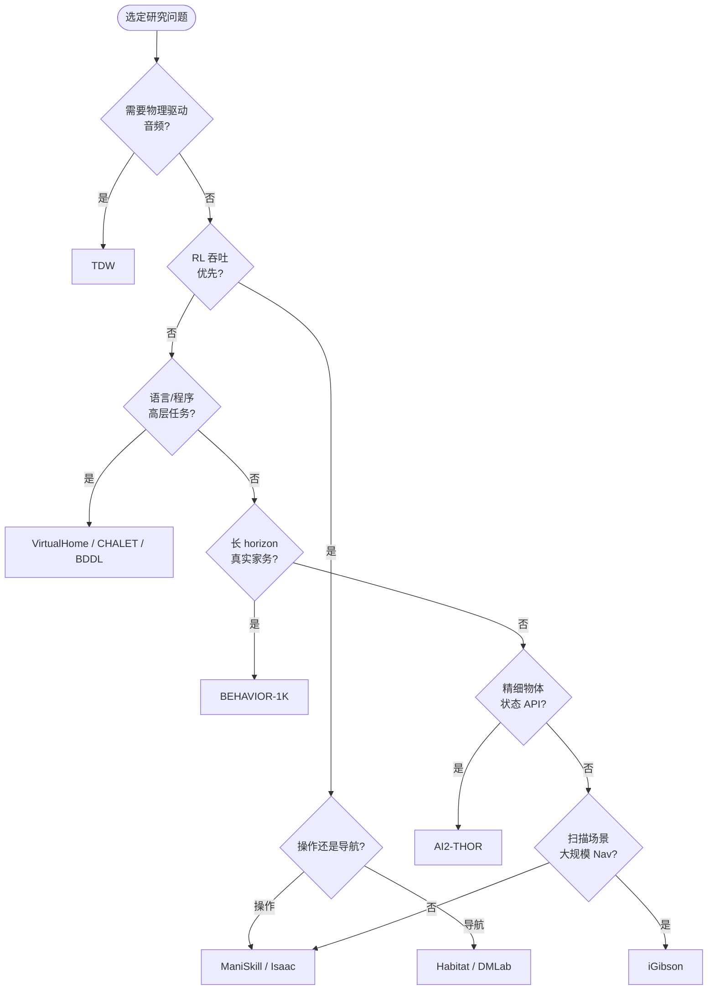
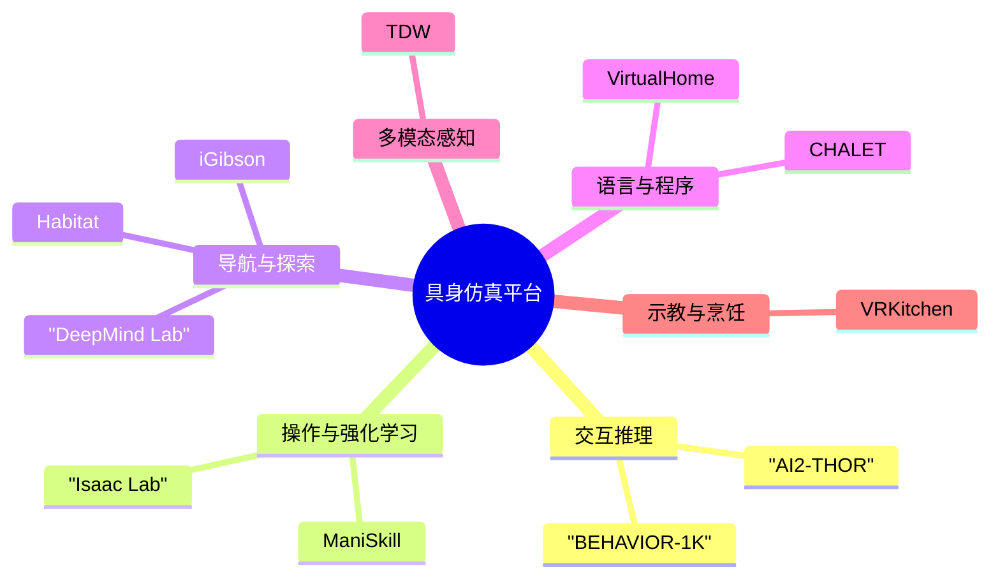

# 具身智能仿真平台 — 主页

> 本页从 **多个维度** 横向整理各仿真平台特点，便于快速选型。  
> 各平台技术文档从博客专栏进入对应平台；综述与索引见 [总体介绍.md](总体介绍.md)。  
> 关联生态：[Meta Habitat](../Habitat%20(Meta%20AI)/总体介绍.md) · [NVIDIA Isaac](../nvidia2/总体介绍.md)

---

## 1. 文档结构

| 层级 | 文档 | 适合 |
|------|------|------|
| **主页（本文）** | 多维度矩阵、按目标选型、决策流程 | 第一次了解、写 related work、定平台 |
| [总体介绍.md](总体介绍.md) | 平台一览表、许可摘要、文档索引 | 快速跳转 |
| **各平台专栏** | 技术介绍、基本使用流程、专题参考 | 安装复现、API、benchmark |

---

## 2. 多维度能力矩阵

图例：**高** = 平台核心优势或业界标杆 · **中** = 可用但非最强 · **低** = 有限支持 · **—** = 基本不具备

| 平台 | 室内导航 | 桌面/厨房操作 | 物体语义状态 | 物理保真度 | 视觉真实感 | RL 训练吞吐 | 语言/程序任务 | 视+听多模态 | VR/人类示教 | 开源维护 |
|------|:--------:|:-------------:|:------------:|:----------:|:----------:|:-----------:|:-------------:|:-----------:|:-----------:|:--------:|
| [AI2-THOR](ai2thor/介绍.md) | 中 | **高** | **高** | 中 | 中 | 中 | 中 | — | — | **高** |
| [ManiSkill / SAPIEN](sapien/介绍.md) | 低 | **高** | 中 | **高** | 中 | **高** | 低 | — | — | **高** |
| [TDW](tdw/介绍.md) | 中 | 中 | 低 | **高** | **高** | 低 | 低 | **高** | 中 | 低 (LTS) |
| [iGibson](igibson/介绍.md) | **高** | 中 | 中 | 中 | 中 | 中 | 低 | — | — | 中 |
| [DeepMind Lab](deepmind_lab/介绍.md) | **高** | — | — | 低 | 低 | **高** | 低 | — | — | 中 |
| [VirtualHome](virtualhome/介绍.md) | 中 | 中 | 中 | 低 | 中 | 中 | **高** | — | 中 | 中 |
| [CHALET](chalet/介绍.md) | 中 | 中 | 低 | 低 | 低 | 低 | **高** | — | — | 低 |
| [VRKitchen](vrkitchen/介绍.md) | 低 | **高** | **高** | 中 | 中 | 低 | 中 | — | **高** | 低 |
| [BEHAVIOR-1K](behavior_1k/介绍.md) | 中 | **高** | **高** | **高** | **高** | 中 | **高** | 中 | 中 | **高** |
| [Habitat](../Habitat%20(Meta%20AI)/总体介绍.md) | **高** | 中 | 中 | 中 | 中 | **高** | 低 | — | — | **高** |
| [Isaac Sim/Lab](../nvidia2/总体介绍.md) | 中 | **高** | 中 | **高** | **高** | **高** | 中 | 中 | 中 | **高** |

**读表提示**：

- **物体语义状态**：Open/Cook/Fill 等离散状态机（AI2-THOR、BEHAVIOR）vs 连续几何变化（VRKitchen、TDW Flex）vs 符号图（VirtualHome）  
- **RL 吞吐**：ManiSkill 3 GPU 并行、Habitat 批量导航 >> Unity 单实例（AI2-THOR、TDW、VirtualHome）  
- **语言/程序**：VirtualHome Program+Graph、CHALET+CHAI、BEHAVIOR BDDL 为典型代表  

---

## 3. 按研究目标选型

### 3.1 视觉导航与探索

| 首选 | 备选 | 理由 |
|------|------|------|
| [Habitat](../Habitat%20(Meta%20AI)/总体介绍.md) + HM3D | [iGibson](igibson/介绍.md)、[DeepMind Lab](deepmind_lab/介绍.md) | 大规模真实/扫描场景、Challenge 生态、高 FPS |
| [iGibson](igibson/介绍.md) | Habitat | Gibson 572 扫描 mesh、 traversability、交互扩展 |

### 3.2 机械臂 / 灵巧操作与 RL 吞吐

| 首选 | 备选 | 理由 |
|------|------|------|
| [ManiSkill 3](sapien/介绍.md) | [Isaac Lab](../nvidia2/总体介绍.md) | GPU 并行、`num_envs`、标准 manipulation benchmark |
| [AI2-THOR ManipulaTHOR](ai2thor/介绍.md) | SAPIEN | 离散臂控 + 物体状态，偏视觉推理 |

### 3.3 长 horizon 家务与移动操作

| 首选 | 备选 | 理由 |
|------|------|------|
| [BEHAVIOR-1K](behavior_1k/介绍.md) | [AI2-THOR](ai2thor/介绍.md) | 1000 BDDL 活动、流体/deformable、2025 Challenge |
| [AI2-THOR](ai2thor/介绍.md) | BEHAVIOR | 更轻量、ManipulaTHOR/ProcTHOR 扩展 |

### 3.4 语言、程序与高层规划

| 首选 | 备选 | 理由 |
|------|------|------|
| [VirtualHome](virtualhome/介绍.md) | [CHALET](chalet/介绍.md) | Program + Environment Graph、WAH 多 agent |
| [CHALET](chalet/介绍.md) | VirtualHome | CHAI 语料、58 rooms、指令跟随 benchmark |
| [BEHAVIOR BDDL](behavior_1k/BDDL与任务体系.md) | VirtualHome | 逻辑谓词 + 物理仿真更完整 |

### 3.5 多模态感知（尤其音频 + 物理）

| 首选 | 理由 |
|------|------|
| [TDW](tdw/介绍.md) | **Clatter** 物理驱动音效、Flex/Obi 流体布料、TDW-Image/Sound/Physics 数据集 |

### 3.6 认知、记忆与非常规环境

| 首选 | 理由 |
|------|------|
| [DeepMind Lab](deepmind_lab/介绍.md) | 迷宫、Psychlab 记忆套件、DMLab-30、第一人称 RL 经典基准 |

### 3.7 烹饪 / 组合目标 + 人类示教

| 首选 | 备选 | 理由 |
|------|------|------|
| [VRKitchen](vrkitchen/介绍.md) | [VirtualHome](virtualhome/介绍.md) | VR 示教、连续 state change、VR Chef Challenge |
| [VRKitchen 2.0](https://github.com/realvcla/VRKitchen2.0) | BEHAVIOR | Omniverse 后继、流体与 household 任务 |

### 3.8 Sim2Real 与工业级机器人栈

| 首选 | 理由 |
|------|------|
| [Isaac Sim / Lab](../nvidia2/总体介绍.md) | Omniverse、PhysX、传感器、LocoManipulation、Mimic |
| [ManiSkill](sapien/介绍.md) | 轻量、开源、GPU 合成数据吞吐 |

---

## 4. 按动作粒度与 API 风格

| 类型 | 代表平台 | 动作形式 | 典型用途 |
|------|----------|----------|----------|
| **离散高层** | VirtualHome、CHALET | `[Walk]` / `GoTo` / 程序行 | 规划、IL、语言 grounding |
| **离散 mid** | AI2-THOR、BEHAVIOR | `step(action="OpenObject")`、BDDL 谓词 | 交互推理、状态跟踪 |
| **连续低层** | ManiSkill、Isaac、VRKitchen Tool | 关节/末端 6-DoF+ | RL、模仿学习 |
| **命令式底层** | TDW | 200+ JSON `$type` 命令 | 多模态采集、自定义物理实验 |
| **导航专用** | Habitat、DMLab | 转向+前进 或 速度指令 | 大规模 RL |

---

## 5. 按引擎与场景来源

| 引擎 / 后端 | 平台 | 场景特点 |
|-------------|------|----------|
| **Unity** | AI2-THOR、TDW、VirtualHome、CHALET | 艺术家/程序化室内；TDW 流式+Floorplan |
| **UE4 / Omniverse** | VRKitchen、BEHAVIOR (OmniGibson)、Isaac | 照片级 PBR；BEHAVIOR/Isaac 流体 |
| **PhysX 5 GPU** | SAPIEN、ManiSkill、Isaac | 并行刚体、铰接物体 |
| **Bullet** | iGibson | 扫描 mesh 室内、PyBullet 生态 |
| **自研 C++** | Habitat | 极速、HM3D/ Gibson 集成 |
| **Quake / ioquake3** | DeepMind Lab | 程序化 3D 迷宫 |
| **纯 Python 图** | VirtualHome Evolving Graph | 无渲染规划、数据集对齐 |

---

## 6. 平台速览

| 平台 | 机构 | 一句话 | 文档入口 |
|------|------|--------|----------|
| **AI2-THOR** | Allen AI | Unity 室内 + **200+ 物体状态** + ManipulaTHOR/RoboTHOR/ProcTHOR | [介绍](ai2thor/介绍.md) |
| **ManiSkill** | UCSD 等 | **GPU 20万+ FPS** 级 manipulation benchmark | [介绍](sapien/介绍.md) |
| **TDW** | MIT | **物理驱动音频** + Flex 软体/流体 + 命令式 API | [介绍](tdw/介绍.md) |
| **iGibson** | Stanford | **572+ Gibson** 扫描场景 + 15 套全交互公寓 | [介绍](igibson/介绍.md) |
| **DeepMind Lab** | DeepMind | 第一人称 **迷宫 + Psychlab** 认知 RL | [介绍](deepmind_lab/介绍.md) |
| **VirtualHome** | MIT/UCLA 等 | **Program + Graph** 家庭活动、WAH 协作 | [介绍](virtualhome/介绍.md) |
| **CHALET** | Cornell | **CHAI 语料** + 58 rooms 语言导航/操作 | [介绍](chalet/介绍.md) |
| **VRKitchen** | UCLA | **VR 示教** + 烹饪组合目标 + 连续 state change | [介绍](vrkitchen/介绍.md) |
| **BEHAVIOR-1K** | Stanford | **1000 家务** BDDL + OmniGibson 高保真 | [介绍](behavior_1k/介绍.md) |
| **Habitat** | Meta | **Challenge 级导航** + HM3D 大规模 | [外部](../Habitat%20(Meta%20AI)/总体介绍.md) |
| **Isaac** | NVIDIA | **工业级** sim2real、LocoManipulation | [外部](../nvidia2/总体介绍.md) |

---

## 7. 决策流程

---

## 8. 任务类型 × 平台推荐（速查）

| 任务类型 | 推荐（按优先级） |
|----------|------------------|
| PointNav / ObjectNav | Habitat → iGibson → AI2-THOR |
| Rearrange / 搬物体 | Habitat 2/3 → BEHAVIOR |
| Pick & Place benchmark | ManiSkill → Isaac Lab |
| 开冰箱 / 烹饪状态 | AI2-THOR → BEHAVIOR |
| 1000 活动家务 | BEHAVIOR-1K |
| 程序生成 / 图规划 | VirtualHome → CHALET |
| 多 agent 社交协作 | VirtualHome WAH → TDW Replicant |
| 材质/碰撞 **声音** | TDW Clatter |
| 流体 / 布料物理 | TDW Flex → BEHAVIOR → VRKitchen 2.0 |
| 迷宫 / 工作记忆 | DeepMind Lab |
| VR 人类 demo | VRKitchen → Isaac Teleop |
| 真实扫描室内 | iGibson → Habitat+HM3D |
| 四足 / 人形 loco | Isaac → ManiSkill（部分） |

---

## 9. 许可与数据（摘要）

| 平台 | 代码许可 | 数据/场景 |
|------|----------|-----------|
| AI2-THOR | Apache-2.0 | 随仓库/文档下载 |
| ManiSkill | Apache-2.0 | 任务资产见文档 |
| TDW | MIT | TDW-Image/Sound/Physics 脚本 |
| iGibson | MIT | Gibson/HM 需注册 |
| DMLab | Apache-2.0 | 内置程序化关卡 |
| VirtualHome | MIT | 程序+图公开 |
| CHALET | 见仓库 | Cornell CHAI 语料 |
| VRKitchen | 见仓库 | Google Drive / 项目站 |
| BEHAVIOR-1K | 见仓库 | BDDL + 场景注册 |

详情见 [总体介绍 §4](总体介绍.md#4-引擎与许可摘要)。

---

## 10. 文档地图

下图按**研究维度**归类各平台专栏（含 NVIDIA Isaac、Meta Habitat 等关联生态）。[总体介绍](总体介绍.md) 提供完整文档索引；各专栏含技术介绍、使用流程与 API 参考。

