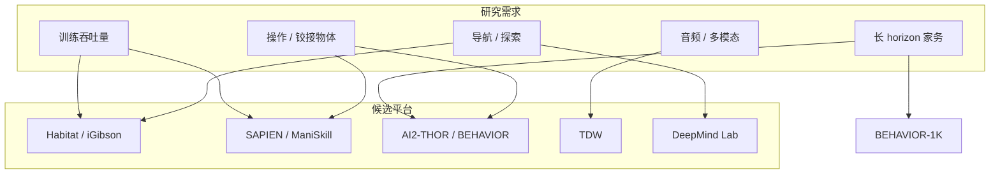

# 具身智能仿真平台 — 总体调研

> 本文档汇总主流 **Embodied AI** 仿真与 benchmark 平台，便于横向对比与选型。  
> **多维度对比与选型决策** 见 **[主页.md](主页.md)**（能力矩阵、按研究目标、决策流程图）。  
> 另见：[Meta Habitat](../Habitat%20(Meta%20AI)/总体介绍.md) · [NVIDIA Isaac](../nvidia2/总体介绍.md)

## 1. 为什么需要仿真

真实世界训练具身智能体存在 **慢、贵、危险、难复现** 等问题。仿真可在集群上 **并行、加速**  rollout，在迁移到真机前验证算法。各平台在 **视觉真实感、物理 fidelity、交互粒度、吞吐量** 之间取舍不同。

---

## 2. 平台一览

| 平台 | 机构 | 引擎 / 后端 | 强项 | 典型任务 |
|------|------|-------------|------|----------|
| [AI2-THOR](ai2thor/介绍.md) | Allen AI | Unity | 物体状态变化、精细交互 | 开冰箱、开关电器、ManipulaTHOR 操作 |
| [SAPIEN / ManiSkill](sapien/介绍.md) | UCSD 等 | PhysX 5 GPU | 铰接物体、高吞吐机械臂 RL | Pick/Place、灵巧操作 benchmark |
| [ThreeDWorld](tdw/介绍.md) | MIT | Unity + Flex | 多模态（视/听）、流体/布料 | 物理预测、多智能体、认知实验 |
| [iGibson](igibson/介绍.md) | Stanford | Bullet | 572+ 真实扫描场景、室内 Nav | 开门、抓取、大规模导航 |
| [DeepMind Lab](deepmind_lab/介绍.md) | Google DeepMind | Quake/ioquake3 | 第一人称探索、记忆、迷宫 | Nav maze、Psychlab 认知任务 |
| [VirtualHome](virtualhome/介绍.md) | MIT / Stanford HCI | Unity + 图模拟 | 高级程序指令、多智能体家庭活动 | 做饭、清洁等长 horizon 程序 |
| [CHALET](chalet/介绍.md) | Cornell | Unity | 58 房间组合、语言+规划 | 导航、操作、指令跟随、QA |
| [VRKitchen](vrkitchen/介绍.md) | UCLA 等 | UE4 / Omniverse | VR 示教、烹饪组合任务 | Tool use、备菜序列 |
| [BEHAVIOR-1K](behavior_1k/介绍.md) | Stanford | OmniGibson (Isaac) | 1000 家务活动、流体/ deformable | 长 horizon 移动操作 benchmark |
| [Habitat](../Habitat%20(Meta%20AI)/总体介绍.md) | Meta | 自研 C++ | 极速导航、Challenge | PointNav、Rearrange |
| [Isaac Sim/Lab](../nvidia2/总体介绍.md) | NVIDIA | Omniverse/PhysX | 高保真机器人 RL/IL |  loco/manipulation、Mimic |

---

## 3. 选型维度

| 维度 | 高吞吐训练 | 高物理/状态 fidelity | 真实扫描大规模场景 | 程序/语言高层任务 |
|------|------------|----------------------|------------------|-------------------|
| **首选** | ManiSkill 3、Habitat | BEHAVIOR/OmniGibson、TDW | iGibson、Habitat+HM3D | VirtualHome、CHALET |
| **精细物体状态** | AI2-THOR | AI2-THOR | — | VirtualHome graph |

---

## 4. 引擎与许可（摘要）

| 平台 | 开源许可 | 数据许可 |
|------|----------|----------|
| AI2-THOR | Apache-2.0 | 场景随仓库/文档 |
| SAPIEN / ManiSkill | Apache-2.0 | 任务资产见文档 |
| TDW | MIT（部分模块另议） | 见 TDW 数据集页 |
| iGibson | MIT | Gibson/HM 等需填表 |
| DeepMind Lab | Apache-2.0 | 内置程序化关卡 |
| VirtualHome | MIT | 程序+场景图公开 |
| CHALET | 见仓库 | Cornell 语料 |
| VRKitchen | 见仓库 | 项目站下载 |
| BEHAVIOR-1K | 见仓库 | BDDL + 场景需注册 |

---

## 5. 文档索引

| 入口 | 路径 |
|------|------|
| **主页（多维度对比）** | [主页.md](主页.md) |

| 平台 | 路径 |
|------|------|
| AI2-THOR 详解 | [ai2thor/介绍.md](ai2thor/介绍.md) |
| AI2-THOR 使用流程 | [ai2thor/基本使用流程.md](ai2thor/基本使用流程.md) |
| AI2-THOR 动作参考 | [ai2thor/动作与对象参考.md](ai2thor/动作与对象参考.md) |
| SAPIEN / ManiSkill 详解 | [sapien/介绍.md](sapien/介绍.md) |
| ManiSkill 使用流程 | [sapien/基本使用流程.md](sapien/基本使用流程.md) |
| ManiSkill 任务与 API | [sapien/ManiSkill任务与API参考.md](sapien/ManiSkill任务与API参考.md) |
| ThreeDWorld 详解 | [tdw/介绍.md](tdw/介绍.md) |
| TDW 使用流程 | [tdw/基本使用流程.md](tdw/基本使用流程.md) |
| TDW 感知与数据集 | [tdw/多模态感知与数据集参考.md](tdw/多模态感知与数据集参考.md) |
| iGibson 详解 | [igibson/介绍.md](igibson/介绍.md) |
| iGibson 使用流程 | [igibson/基本使用流程.md](igibson/基本使用流程.md) |
| iGibson 场景与 API | [igibson/场景任务与API参考.md](igibson/场景任务与API参考.md) |
| DeepMind Lab 详解 | [deepmind_lab/介绍.md](deepmind_lab/介绍.md) |
| DeepMind Lab 使用流程 | [deepmind_lab/基本使用流程.md](deepmind_lab/基本使用流程.md) |
| DMLab 关卡参考 | [deepmind_lab/关卡与任务参考.md](deepmind_lab/关卡与任务参考.md) |
| VirtualHome 详解 | [virtualhome/介绍.md](virtualhome/介绍.md) |
| VirtualHome 使用流程 | [virtualhome/基本使用流程.md](virtualhome/基本使用流程.md) |
| VirtualHome 程序与数据集 | [virtualhome/程序图谱与数据集参考.md](virtualhome/程序图谱与数据集参考.md) |
| CHALET 详解 | [chalet/介绍.md](chalet/介绍.md) |
| CHALET 使用流程 | [chalet/基本使用流程.md](chalet/基本使用流程.md) |
| CHAI 语料与评测 | [chalet/CHAI语料与评测.md](chalet/CHAI语料与评测.md) |
| VRKitchen 详解 | [vrkitchen/介绍.md](vrkitchen/介绍.md) |
| VRKitchen 使用流程 | [vrkitchen/基本使用流程.md](vrkitchen/基本使用流程.md) |
| VR Chef Challenge 参考 | [vrkitchen/VR Chef Challenge与API参考.md](vrkitchen/VR%20Chef%20Challenge与API参考.md) |
| BEHAVIOR-1K 详解 | [behavior_1k/介绍.md](behavior_1k/介绍.md) |
| BEHAVIOR-1K 使用流程 | [behavior_1k/基本使用流程.md](behavior_1k/基本使用流程.md) |
| BEHAVIOR BDDL 体系 | [behavior_1k/BDDL与任务体系.md](behavior_1k/BDDL与任务体系.md) |
| OmniGibson 参考 | [behavior_1k/OmniGibson技术参考.md](behavior_1k/OmniGibson技术参考.md) |
| Meta Habitat | [../Habitat (Meta AI)/总体介绍.md](../Habitat%20(Meta%20AI)/总体介绍.md) |
| NVIDIA Isaac | [../nvidia2/总体介绍.md](../nvidia2/总体介绍.md) |
