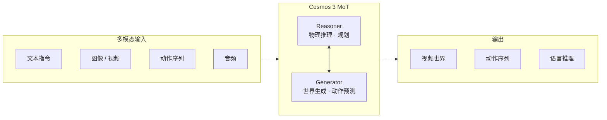

# NVIDIA Cosmos 技术介绍

> **Cosmos 3（2026）** 为当前主线：统一 Reasoner + Generator 的 omnimodal 世界基础模型。  
> 官方入口：[github.com/nvidia/cosmos](https://github.com/nvidia/cosmos) · [Cosmos 3 技术报告](https://research.nvidia.com/labs/cosmos-lab/cosmos3/technical-report.pdf) · [Developer 页面](https://developer.nvidia.com/cosmos)  
> 与 Isaac 集成说明见 [../总体介绍.md](../总体介绍.md) §3；Cookbook 见 [在线资源与Cookbook.md](在线资源与Cookbook.md)。

## 1. 概述

**NVIDIA Cosmos** 是面向 **Physical AI**（机器人、自动驾驶、智能空间等）的**世界基础模型（World Foundation Model, WFM）**平台，覆盖：

- **世界生成**：文本 / 图像 / 视频 → 逼真、物理 plausible 的视频世界
- **物理推理**：空间、时序、因果与常识推理（VLM）
- **动作建模**：基于观测与指令预测未来动作序列（world-action model）
- **数据管线**：视频清洗、标注、去重、质量过滤（Curator）
- **域适配**：Sim2Real、天气/光照增强、多视角 AV 等 post-training

**Cosmos 3**（2026 年 6 月发布）将此前分散的 **Predict / Transfer / Reason / Policy** 能力整合为单一 **Mixture-of-Transformers（MoT）** 架构，可在一次前向中处理语言、图像、视频、音频与动作。旧版独立仓库（Predict 2.5、Transfer 2.5、Reason 1/2 等）仍可用于遗留工作流，但新功能以 **Cosmos 3 + cosmos-framework** 为准。

| 模型 | 参数量 | 定位 | Hugging Face |
|------|--------|------|--------------|
| **Cosmos 3 Nano** | 16B（8B Reasoner + 8B Generator） | 工作站级推理（如 RTX PRO 6000） | [nvidia/Cosmos3-Nano](https://huggingface.co/nvidia/Cosmos3-Nano) |
| **Cosmos 3 Super** | 64B（32B + 32B） | 大规模 SDG 与研究（Hopper / Blackwell） | [nvidia/Cosmos3-Super](https://huggingface.co/nvidia/Cosmos3-Super) |

---

## 2. 产品线演进

### 2.1 Cosmos 3（当前主线）

- **仓库**：[nvidia/cosmos](https://github.com/nvidia/cosmos)（主入口）+ [NVIDIA/cosmos-framework](https://github.com/NVIDIA/cosmos-framework)（训练与服务框架）
- **架构**：Reasoner + Generator 双塔 MoT；支持灵活 I/O 组合（T2V、V2W、动作条件生成等）
- **部署**：
  - 源码推理 / post-training：`cosmos-framework` CLI
  - 生产推理：**Cosmos NIM** 微服务（Reasoner NIM 已发布；Generator NIM 陆续推出）
  - 快速体验：**Hugging Face Diffusers** `Cosmos3OmniPipeline`

### 2.2 上一代独立模型（仍维护，逐步迁移）

| 系列 | 仓库 | 能力 |
|------|------|------|
| **Predict 2.5** | [nvidia-cosmos/cosmos-predict2.5](https://github.com/nvidia-cosmos/cosmos-predict2.5) | 扩散 Transformer；T2I、Video-to-World；机器人/仿真专用 checkpoint |
| **Transfer 2.5** | [nvidia-cosmos/cosmos-transfer2.5](https://github.com/nvidia-cosmos/cosmos-transfer2.5) | MultiControlNet（depth / seg / edge / vis 等）；Sim2Real、4K upscale |
| **Reason 1** | [nvidia-cosmos/cosmos-reason1](https://github.com/nvidia-cosmos/cosmos-reason1) | 7B VLM；物理 plausible 质检、AV caption/VQA |
| **Reason 2** | [nvidia-cosmos/cosmos-reason2](https://github.com/nvidia-cosmos/cosmos-reason2) | 2B / 8B / 32B；边缘 Jetson Thor、仓库安全、社交推理 |
| **Curator** | Cookbook 文档 | Ray 加速视频 curation 管线 |
| **Cosmos RL** | Cookbook / 框架文档 | 分布式 SFT / RL；FP8/FP4；大模型 rollout |

> 2026-06 起官方将 GitHub 组织迁移至 [github.com/nvidia/cosmos](https://github.com/nvidia/cosmos)，旧仓库 README 会指向新入口。

---

## 3. 核心架构（Cosmos 3）



| 组件 | 作用 | 典型任务 |
|------|------|----------|
| **Reasoner** | 空间/时序/因果理解；chain-of-thought | 场景 caption、安全合规、物理 plausible 评分、3D grounding |
| **Generator** | 扩散式世界生成 | T2V、I2V、动作条件未来帧、Sim2Real 风格迁移（统一于 omni 模型） |
| **Post-training** | 领域 LoRA / SFT / RL | 手术仿真、农业车队、AV 多视角、人形机器人轨迹 |

**与旧版对比**：此前需分别部署 Predict + Transfer + Reason 管道；Cosmos 3 在单一 checkpoint 内切换模式（推理 preset / JSON 输入配置）。

---

## 4. 与 Isaac Sim / Isaac Lab 的关系

Cosmos **不提供**仿真环境或 RL 训练循环，处理 **Sim/Lab 输出的视觉数据**：

| 环节 | Isaac 侧 | Cosmos 侧 |
|------|----------|-----------|
| 仿真 | Sim 渲染 RGB/深度/分割 | Transfer 多控制增强 realism |
| 训练数据 | Lab Mimic / SDG 管线 | Predict 生成合成轨迹；Reason 作 video critic 拒绝采样 |
| 感知闭环 | Lab 相机观测 | Cosmos 增强域随机化后的图像分布 |

Isaac Lab 文档中有 **Cosmos Transfer** 与 Mimic/Stack 等集成示例（如 `augmented_imitation.rst`）。

典型链路：

```
Isaac Sim 场景 → Isaac Lab 采集/训练 →（可选）Cosmos 视觉增强 → 真机部署
```

---

## 5. 主要应用场景

| 领域 | Cosmos 能力 | Cookbook 示例 |
|------|-------------|---------------|
| **机器人** | Sim2Real、合成操作轨迹、egocentric 推理 | GR00T-Dreams、GR00T-Mimic、X-Mobility |
| **自动驾驶** | 多视角生成、天气/异常场景、AV VQA | Multiview AV、Traffic Anomaly、CARLA Sim2Real |
| **智能交通 / 仓库** | 场景理解、工人安全检测 | Intelligent Transportation、Worker Safety |
| **医疗 / 农业** | 手术仿真 post-train、农业 photorealistic SDG | Surgical Robotics、Agriculture Sim2Real |

---

## 6. 许可与资源

- **代码**：各仓库许可不同（如 Reason 2 为 Apache-2.0；framework 见仓库 LICENSE）
- **模型权重**：Hugging Face 下载通常需接受 NVIDIA 模型许可并配置 token
- **在线文档**：
  - [Cosmos Cookbook](https://nvidia-cosmos.github.io/cosmos-cookbook/)
  - [Cosmos 3 Technical Blog](https://developer.nvidia.com/blog/develop-physical-ai-reasoning-world-and-action-models-with-nvidia-cosmos-3/)
  - [Physical AI Datasets（HF Collection）](https://huggingface.co/collections/nvidia/physical-ai)

官方代码与 Cookbook 见 [github.com/nvidia/cosmos](https://github.com/nvidia/cosmos) 与 [官方仓库索引.md](官方仓库索引.md)。
