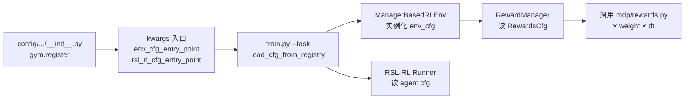

# Isaac Lab 任务介绍 — 代码结构、观测、动作与奖励（2.3.2）

> 源码根目录：[Isaac Lab 官方仓库](https://github.com/isaac-sim/IsaacLab/blob/main/) · 版本见 [VERSION](https://github.com/isaac-sim/IsaacLab/blob/main/VERSION)  
> 表格 **源码** 列格式：`文件` · **L行号**

本文档说明 Isaac Lab 仓库结构，以及代表性任务的观测、动作、奖励配置与源码位置。

---

## Isaac Lab 项目代码结构

Isaac Lab 是一个 **多 Python 包** 仓库：仿真核心、任务定义、机器人资产、RL 封装分目录维护，通过 **Gymnasium 注册表** 把「任务 ID」与各类配置入口绑在一起。

### 顶层目录一览

| 路径 | 包名 | 主要内容 | 在系统中的角色 |
|------|------|----------|----------------|
| [source/isaaclab/](https://github.com/isaac-sim/IsaacLab/blob/main/source/isaaclab/) | `isaaclab` | 环境基类、Manager、通用 MDP、仿真/场景 | **运行时引擎**：读配置、跑物理、算 obs/reward |
| [source/isaaclab_tasks/](https://github.com/isaac-sim/IsaacLab/blob/main/source/isaaclab_tasks/) | `isaaclab_tasks` | 各任务 `*_env_cfg.py`、`mdp/`、`config/` | **任务定义**：MDP 长什么样、奖励权重写在哪 |
| [source/isaaclab_assets/](https://github.com/isaac-sim/IsaacLab/blob/main/source/isaaclab_assets/) | `isaaclab_assets` | Franka、Anymal、G1 等 `*Cfg` | **资产库**：USD/关节/默认姿态，被 scene 引用 |
| [source/isaaclab_rl/](https://github.com/isaac-sim/IsaacLab/blob/main/source/isaaclab_rl/) | `isaaclab_rl` | RSL-RL / SB3 / skrl 等 wrapper | **训练桥接**：把 Isaac 环境包成各 RL 库接口 |
| [source/isaaclab_mimic/](https://github.com/isaac-sim/IsaacLab/blob/main/source/isaaclab_mimic/) | `isaaclab_mimic` | 模仿学习、数据生成 | IL / 遥操作数据采集 |
| [scripts/reinforcement_learning/](https://github.com/isaac-sim/IsaacLab/blob/main/scripts/reinforcement_learning/) | — | `rsl_rl/train.py`、`play.py` 等 | **入口脚本**：解析 `--task`，加载 cfg，启动训练 |

任务套件组织方式见官方说明：[isaaclab_tasks/docs/README.md](https://github.com/isaac-sim/IsaacLab/blob/main/source/isaaclab_tasks/docs/README.md)。

### 两种环境工作流

| 工作流 | 环境类 | 配置 / 逻辑位置 | 典型任务 |
|--------|--------|-----------------|----------|
| **Manager-Based** | `ManagerBasedRLEnv` | `*_env_cfg.py` 声明式配置 + `mdp/` 函数 | Cartpole、Lift、Velocity、Dexsuite |
| **Direct** | `DirectRLEnv` | `*_env.py` 内手写 step / reward | Factory、Shadow Hand |

Manager-Based 是主流：**不在 env 类里写 if-else**，而是把 obs / action / reward / termination 拆成独立 **Manager**，由配置类驱动。

### 单个任务目录长什么样（以 Lift 为例）

```
isaaclab_tasks/manager_based/manipulation/lift/
├── lift_env_cfg.py          # 任务 MDP 基类：Scene、RewardsCfg、ObservationsCfg…
├── mdp/
│   ├── rewards.py           # 本任务专用奖励公式（PyTorch）
│   ├── observations.py
│   └── terminations.py
└── config/
    ├── franka/
    │   ├── __init__.py      # gym.register：任务 ID ↔ 各 cfg 入口
    │   ├── joint_pos_env_cfg.py   # Franka 特化：换机器人、改动作
    │   ├── ik_rel_env_cfg.py      # 同任务、不同控制方式
    │   └── agents/
    │       ├── rsl_rl_ppo_cfg.py  # PPO 超参（网络、lr、迭代次数）
    │       ├── rl_games_ppo_cfg.yaml
    │       └── skrl_ppo_cfg.yaml
    └── openarm/             # 另一台机器人，同一 lift 任务骨架
```

Velocity 等带地形变体的任务结构相同，见 [velocity/config/anymal_d/](https://github.com/isaac-sim/IsaacLab/blob/main/source/isaaclab_tasks/isaaclab_tasks/manager_based/locomotion/velocity/config/anymal_d/)：`rough_env_cfg.py` / `flat_env_cfg.py` 继承公共 [velocity_env_cfg.py](https://github.com/isaac-sim/IsaacLab/blob/main/source/isaaclab_tasks/isaaclab_tasks/manager_based/locomotion/velocity/velocity_env_cfg.py)。

### 常见文件类型与职责

| 文件 / 类 | 大致内容 | 在 Isaac Lab 中的作用 |
|-----------|----------|----------------------|
| **`config/<robot>/__init__.py`** | `gym.register(id=..., kwargs={...})` | 把 **任务 ID** 注册进 Gym；`kwargs` 里挂各类 cfg 的**入口字符串** |
| **`*_env_cfg.py`** | `@configclass` 的配置类 | **环境 MDP 的单一事实来源**：场景、观测项、动作、**奖励权重**、终止、课程、事件 |
| **`mdp/rewards.py`** 等 | `def object_is_lifted(env, ...)` | **奖励/观测/终止的数学实现**；配置里 `func=mdp.xxx` 指向这里 |
| **`mdp/__init__.py`** | `from isaaclab.envs.mdp import *` + 任务函数 | 合并**通用 MDP** 与**任务专用 MDP**，供 cfg 里 `import .mdp` 使用 |
| **`config/.../agents/rsl_rl_ppo_cfg.py`** | `CartpolePPORunnerCfg` 等 | **RL 算法超参**（学习率、网络宽度、训练步数），**不是**环境奖励权重 |
| **`agents/*.yaml`** | rl_games / skrl / sb3 配置 | 同上，给其他 RL 库用 YAML 描述算法 |
| **`isaaclab_assets/.../franka.py`** | `FRANKA_PANDA_CFG` | 机器人 USD、关节名、默认 PD；在 scene 里 `robot=FRANKA_PANDA_CFG.replace(...)` |
| **`scripts/.../train.py`** | CLI + Hydra | 按 `--task` 从注册表 **load_cfg_from_registry** 拉 env + agent 配置并训练 |

### 奖励权重与算法超参

两类 **weight** 位于不同文件，含义不同：

| 含义 | 放在哪 | 示例 | 谁读取 |
|------|--------|------|--------|
| **奖励项权重** | `*_env_cfg.py` → `class RewardsCfg` → `RewTerm(..., weight=...)` | Lift `lifting_object` **15.0** · [lift_env_cfg.py L140](https://github.com/isaac-sim/IsaacLab/blob/main/source/isaaclab_tasks/isaaclab_tasks/manager_based/manipulation/lift/lift_env_cfg.py#L140) | 运行时 [`RewardManager`](https://github.com/isaac-sim/IsaacLab/blob/main/source/isaaclab/isaaclab/managers/reward_manager.py) 每步加权求和 |
| **PPO / 网络超参** | `config/<robot>/agents/rsl_rl_ppo_cfg.py` 或 `*.yaml` | `learning_rate=1e-3`、`actor_hidden_dims=[32,32]` · [cartpole agents](https://github.com/isaac-sim/IsaacLab/blob/main/source/isaaclab_tasks/isaaclab_tasks/manager_based/classic/cartpole/agents/rsl_rl_ppo_cfg.py) | RSL-RL `OnPolicyRunner`，与仿真 MDP 无关 |
| **课程对权重的修改** | `CurriculumCfg` + `__post_init__` | Lift 10k 步后把 `action_rate` 调到 -0.1 · [L179–185](https://github.com/isaac-sim/IsaacLab/blob/main/source/isaaclab_tasks/isaaclab_tasks/manager_based/manipulation/lift/lift_env_cfg.py#L179-L185) | [`CurriculumManager`](https://github.com/isaac-sim/IsaacLab/blob/main/source/isaaclab/isaaclab/managers/curriculum_manager.py) 训练过程中改 `RewTerm.weight` |

**环境 MDP** 由 Python `@configclass`（`*_env_cfg.py`）描述；**RL 算法** 超参在 `agents/rsl_rl_ppo_cfg.py` 或 `agents/*.yaml` 中。

### `*_env_cfg.py` 里通常有哪些配置块

继承关系：`ManagerBasedRLEnvCfg` → [`ManagerBasedEnvCfg`](https://github.com/isaac-sim/IsaacLab/blob/main/source/isaaclab/isaaclab/envs/manager_based_env_cfg.py) → 各任务子类。

| 配置块 | Manager | 作用 |
|--------|---------|------|
| `scene` | `InteractiveScene` | 机器人、物体、地面、传感器 prim |
| `observations` | `ObservationManager` | 观测组（`policy` / `critic` 等）及每项 `ObsTerm` |
| `actions` | `ActionManager` | 关节位置、IK、力矩等 `ActionTerm` |
| `events` | `EventManager` | reset 随机化、推机器人、改摩擦等 |
| `rewards` | `RewardManager` | **奖励名 + weight + func** |
| `terminations` | `TerminationManager` | 超时、失败、成功 done |
| `commands` | `CommandManager` | 速度指令、目标位姿等（locomotion / lift 常用） |
| `curriculum` | `CurriculumManager` | 按训练进度改难度或 reward weight |
| `sim` / `decimation` / `episode_length_s` | 环境步进 | 物理步长、控制频率、回合长度 |

RL 专用字段见 [`ManagerBasedRLEnvCfg`](https://github.com/isaac-sim/IsaacLab/blob/main/source/isaaclab/isaaclab/envs/manager_based_rl_env_cfg.py)（`rewards`、`terminations`、`curriculum`、`commands` 等）。

### 从注册到训练：配置如何串起来



1. **注册**：[`cartpole/__init__.py`](https://github.com/isaac-sim/IsaacLab/blob/main/source/isaaclab_tasks/isaaclab_tasks/manager_based/classic/cartpole/__init__.py) 把 `Isaac-Cartpole-v0` 与 `CartpoleEnvCfg`、`CartpolePPORunnerCfg` 入口写入 Gym。
2. **加载**：[`parse_cfg.load_cfg_from_registry`](https://github.com/isaac-sim/IsaacLab/blob/main/source/isaaclab_tasks/isaaclab_tasks/utils/parse_cfg.py) 按任务名解析 `env_cfg_entry_point` / `rsl_rl_cfg_entry_point`（支持 **Python 类** 或 **YAML 路径**）。
3. **仿真步**：[`ManagerBasedRLEnv`](https://github.com/isaac-sim/IsaacLab/blob/main/source/isaaclab/isaaclab/envs/manager_based_rl_env.py) 各 Manager 按 cfg 调用 `mdp` 函数；[`RewardManager`](https://github.com/isaac-sim/IsaacLab/blob/main/source/isaaclab/isaaclab/managers/reward_manager.py) 将各项 `weight * value * dt` 累加为标量 reward。
4. **训练**：[`scripts/reinforcement_learning/rsl_rl/train.py`](https://github.com/isaac-sim/IsaacLab/blob/main/scripts/reinforcement_learning/rsl_rl/train.py) 用 agent cfg 建 PPO，与环境 wrapper 对接。

Hydra 覆盖：[`utils/hydra.py`](https://github.com/isaac-sim/IsaacLab/blob/main/source/isaaclab_tasks/isaaclab_tasks/utils/hydra.py) 把 env + agent 注册进 Hydra，命令行可改 `env.rewards.lifting_object.weight` 等字段而无需改源码。

### Direct 任务差异（如 Factory）

- 配置：[factory_env_cfg.py](https://github.com/isaac-sim/IsaacLab/blob/main/source/isaaclab_tasks/isaaclab_tasks/direct/factory/factory_env_cfg.py) 定义 `action_space`、`observation_space` 等。
- 奖励：**写在** [factory_env.py `_get_rewards`](https://github.com/isaac-sim/IsaacLab/blob/main/source/isaaclab_tasks/isaaclab_tasks/direct/factory/factory_env.py) 内，**没有** `RewardsCfg` / `RewardManager`。
- 查 Direct 任务奖励需阅读 `*_env.py` 中的 `_get_rewards`，不走 Manager-Based 的 `RewardsCfg` 路径。

---

## 如何查奖励

Manager-Based 任务的奖励按三层定位（详见上文 **「奖励权重与算法超参」**）：

| 层级 | 看什么 | 典型路径 |
|------|--------|----------|
| **① 注册** | 任务 ID → 环境配置类 | `.../config/<robot>/__init__.py` 中 `gym.register` |
| **② 配置** | 奖励**名称**、**权重**、`func=` 指向 | `*_env_cfg.py` 内 `class RewardsCfg` 的 `RewTerm(...)` |
| **③ 实现** | 奖励**公式**（PyTorch） | 配置里 `func=mdp.xxx` → 对应 `mdp/rewards.py` 中的 `def xxx` |

列出全部任务 ID：[scripts/environments/list_envs.py](https://github.com/isaac-sim/IsaacLab/blob/main/scripts/environments/list_envs.py)。

---

## 一、经典控制

### 1. `Isaac-Cartpole-v0`

| | |
|--|--|
| **注册** | [classic/cartpole/__init__.py · L18–29](https://github.com/isaac-sim/IsaacLab/blob/main/source/isaaclab_tasks/isaaclab_tasks/manager_based/classic/cartpole/__init__.py#L18-L29) |
| **环境类** | `CartpoleEnvCfg` · [cartpole_env_cfg.py](https://github.com/isaac-sim/IsaacLab/blob/main/source/isaaclab_tasks/isaaclab_tasks/manager_based/classic/cartpole/cartpole_env_cfg.py) |

| 项目 | 内容 | 源码 |
|------|------|------|
| **观测** | `joint_pos_rel`+`joint_vel_rel` 拼接，**4 维** | [cartpole_env_cfg.py · L74–79](https://github.com/isaac-sim/IsaacLab/blob/main/source/isaaclab_tasks/isaaclab_tasks/manager_based/classic/cartpole/cartpole_env_cfg.py#L74-L79) |
| **动作** | 1 维力矩，`slider_to_cart`，`scale=100` | [L62](https://github.com/isaac-sim/IsaacLab/blob/main/source/isaaclab_tasks/isaaclab_tasks/manager_based/classic/cartpole/cartpole_env_cfg.py#L62) |
| **`alive`** | w=**1.0**，`mdp.is_alive` | [L116](https://github.com/isaac-sim/IsaacLab/blob/main/source/isaaclab_tasks/isaaclab_tasks/manager_based/classic/cartpole/cartpole_env_cfg.py#L116) |
| **`terminating`** | w=**-2.0**，`mdp.is_terminated` | [L118](https://github.com/isaac-sim/IsaacLab/blob/main/source/isaaclab_tasks/isaaclab_tasks/manager_based/classic/cartpole/cartpole_env_cfg.py#L118) |
| **`pole_pos`** | w=**-1.0**，`mdp.joint_pos_target_l2`，target=0 | [L120–124](https://github.com/isaac-sim/IsaacLab/blob/main/source/isaaclab_tasks/isaaclab_tasks/manager_based/classic/cartpole/cartpole_env_cfg.py#L120-L124) |
| **`cart_vel`** | w=**-0.01**，`mdp.joint_vel_l1` | [L126–130](https://github.com/isaac-sim/IsaacLab/blob/main/source/isaaclab_tasks/isaaclab_tasks/manager_based/classic/cartpole/cartpole_env_cfg.py#L126-L130) |
| **`pole_vel`** | w=**-0.005**，`mdp.joint_vel_l1` | [L132–136](https://github.com/isaac-sim/IsaacLab/blob/main/source/isaaclab_tasks/isaaclab_tasks/manager_based/classic/cartpole/cartpole_env_cfg.py#L132-L136) |
| **终止** | 超时；\|cart\|>3.0 m | [L144–148](https://github.com/isaac-sim/IsaacLab/blob/main/source/isaaclab_tasks/isaaclab_tasks/manager_based/classic/cartpole/cartpole_env_cfg.py#L144-L148) |
| **episode** | 5 s，`decimation=2`，`dt=1/120` | [L175–181](https://github.com/isaac-sim/IsaacLab/blob/main/source/isaaclab_tasks/isaaclab_tasks/manager_based/classic/cartpole/cartpole_env_cfg.py#L175-L181) |

奖励实现：`mdp.is_alive` 等在 [isaaclab/envs/mdp/rewards.py](https://github.com/isaac-sim/IsaacLab/blob/main/source/isaaclab/isaaclab/envs/mdp/rewards.py)；`joint_pos_target_l2` 在 [classic/cartpole/mdp/rewards.py L20–27](https://github.com/isaac-sim/IsaacLab/blob/main/source/isaaclab_tasks/isaaclab_tasks/manager_based/classic/cartpole/mdp/rewards.py#L20-L27)。

---

### 2. `Isaac-Ant-v0`

| | |
|--|--|
| **注册** | [classic/ant/__init__.py · L18–29](https://github.com/isaac-sim/IsaacLab/blob/main/source/isaaclab_tasks/isaaclab_tasks/manager_based/classic/ant/__init__.py#L18-L29) |
| **环境类** | `AntEnvCfg` · [ant_env_cfg.py](https://github.com/isaac-sim/IsaacLab/blob/main/source/isaaclab_tasks/isaaclab_tasks/manager_based/classic/ant/ant_env_cfg.py) |

| 项目 | 内容 | 源码 |
|------|------|------|
| **观测** | 12+8+8+24+8=**60 维**（见 L76–94 各项相加） | [ant_env_cfg.py · L76–98](https://github.com/isaac-sim/IsaacLab/blob/main/source/isaaclab_tasks/isaaclab_tasks/manager_based/classic/ant/ant_env_cfg.py#L76-L98) |
| **动作** | 8 维力矩，`scale=7.5` | [L65](https://github.com/isaac-sim/IsaacLab/blob/main/source/isaaclab_tasks/isaaclab_tasks/manager_based/classic/ant/ant_env_cfg.py#L65) |
| **`progress`** | w=**1.0** | [L129](https://github.com/isaac-sim/IsaacLab/blob/main/source/isaaclab_tasks/isaaclab_tasks/manager_based/classic/ant/ant_env_cfg.py#L129) |
| **`alive`** | w=**0.5** | [L131](https://github.com/isaac-sim/IsaacLab/blob/main/source/isaaclab_tasks/isaaclab_tasks/manager_based/classic/ant/ant_env_cfg.py#L131) |
| **`upright`** | w=**0.1**，threshold=0.93 | [L133](https://github.com/isaac-sim/IsaacLab/blob/main/source/isaaclab_tasks/isaaclab_tasks/manager_based/classic/ant/ant_env_cfg.py#L133) |
| **`move_to_target`** | w=**0.5** | [L135–137](https://github.com/isaac-sim/IsaacLab/blob/main/source/isaaclab_tasks/isaaclab_tasks/manager_based/classic/ant/ant_env_cfg.py#L135-L137) |
| **`action_l2`** | w=**-0.005** | [L139](https://github.com/isaac-sim/IsaacLab/blob/main/source/isaaclab_tasks/isaaclab_tasks/manager_based/classic/ant/ant_env_cfg.py#L139) |
| **`energy`** | w=**-0.05** | [L141](https://github.com/isaac-sim/IsaacLab/blob/main/source/isaaclab_tasks/isaaclab_tasks/manager_based/classic/ant/ant_env_cfg.py#L141) |
| **`joint_pos_limits`** | w=**-0.1** | [L143–145](https://github.com/isaac-sim/IsaacLab/blob/main/source/isaaclab_tasks/isaaclab_tasks/manager_based/classic/ant/ant_env_cfg.py#L143-L145) |
| **终止** | 高度 < **0.31** m | [L153–155](https://github.com/isaac-sim/IsaacLab/blob/main/source/isaaclab_tasks/isaaclab_tasks/manager_based/classic/ant/ant_env_cfg.py#L153-L155) |

奖励实现：[classic/humanoid/mdp/rewards.py](https://github.com/isaac-sim/IsaacLab/blob/main/source/isaaclab_tasks/isaaclab_tasks/manager_based/classic/humanoid/mdp/rewards.py)（Ant 与 Humanoid 共用该 mdp 包）。

---

### 3. `Isaac-Humanoid-v0`

| | |
|--|--|
| **注册** | [classic/humanoid/__init__.py · L18–29](https://github.com/isaac-sim/IsaacLab/blob/main/source/isaaclab_tasks/isaaclab_tasks/manager_based/classic/humanoid/__init__.py#L18-L29) |
| **环境类** | `HumanoidEnvCfg` · [humanoid_env_cfg.py](https://github.com/isaac-sim/IsaacLab/blob/main/source/isaaclab_tasks/isaaclab_tasks/manager_based/classic/humanoid/humanoid_env_cfg.py) |

| 项目 | 内容 | 源码 |
|------|------|------|
| **观测** | 结构同 Ant；2 足×6 + 21 关节项 → **87 维** | [humanoid_env_cfg.py · L86–104](https://github.com/isaac-sim/IsaacLab/blob/main/source/isaaclab_tasks/isaaclab_tasks/manager_based/classic/humanoid/humanoid_env_cfg.py#L86-L104) |
| **动作** | 21 维力矩，分组 `scale` | [L61–75](https://github.com/isaac-sim/IsaacLab/blob/main/source/isaaclab_tasks/isaaclab_tasks/manager_based/classic/humanoid/humanoid_env_cfg.py#L61-L75) |
| **`progress`** | w=**1.0** | [L135](https://github.com/isaac-sim/IsaacLab/blob/main/source/isaaclab_tasks/isaaclab_tasks/manager_based/classic/humanoid/humanoid_env_cfg.py#L135) |
| **`alive`** | w=**2.0** | [L137](https://github.com/isaac-sim/IsaacLab/blob/main/source/isaaclab_tasks/isaaclab_tasks/manager_based/classic/humanoid/humanoid_env_cfg.py#L137) |
| **`upright`** | w=**0.1** | [L139](https://github.com/isaac-sim/IsaacLab/blob/main/source/isaaclab_tasks/isaaclab_tasks/manager_based/classic/humanoid/humanoid_env_cfg.py#L139) |
| **`move_to_target`** | w=**0.5** | [L141–143](https://github.com/isaac-sim/IsaacLab/blob/main/source/isaaclab_tasks/isaaclab_tasks/manager_based/classic/humanoid/humanoid_env_cfg.py#L141-L143) |
| **`action_l2`** | w=**-0.01** | [L145](https://github.com/isaac-sim/IsaacLab/blob/main/source/isaaclab_tasks/isaaclab_tasks/manager_based/classic/humanoid/humanoid_env_cfg.py#L145) |
| **`energy`** | w=**-0.005** | [L147–163](https://github.com/isaac-sim/IsaacLab/blob/main/source/isaaclab_tasks/isaaclab_tasks/manager_based/classic/humanoid/humanoid_env_cfg.py#L147-L163) |
| **`joint_pos_limits`** | w=**-0.25** | [L165–182](https://github.com/isaac-sim/IsaacLab/blob/main/source/isaaclab_tasks/isaaclab_tasks/manager_based/classic/humanoid/humanoid_env_cfg.py#L165-L182) |
| **终止** | 高度 < **0.8** m | [L190–192](https://github.com/isaac-sim/IsaacLab/blob/main/source/isaaclab_tasks/isaaclab_tasks/manager_based/classic/humanoid/humanoid_env_cfg.py#L190-L192) |

---

## 二、操作任务

### 4. `Isaac-Lift-Cube-Franka-v0`

| | |
|--|--|
| **注册** | [lift/config/franka/__init__.py · L17–28](https://github.com/isaac-sim/IsaacLab/blob/main/source/isaaclab_tasks/isaaclab_tasks/manager_based/manipulation/lift/config/franka/__init__.py#L17-L28) |
| **Franka 配置** | `FrankaCubeLiftEnvCfg` · [joint_pos_env_cfg.py](https://github.com/isaac-sim/IsaacLab/blob/main/source/isaaclab_tasks/isaaclab_tasks/manager_based/manipulation/lift/config/franka/joint_pos_env_cfg.py) |
| **MDP 基类** | `LiftEnvCfg` · [lift_env_cfg.py](https://github.com/isaac-sim/IsaacLab/blob/main/source/isaaclab_tasks/isaaclab_tasks/manager_based/manipulation/lift/lift_env_cfg.py) |
| **奖励实现** | [lift/mdp/rewards.py](https://github.com/isaac-sim/IsaacLab/blob/main/source/isaaclab_tasks/isaaclab_tasks/manager_based/manipulation/lift/mdp/rewards.py) |

| 项目 | 内容 | 源码 |
|------|------|------|
| **观测** | 项名 `joint_pos`/`joint_vel`（函数 `joint_pos_rel`/`joint_vel_rel`）+ 物体(3)+命令(7)+动作(8)=**36 维** | [lift_env_cfg.py · L103–111](https://github.com/isaac-sim/IsaacLab/blob/main/source/isaaclab_tasks/isaaclab_tasks/manager_based/manipulation/lift/lift_env_cfg.py#L103-L111) |
| **动作** | 臂 7 关节位置 + 二值夹爪 → **8 维** | [joint_pos_env_cfg.py · L34–42](https://github.com/isaac-sim/IsaacLab/blob/main/source/isaaclab_tasks/isaaclab_tasks/manager_based/manipulation/lift/config/franka/joint_pos_env_cfg.py#L34-L42) |
| **命令** | `object_pose`，body=`panda_hand` | [lift_env_cfg.py · L75–83](https://github.com/isaac-sim/IsaacLab/blob/main/source/isaaclab_tasks/isaaclab_tasks/manager_based/manipulation/lift/lift_env_cfg.py#L75-L83)；[joint_pos_env_cfg.py · L44](https://github.com/isaac-sim/IsaacLab/blob/main/source/isaaclab_tasks/isaaclab_tasks/manager_based/manipulation/lift/config/franka/joint_pos_env_cfg.py#L44) |
| **`reaching_object`** | w=**1.0**，`mdp.object_ee_distance` | 配置 [L138](https://github.com/isaac-sim/IsaacLab/blob/main/source/isaaclab_tasks/isaaclab_tasks/manager_based/manipulation/lift/lift_env_cfg.py#L138)；实现 [rewards.py L29–46](https://github.com/isaac-sim/IsaacLab/blob/main/source/isaaclab_tasks/isaaclab_tasks/manager_based/manipulation/lift/mdp/rewards.py#L29-L46) |
| **`lifting_object`** | w=**15.0**，`mdp.object_is_lifted`，h>0.04 | 配置 [L140](https://github.com/isaac-sim/IsaacLab/blob/main/source/isaaclab_tasks/isaaclab_tasks/manager_based/manipulation/lift/lift_env_cfg.py#L140)；实现 [rewards.py L21–26](https://github.com/isaac-sim/IsaacLab/blob/main/source/isaaclab_tasks/isaaclab_tasks/manager_based/manipulation/lift/mdp/rewards.py#L21-L26) |
| **`object_goal_tracking`** | w=**16.0**，std=0.3 | [L142–146](https://github.com/isaac-sim/IsaacLab/blob/main/source/isaaclab_tasks/isaaclab_tasks/manager_based/manipulation/lift/lift_env_cfg.py#L142-L146) |
| **`object_goal_tracking_fine_grained`** | w=**5.0**，std=0.05 | [L148–152](https://github.com/isaac-sim/IsaacLab/blob/main/source/isaaclab_tasks/isaaclab_tasks/manager_based/manipulation/lift/lift_env_cfg.py#L148-L152) |
| **`action_rate`** | w=**-1e-4** | [L155](https://github.com/isaac-sim/IsaacLab/blob/main/source/isaaclab_tasks/isaaclab_tasks/manager_based/manipulation/lift/lift_env_cfg.py#L155) |
| **`joint_vel`** | w=**-1e-4** | [L157–161](https://github.com/isaac-sim/IsaacLab/blob/main/source/isaaclab_tasks/isaaclab_tasks/manager_based/manipulation/lift/lift_env_cfg.py#L157-L161) |
| **课程** | 10k 步后 `action_rate`/`joint_vel` 权重增至 -0.1 | [L179–185](https://github.com/isaac-sim/IsaacLab/blob/main/source/isaaclab_tasks/isaaclab_tasks/manager_based/manipulation/lift/lift_env_cfg.py#L179-L185) |
| **终止** | 超时；物体 z < -0.05 | [L168–172](https://github.com/isaac-sim/IsaacLab/blob/main/source/isaaclab_tasks/isaaclab_tasks/manager_based/manipulation/lift/lift_env_cfg.py#L168-L172) |
| **episode** | 5 s，`decimation=2`，`dt=0.01` | [L212–216](https://github.com/isaac-sim/IsaacLab/blob/main/source/isaaclab_tasks/isaaclab_tasks/manager_based/manipulation/lift/lift_env_cfg.py#L212-L216) |

---

### 5. `Isaac-Stack-Cube-Franka-IK-Rel-v0`（IL / 遥操作，**无 RL 奖励**）

| | |
|--|--|
| **注册** | [stack/config/franka/__init__.py · L42–49](https://github.com/isaac-sim/IsaacLab/blob/main/source/isaaclab_tasks/isaaclab_tasks/manager_based/manipulation/stack/config/franka/__init__.py#L42-L49) |
| **基类** | `StackEnvCfg` · [stack_env_cfg.py](https://github.com/isaac-sim/IsaacLab/blob/main/source/isaaclab_tasks/isaaclab_tasks/manager_based/manipulation/stack/stack_env_cfg.py) |
| **IK** | `FrankaCubeStackEnvCfg` · [stack_ik_rel_env_cfg.py L28–45](https://github.com/isaac-sim/IsaacLab/blob/main/source/isaaclab_tasks/isaaclab_tasks/manager_based/manipulation/stack/config/franka/stack_ik_rel_env_cfg.py#L28-L45) |

| 项目 | 内容 | 源码 |
|------|------|------|
| **观测 `policy`** | **字典**（不拼接）：9 个 ObsTerm | [stack_env_cfg.py · L81–93](https://github.com/isaac-sim/IsaacLab/blob/main/source/isaaclab_tasks/isaaclab_tasks/manager_based/manipulation/stack/stack_env_cfg.py#L81-L93) |
| **观测 `rgb_camera`** | 基类 IK-Rel 下为**空组**；RGB 见 Visuomotor 变体 | 空组 [L96–101](https://github.com/isaac-sim/IsaacLab/blob/main/source/isaaclab_tasks/isaaclab_tasks/manager_based/manipulation/stack/stack_env_cfg.py#L96-L101)；相机 [stack_ik_rel_visuomotor_env_cfg.py L124–127](https://github.com/isaac-sim/IsaacLab/blob/main/source/isaaclab_tasks/isaaclab_tasks/manager_based/manipulation/stack/config/franka/stack_ik_rel_visuomotor_env_cfg.py#L124-L127) |
| **观测 `subtask_terms`** | `grasp_1`/`stack_1`/`grasp_2` | [stack_env_cfg.py · L107–139](https://github.com/isaac-sim/IsaacLab/blob/main/source/isaaclab_tasks/isaaclab_tasks/manager_based/manipulation/stack/stack_env_cfg.py#L107-L139) |
| **动作** | IK 相对 6D+夹爪；`scale=0.5` | [stack_ik_rel_env_cfg.py · L38–45](https://github.com/isaac-sim/IsaacLab/blob/main/source/isaaclab_tasks/isaaclab_tasks/manager_based/manipulation/stack/config/franka/stack_ik_rel_env_cfg.py#L38-L45)；夹爪 [stack_joint_pos_env_cfg.py · L85–90](https://github.com/isaac-sim/IsaacLab/blob/main/source/isaaclab_tasks/isaaclab_tasks/manager_based/manipulation/stack/config/franka/stack_joint_pos_env_cfg.py#L85-L90) |
| **奖励** | **`commands/rewards/events/curriculum = None`** | [stack_env_cfg.py · L175–179](https://github.com/isaac-sim/IsaacLab/blob/main/source/isaaclab_tasks/isaaclab_tasks/manager_based/manipulation/stack/stack_env_cfg.py#L175-L179) |
| **成功** | `TerminationsCfg.success` → `mdp.cubes_stacked` | [L160](https://github.com/isaac-sim/IsaacLab/blob/main/source/isaaclab_tasks/isaaclab_tasks/manager_based/manipulation/stack/stack_env_cfg.py#L160) |
| **episode** | 30 s，`decimation=5` | [L189–190](https://github.com/isaac-sim/IsaacLab/blob/main/source/isaaclab_tasks/isaaclab_tasks/manager_based/manipulation/stack/stack_env_cfg.py#L189-L190) |

> 本任务面向模仿学习 / 遥操作：`rewards = None`，训练配置见注册 kwargs 中的 `robomimic_bc_cfg_entry_point`；episode 成功与否由 `mdp.cubes_stacked` 终止项判定。

---

### 6. `Isaac-Stack-Cube-UR10-Long-Suction-IK-Rel-v0`

| | |
|--|--|
| **注册** | [stack/config/ur10_gripper/__init__.py · L17–24](https://github.com/isaac-sim/IsaacLab/blob/main/source/isaaclab_tasks/isaaclab_tasks/manager_based/manipulation/stack/config/ur10_gripper/__init__.py#L17-L24) |
| **配置** | `UR10LongSuctionCubeStackEnvCfg` · [stack_ik_rel_env_cfg.py L18–33](https://github.com/isaac-sim/IsaacLab/blob/main/source/isaaclab_tasks/isaaclab_tasks/manager_based/manipulation/stack/config/ur10_gripper/stack_ik_rel_env_cfg.py#L18-L33) |

| 项目 | 内容 | 源码 |
|------|------|------|
| **观测** | 同 §5 Stack 基类 | [stack_env_cfg.py](https://github.com/isaac-sim/IsaacLab/blob/main/source/isaaclab_tasks/isaaclab_tasks/manager_based/manipulation/stack/stack_env_cfg.py) |
| **臂动作** | IK 相对，`ee_link`，`scale=1.0` | [stack_ik_rel_env_cfg.py · L26–33](https://github.com/isaac-sim/IsaacLab/blob/main/source/isaaclab_tasks/isaaclab_tasks/manager_based/manipulation/stack/config/ur10_gripper/stack_ik_rel_env_cfg.py#L26-L33) |
| **吸盘动作** | `SurfaceGripperBinaryActionCfg`，±1.0 | [stack_joint_pos_env_cfg.py · L94–98](https://github.com/isaac-sim/IsaacLab/blob/main/source/isaaclab_tasks/isaaclab_tasks/manager_based/manipulation/stack/config/ur10_gripper/stack_joint_pos_env_cfg.py#L94-L98) |
| **设备** | 强制 **CPU**（吸盘限制） | [stack_joint_pos_env_cfg.py · L145](https://github.com/isaac-sim/IsaacLab/blob/main/source/isaaclab_tasks/isaaclab_tasks/manager_based/manipulation/stack/config/ur10_gripper/stack_joint_pos_env_cfg.py#L145) |
| **奖励** | **`rewards = None`** | [stack_env_cfg.py · L177](https://github.com/isaac-sim/IsaacLab/blob/main/source/isaaclab_tasks/isaaclab_tasks/manager_based/manipulation/stack/stack_env_cfg.py#L177) |

---

## 三、四足 / 人形运动（velocity 模板）

**MDP 基类**：[`velocity_env_cfg.py`](https://github.com/isaac-sim/IsaacLab/blob/main/source/isaaclab_tasks/isaaclab_tasks/manager_based/locomotion/velocity/velocity_env_cfg.py)  
**共享奖励实现**：[`isaaclab/envs/mdp/rewards.py`](https://github.com/isaac-sim/IsaacLab/blob/main/source/isaaclab/isaaclab/envs/mdp/rewards.py)；`feet_air_time` 等在 [locomotion/velocity/mdp/rewards.py](https://github.com/isaac-sim/IsaacLab/blob/main/source/isaaclab_tasks/isaaclab_tasks/manager_based/locomotion/velocity/mdp/rewards.py)

### 7. `Isaac-Velocity-Rough-Anymal-D-v0`

| | |
|--|--|
| **注册** | [config/anymal_d/__init__.py · L52–63](https://github.com/isaac-sim/IsaacLab/blob/main/source/isaaclab_tasks/isaaclab_tasks/manager_based/locomotion/velocity/config/anymal_d/__init__.py#L52-L63) |
| **机器人** | `AnymalDRoughEnvCfg` · [rough_env_cfg.py L17–22](https://github.com/isaac-sim/IsaacLab/blob/main/source/isaaclab_tasks/isaaclab_tasks/manager_based/locomotion/velocity/config/anymal_d/rough_env_cfg.py#L17-L22) |

| 项目 | 内容 | 源码 |
|------|------|------|
| **观测** | 本体 48 + `height_scan` **187** = **235 维**（网格 17×11，见 scanner L66–70） | [velocity_env_cfg.py · L124–138](https://github.com/isaac-sim/IsaacLab/blob/main/source/isaaclab_tasks/isaaclab_tasks/manager_based/locomotion/velocity/velocity_env_cfg.py#L124-L138) |
| **速度命令** | **3 维** `[lin_x, lin_y, ang_z]` | [velocity_command.py · L107–108](https://github.com/isaac-sim/IsaacLab/blob/main/source/isaaclab/isaaclab/envs/mdp/commands/velocity_command.py#L107-L108) |
| **动作** | 12 关节位置，`scale=0.5`，默认姿态偏移 | [velocity_env_cfg.py · L112](https://github.com/isaac-sim/IsaacLab/blob/main/source/isaaclab_tasks/isaaclab_tasks/manager_based/locomotion/velocity/velocity_env_cfg.py#L112) |
| **`track_lin_vel_xy_exp`** | w=**1.0**，`mdp.track_lin_vel_xy_exp` | [L235–237](https://github.com/isaac-sim/IsaacLab/blob/main/source/isaaclab_tasks/isaaclab_tasks/manager_based/locomotion/velocity/velocity_env_cfg.py#L235-L237)；实现 [rewards.py L304–315](https://github.com/isaac-sim/IsaacLab/blob/main/source/isaaclab/isaaclab/envs/mdp/rewards.py#L304-L315) |
| **`track_ang_vel_z_exp`** | w=**0.5**，`mdp.track_ang_vel_z_exp` | [L238–240](https://github.com/isaac-sim/IsaacLab/blob/main/source/isaaclab_tasks/isaaclab_tasks/manager_based/locomotion/velocity/velocity_env_cfg.py#L238-L240) |
| **`lin_vel_z_l2`** | w=**-2.0** | [L242](https://github.com/isaac-sim/IsaacLab/blob/main/source/isaaclab_tasks/isaaclab_tasks/manager_based/locomotion/velocity/velocity_env_cfg.py#L242) |
| **`ang_vel_xy_l2`** | w=**-0.05** | [L243](https://github.com/isaac-sim/IsaacLab/blob/main/source/isaaclab_tasks/isaaclab_tasks/manager_based/locomotion/velocity/velocity_env_cfg.py#L243) |
| **`dof_torques_l2`** | w=**-1e-5** | [L244](https://github.com/isaac-sim/IsaacLab/blob/main/source/isaaclab_tasks/isaaclab_tasks/manager_based/locomotion/velocity/velocity_env_cfg.py#L244) |
| **`dof_acc_l2`** | w=**-2.5e-7** | [L245](https://github.com/isaac-sim/IsaacLab/blob/main/source/isaaclab_tasks/isaaclab_tasks/manager_based/locomotion/velocity/velocity_env_cfg.py#L245) |
| **`action_rate_l2`** | w=**-0.01** | [L246](https://github.com/isaac-sim/IsaacLab/blob/main/source/isaaclab_tasks/isaaclab_tasks/manager_based/locomotion/velocity/velocity_env_cfg.py#L246) |
| **`feet_air_time`** | w=**0.125** | [L247–255](https://github.com/isaac-sim/IsaacLab/blob/main/source/isaaclab_tasks/isaaclab_tasks/manager_based/locomotion/velocity/velocity_env_cfg.py#L247-L255) |
| **`undesired_contacts`** | w=**-1.0** | [L256–260](https://github.com/isaac-sim/IsaacLab/blob/main/source/isaaclab_tasks/isaaclab_tasks/manager_based/locomotion/velocity/velocity_env_cfg.py#L256-L260) |
| **`flat_orientation_l2`** | w=**0.0**（Rough 关闭） | [L262](https://github.com/isaac-sim/IsaacLab/blob/main/source/isaaclab_tasks/isaaclab_tasks/manager_based/locomotion/velocity/velocity_env_cfg.py#L262) |
| **`dof_pos_limits`** | w=**0.0** | [L263](https://github.com/isaac-sim/IsaacLab/blob/main/source/isaaclab_tasks/isaaclab_tasks/manager_based/locomotion/velocity/velocity_env_cfg.py#L263) |
| **终止** | 超时；base 非法接触 | [L270–274](https://github.com/isaac-sim/IsaacLab/blob/main/source/isaaclab_tasks/isaaclab_tasks/manager_based/locomotion/velocity/velocity_env_cfg.py#L270-L274) |

**Flat 变体** `Isaac-Velocity-Flat-Anymal-D-v0`：去掉 height_scan → 观测 **48 维**；`flat_orientation_l2`→**-5.0**，`feet_air_time`→**0.5**，`dof_torques_l2`→**-2.5e-5** · [flat_env_cfg.py · L17–26](https://github.com/isaac-sim/IsaacLab/blob/main/source/isaaclab_tasks/isaaclab_tasks/manager_based/locomotion/velocity/config/anymal_d/flat_env_cfg.py#L17-L26)

---

### 8–10. 其他四足（继承同一 `velocity_env_cfg.py`）

| 任务 ID | 目录 | 注册 |
|---------|------|------|
| `Isaac-Velocity-Flat-Anymal-B-v0` | [config/anymal_b/](https://github.com/isaac-sim/IsaacLab/blob/main/source/isaaclab_tasks/isaaclab_tasks/manager_based/locomotion/velocity/config/anymal_b/) | [__init__.py](https://github.com/isaac-sim/IsaacLab/blob/main/source/isaaclab_tasks/isaaclab_tasks/manager_based/locomotion/velocity/config/anymal_b/__init__.py) |
| `Isaac-Velocity-Rough-Unitree-A1-v0` | [config/a1/](https://github.com/isaac-sim/IsaacLab/blob/main/source/isaaclab_tasks/isaaclab_tasks/manager_based/locomotion/velocity/config/a1/) | [__init__.py · L39](https://github.com/isaac-sim/IsaacLab/blob/main/source/isaaclab_tasks/isaaclab_tasks/manager_based/locomotion/velocity/config/a1/__init__.py#L39) |
| `Isaac-Velocity-Rough-Unitree-Go2-v0` | [config/go2/](https://github.com/isaac-sim/IsaacLab/blob/main/source/isaaclab_tasks/isaaclab_tasks/manager_based/locomotion/velocity/config/go2/) | [__init__.py · L37](https://github.com/isaac-sim/IsaacLab/blob/main/source/isaaclab_tasks/isaaclab_tasks/manager_based/locomotion/velocity/config/go2/__init__.py#L37) |

---

### 11. `Isaac-Velocity-Rough-G1-v0`

| | |
|--|--|
| **注册** | [config/g1/__init__.py · L14–22](https://github.com/isaac-sim/IsaacLab/blob/main/source/isaaclab_tasks/isaaclab_tasks/manager_based/locomotion/velocity/config/g1/__init__.py#L14-L22) |
| **配置** | `G1RoughEnvCfg` · [rough_env_cfg.py](https://github.com/isaac-sim/IsaacLab/blob/main/source/isaaclab_tasks/isaaclab_tasks/manager_based/locomotion/velocity/config/g1/rough_env_cfg.py) |

G1 **覆盖/追加**的奖励（在基类之上，见 `class G1Rewards`）：

| 奖励名 | 权重 | 源码 |
|--------|------|------|
| `termination_penalty` | **-200** | [rough_env_cfg.py · L23](https://github.com/isaac-sim/IsaacLab/blob/main/source/isaaclab_tasks/isaaclab_tasks/manager_based/locomotion/velocity/config/g1/rough_env_cfg.py#L23) |
| `track_lin_vel_xy_exp` | **1.0**（函数 `track_lin_vel_xy_yaw_frame_exp`） | [L24–28](https://github.com/isaac-sim/IsaacLab/blob/main/source/isaaclab_tasks/isaaclab_tasks/manager_based/locomotion/velocity/config/g1/rough_env_cfg.py#L24-L28) |
| `track_ang_vel_z_exp` | **2.0**（`track_ang_vel_z_world_exp`） | [L29–31](https://github.com/isaac-sim/IsaacLab/blob/main/source/isaaclab_tasks/isaaclab_tasks/manager_based/locomotion/velocity/config/g1/rough_env_cfg.py#L29-L31) |
| `feet_air_time` | **0.25**（双足版 `feet_air_time_positive_biped`） | [L32–40](https://github.com/isaac-sim/IsaacLab/blob/main/source/isaaclab_tasks/isaaclab_tasks/manager_based/locomotion/velocity/config/g1/rough_env_cfg.py#L32-L40) |
| `feet_slide` | **-0.1** | [L41–48](https://github.com/isaac-sim/IsaacLab/blob/main/source/isaaclab_tasks/isaaclab_tasks/manager_based/locomotion/velocity/config/g1/rough_env_cfg.py#L41-L48) |
| `dof_pos_limits` | **-1.0**（踝关节） | [L51–55](https://github.com/isaac-sim/IsaacLab/blob/main/source/isaaclab_tasks/isaaclab_tasks/manager_based/locomotion/velocity/config/g1/rough_env_cfg.py#L51-L55) |
| `joint_deviation_*` | **-0.05 ~ -0.1**（髋/臂/指/躯干） | [L57–100](https://github.com/isaac-sim/IsaacLab/blob/main/source/isaaclab_tasks/isaaclab_tasks/manager_based/locomotion/velocity/config/g1/rough_env_cfg.py#L57-L100) |

`__post_init__` 中进一步改权重：`lin_vel_z_l2`→0，`undesired_contacts` 移除，`flat_orientation_l2`→**-1.0** 等 · [L132–144](https://github.com/isaac-sim/IsaacLab/blob/main/source/isaaclab_tasks/isaaclab_tasks/manager_based/locomotion/velocity/config/g1/rough_env_cfg.py#L132-L144)

---

## 四、灵巧手

### 12. `Isaac-Dexsuite-Kuka-Allegro-Reorient-v0`

| | |
|--|--|
| **注册** | [dexsuite/config/kuka_allegro/__init__.py · L19–28](https://github.com/isaac-sim/IsaacLab/blob/main/source/isaaclab_tasks/isaaclab_tasks/manager_based/manipulation/dexsuite/config/kuka_allegro/__init__.py#L19-L28) |
| **基类** | `DexsuiteReorientEnvCfg` · [dexsuite_env_cfg.py L391–405](https://github.com/isaac-sim/IsaacLab/blob/main/source/isaaclab_tasks/isaaclab_tasks/manager_based/manipulation/dexsuite/dexsuite_env_cfg.py#L391-L405) |
| **Kuka 特化** | [dexsuite_kuka_allegro_env_cfg.py](https://github.com/isaac-sim/IsaacLab/blob/main/source/isaaclab_tasks/isaaclab_tasks/manager_based/manipulation/dexsuite/config/kuka_allegro/dexsuite_kuka_allegro_env_cfg.py) |
| **奖励实现** | [dexsuite/mdp/](https://github.com/isaac-sim/IsaacLab/blob/main/source/isaaclab_tasks/isaaclab_tasks/manager_based/manipulation/dexsuite/mdp/) |

| 项目 | 内容 | 源码 |
|------|------|------|
| **观测** | 三组 `policy` / `proprio` / `perception`；`history_length=5` | [dexsuite_env_cfg.py · L124–181](https://github.com/isaac-sim/IsaacLab/blob/main/source/isaaclab_tasks/isaaclab_tasks/manager_based/manipulation/dexsuite/dexsuite_env_cfg.py#L124-L181) |
| **动作** | 全关节相对位置，`scale=0.1` | [dexsuite_kuka_allegro_env_cfg.py · L19–20](https://github.com/isaac-sim/IsaacLab/blob/main/source/isaaclab_tasks/isaaclab_tasks/manager_based/manipulation/dexsuite/config/kuka_allegro/dexsuite_kuka_allegro_env_cfg.py#L19-L20) |
| **`action_l2`** | w=**-0.005** | [dexsuite_env_cfg.py · L330](https://github.com/isaac-sim/IsaacLab/blob/main/source/isaaclab_tasks/isaaclab_tasks/manager_based/manipulation/dexsuite/dexsuite_env_cfg.py#L330) |
| **`action_rate_l2`** | w=**-0.005** | [L332](https://github.com/isaac-sim/IsaacLab/blob/main/source/isaaclab_tasks/isaaclab_tasks/manager_based/manipulation/dexsuite/dexsuite_env_cfg.py#L332) |
| **`fingers_to_object`** | w=**1.0** | [L334](https://github.com/isaac-sim/IsaacLab/blob/main/source/isaaclab_tasks/isaaclab_tasks/manager_based/manipulation/dexsuite/dexsuite_env_cfg.py#L334) |
| **`position_tracking`** | w=**2.0** | [L336–345](https://github.com/isaac-sim/IsaacLab/blob/main/source/isaaclab_tasks/isaaclab_tasks/manager_based/manipulation/dexsuite/dexsuite_env_cfg.py#L336-L345) |
| **`orientation_tracking`** | w=**4.0** | [L347–356](https://github.com/isaac-sim/IsaacLab/blob/main/source/isaaclab_tasks/isaaclab_tasks/manager_based/manipulation/dexsuite/dexsuite_env_cfg.py#L347-L356) |
| **`success`** | w=**10** | [L358–368](https://github.com/isaac-sim/IsaacLab/blob/main/source/isaaclab_tasks/isaaclab_tasks/manager_based/manipulation/dexsuite/dexsuite_env_cfg.py#L358-L368) |
| **`early_termination`** | w=**-1** | [L370](https://github.com/isaac-sim/IsaacLab/blob/main/source/isaaclab_tasks/isaaclab_tasks/manager_based/manipulation/dexsuite/dexsuite_env_cfg.py#L370) |
| **`good_finger_contact`** | w=**0.5**（Kuka 追加） | [dexsuite_kuka_allegro_env_cfg.py · L26–30](https://github.com/isaac-sim/IsaacLab/blob/main/source/isaaclab_tasks/isaaclab_tasks/manager_based/manipulation/dexsuite/config/kuka_allegro/dexsuite_kuka_allegro_env_cfg.py#L26-L30) |
| **ADR** | [adr_curriculum.py](https://github.com/isaac-sim/IsaacLab/blob/main/source/isaaclab_tasks/isaaclab_tasks/manager_based/manipulation/dexsuite/adr_curriculum.py) | [dexsuite_env_cfg.py · L432–434](https://github.com/isaac-sim/IsaacLab/blob/main/source/isaaclab_tasks/isaaclab_tasks/manager_based/manipulation/dexsuite/dexsuite_env_cfg.py#L432-L434) |

---

## 五、人形 loco-manipulation（IL，无 RL 奖励）

### 13. `Isaac-PickPlace-Locomanipulation-G1-Abs-v0`

| | |
|--|--|
| **注册** | [locomanipulation/pick_place/__init__.py · L14–21](https://github.com/isaac-sim/IsaacLab/blob/main/source/isaaclab_tasks/isaaclab_tasks/manager_based/locomanipulation/pick_place/__init__.py#L14-L21) |
| **配置** | `LocomanipulationG1EnvCfg` · [locomanipulation_g1_env_cfg.py](https://github.com/isaac-sim/IsaacLab/blob/main/source/isaaclab_tasks/isaaclab_tasks/manager_based/locomanipulation/pick_place/locomanipulation_g1_env_cfg.py) |

| 项目 | 内容 | 源码 |
|------|------|------|
| **观测 `policy`** | 字典：根/物体/双臂 EEF/手/链接状态等 | [L123–151](https://github.com/isaac-sim/IsaacLab/blob/main/source/isaaclab_tasks/isaaclab_tasks/manager_based/locomanipulation/pick_place/locomanipulation_g1_env_cfg.py#L123-L151) |
| **观测 `lower_body_policy`** | Agile teacher 策略观测 | [L152](https://github.com/isaac-sim/IsaacLab/blob/main/source/isaaclab_tasks/isaaclab_tasks/manager_based/locomanipulation/pick_place/locomanipulation_g1_env_cfg.py#L152) |
| **动作** | 上身 Pink IK + 下肢 Agile 策略 | [L98–110](https://github.com/isaac-sim/IsaacLab/blob/main/source/isaaclab_tasks/isaaclab_tasks/manager_based/locomanipulation/pick_place/locomanipulation_g1_env_cfg.py#L98-L110) |
| **奖励** | **`rewards = None`** | [L192](https://github.com/isaac-sim/IsaacLab/blob/main/source/isaaclab_tasks/isaaclab_tasks/manager_based/locomanipulation/pick_place/locomanipulation_g1_env_cfg.py#L192) |
| **成功** | `task_done_pick_place` | [L165](https://github.com/isaac-sim/IsaacLab/blob/main/source/isaaclab_tasks/isaaclab_tasks/manager_based/locomanipulation/pick_place/locomanipulation_g1_env_cfg.py#L165) |
| **episode** | 20 s，`decimation=4`，`dt=1/200` | [L204–208](https://github.com/isaac-sim/IsaacLab/blob/main/source/isaaclab_tasks/isaaclab_tasks/manager_based/locomanipulation/pick_place/locomanipulation_g1_env_cfg.py#L204-L208) |

相关：`Isaac-PickPlace-FixedBaseUpperBodyIK-G1-Abs-v0` · [__init__.py · L24–30](https://github.com/isaac-sim/IsaacLab/blob/main/source/isaaclab_tasks/isaaclab_tasks/manager_based/locomanipulation/pick_place/__init__.py#L24-L30)

---

## 六、工业装配（Direct RL）

### 14. `Isaac-Factory-PegInsert-Direct-v0`

| | |
|--|--|
| **注册** | [direct/factory/__init__.py · L14–21](https://github.com/isaac-sim/IsaacLab/blob/main/source/isaaclab_tasks/isaaclab_tasks/direct/factory/__init__.py#L14-L21) |
| **环境** | `FactoryEnv`（Direct，奖励在 `_get_rewards` 内联计算） · [factory_env.py](https://github.com/isaac-sim/IsaacLab/blob/main/source/isaaclab_tasks/isaaclab_tasks/direct/factory/factory_env.py) |
| **配置** | [factory_env_cfg.py](https://github.com/isaac-sim/IsaacLab/blob/main/source/isaaclab_tasks/isaaclab_tasks/direct/factory/factory_env_cfg.py) |

| 项目 | 内容 | 源码 |
|------|------|------|
| **动作** | **6 维** | [factory_env_cfg.py · L73](https://github.com/isaac-sim/IsaacLab/blob/main/source/isaaclab_tasks/isaaclab_tasks/direct/factory/factory_env_cfg.py#L73) |
| **观测** | **21 维**（`obs_order` 四段之和） | [L17–23, L75–77](https://github.com/isaac-sim/IsaacLab/blob/main/source/isaaclab_tasks/isaaclab_tasks/direct/factory/factory_env_cfg.py#L17-L23) |
| **状态** | **72 维**（critic） | [L76, L78–89](https://github.com/isaac-sim/IsaacLab/blob/main/source/isaaclab_tasks/isaaclab_tasks/direct/factory/factory_env_cfg.py#L76) |
| **奖励项** | `kp_baseline` / `kp_coarse` / `kp_fine` / `action_penalty_ee` / `action_grad_penalty` / `curr_engaged` / `curr_success` | 计算 [factory_env.py · L468–485](https://github.com/isaac-sim/IsaacLab/blob/main/source/isaaclab_tasks/isaaclab_tasks/direct/factory/factory_env.py#L468-L485)；汇总 [L405–422](https://github.com/isaac-sim/IsaacLab/blob/main/source/isaaclab_tasks/isaaclab_tasks/direct/factory/factory_env.py#L405-L422) |

奖励基于 held / fixed 资产关键点距离 `keypoint_dist`，经 `factory_utils.squashing_fn` 映射为 `kp_*` 三项；成功与 engagement 以布尔项 `curr_success` / `curr_engaged` 计入。

---

## 七、索引

| 用途 | 路径 |
|------|------|
| **项目结构说明** | 本文「Isaac Lab 项目代码结构」 |
| 任务套件 README | [isaaclab_tasks/docs/README.md](https://github.com/isaac-sim/IsaacLab/blob/main/source/isaaclab_tasks/docs/README.md) |
| 列出全部 task ID | [scripts/environments/list_envs.py](https://github.com/isaac-sim/IsaacLab/blob/main/scripts/environments/list_envs.py) |
| 从注册表加载 cfg | [isaaclab_tasks/utils/parse_cfg.py](https://github.com/isaac-sim/IsaacLab/blob/main/source/isaaclab_tasks/isaaclab_tasks/utils/parse_cfg.py) |
| Manager-Based 任务 | [manager_based/](https://github.com/isaac-sim/IsaacLab/blob/main/source/isaaclab_tasks/isaaclab_tasks/manager_based/) |
| Direct 任务 | [direct/](https://github.com/isaac-sim/IsaacLab/blob/main/source/isaaclab_tasks/isaaclab_tasks/direct/) |
| 机器人资产 | [isaaclab_assets/](https://github.com/isaac-sim/IsaacLab/blob/main/source/isaaclab_assets/isaaclab_assets/) |
| 通用 MDP 奖励库 | [isaaclab/envs/mdp/rewards.py](https://github.com/isaac-sim/IsaacLab/blob/main/source/isaaclab/isaaclab/envs/mdp/rewards.py) |
| RewardManager 实现 | [isaaclab/managers/reward_manager.py](https://github.com/isaac-sim/IsaacLab/blob/main/source/isaaclab/isaaclab/managers/reward_manager.py) |
| RSL-RL 训练入口 | [scripts/reinforcement_learning/rsl_rl/train.py](https://github.com/isaac-sim/IsaacLab/blob/main/scripts/reinforcement_learning/rsl_rl/train.py) |
| Lift 奖励实现 | [lift/mdp/rewards.py](https://github.com/isaac-sim/IsaacLab/blob/main/source/isaaclab_tasks/isaaclab_tasks/manager_based/manipulation/lift/mdp/rewards.py) |

---

*Isaac Lab 2.3.2 · 条目均对照官方仓库 [Isaac Lab 官方仓库](https://github.com/isaac-sim/IsaacLab/blob/main/) 编写。*
