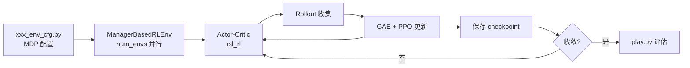

# Isaac Lab 强化学习训练流程

> 对照本地 [Isaac Lab 官方仓库](https://github.com/isaac-sim/IsaacLab/blob/main/)（v2.3.2）修订。

## 1. 强化学习在 Isaac Lab 中的定位

Isaac Lab 将外部 RL 库（主要是 **`rsl_rl` PPO**）与 GPU 并行仿真环境结合：环境输出 `(num_envs, ...)` 张量，策略在同一 GPU 上完成 rollout 与更新。

**核心逻辑**：
- Isaac Lab：`ManagerBasedRLEnv` 管理并行环境与 MDP 管理器
- `rsl_rl`：PPO 算法与 Actor-Critic（**pip 依赖，不在本仓库内**）
- 桥接脚本：[scripts/reinforcement_learning/rsl_rl/train.py](https://github.com/isaac-sim/IsaacLab/blob/main/scripts/reinforcement_learning/rsl_rl/train.py)

---

## 2. 并行环境架构

基于 [ManagerBasedRLEnv](https://github.com/isaac-sim/IsaacLab/blob/main/source/isaaclab/isaaclab/envs/manager_based_rl_env.py)（继承 [ManagerBasedEnv](https://github.com/isaac-sim/IsaacLab/blob/main/source/isaaclab/isaaclab/envs/manager_based_env.py)）：

- 单 GPU 上 `num_envs` 个并行实例
- 观测、动作、奖励、done 均为 GPU 张量
- Gymnasium 风格接口：`reset()` / `step(action)`

---

## 3. 训练主循环（rsl_rl PPO）

入口：[train.py](https://github.com/isaac-sim/IsaacLab/blob/main/scripts/reinforcement_learning/rsl_rl/train.py)

### 3.1 初始化
- 解析 `--task`，通过 `gym.make` 加载环境及 `env_cfg_entry_point`
- 从 `rsl_rl_cfg_entry_point` 加载 PPO 配置（如 [anymal_d/agents/rsl_rl_ppo_cfg.py](https://github.com/isaac-sim/IsaacLab/blob/main/source/isaaclab_tasks/isaaclab_tasks/manager_based/locomotion/velocity/config/anymal_d/agents/rsl_rl_ppo_cfg.py)）
- 构建 Actor-Critic 与 `OnPolicyRunner`

### 3.2 Rollout → GAE → PPO 更新
`rsl_rl` 内部完成：采样 `num_steps_per_env` 步 → 计算 GAE → 多 epoch mini-batch 更新。具体实现见已安装的 `rsl_rl` 包（非本地仓库文件）。

### 3.3 迭代与保存
循环至 `max_iterations`，定期保存 checkpoint 到 `logs/`。

---

## 4. PPO 配置位置

| 内容 | 官方文件 |
|------|----------|
| 环境 MDP（奖励权重等） | `source/isaaclab_tasks/.../xxx_env_cfg.py` |
| PPO 超参 / 网络结构 | `.../agents/rsl_rl_ppo_cfg.py` 或 `agents/skrl_*_cfg.yaml` |
| 共享速度跟踪奖励 | [isaaclab/envs/mdp/rewards.py](https://github.com/isaac-sim/IsaacLab/blob/main/source/isaaclab/isaaclab/envs/mdp/rewards.py) |

网络 hidden dims、learning rate 等在 `RslRlPpoActorCriticCfg` / `RslRlPpoAlgorithmCfg` 中定义，而非环境 `cfg.yaml`（该文件不存在）。

---

## 5. 域随机化与 PBT

- **域随机化**：各任务 `EventCfg` 中定义（如 [velocity_env_cfg.py EventCfg](https://github.com/isaac-sim/IsaacLab/blob/main/source/isaaclab_tasks/isaaclab_tasks/manager_based/locomotion/velocity/velocity_env_cfg.py)）
- **PBT**：`rl_games` 路径下实现（[isaaclab_rl/rl_games/pbt/](https://github.com/isaac-sim/IsaacLab/blob/main/source/isaaclab_rl/isaaclab_rl/rl_games/pbt/)），非所有 `rsl_rl` 训练默认启用

---

## 6. 关键文件一览

| 组件 | 官方路径 |
|------|----------|
| PPO 训练脚本 | [scripts/reinforcement_learning/rsl_rl/train.py](https://github.com/isaac-sim/IsaacLab/blob/main/scripts/reinforcement_learning/rsl_rl/train.py) |
| PPO 测试脚本 | [scripts/reinforcement_learning/rsl_rl/play.py](https://github.com/isaac-sim/IsaacLab/blob/main/scripts/reinforcement_learning/rsl_rl/play.py) |
| 环境基类 | [isaaclab/envs/manager_based_env.py](https://github.com/isaac-sim/IsaacLab/blob/main/source/isaaclab/isaaclab/envs/manager_based_env.py) |
| RL 环境 | [isaaclab/envs/manager_based_rl_env.py](https://github.com/isaac-sim/IsaacLab/blob/main/source/isaaclab/isaaclab/envs/manager_based_rl_env.py) |
| 四足任务 MDP 基类 | [locomotion/velocity/velocity_env_cfg.py](https://github.com/isaac-sim/IsaacLab/blob/main/source/isaaclab_tasks/isaaclab_tasks/manager_based/locomotion/velocity/velocity_env_cfg.py) |
| Anymal D 注册 | [config/anymal_d/__init__.py](https://github.com/isaac-sim/IsaacLab/blob/main/source/isaaclab_tasks/isaaclab_tasks/manager_based/locomotion/velocity/config/anymal_d/__init__.py) |

> **`rsl_rl` 的 `ppo.py`** 位于 pip 安装的 `rsl_rl` 包中（通常来自 https://github.com/leggedrobotics/rsl_rl），**不在**本地 IsaacLab 仓库内。

---

## 7. 流程图

---

*对照版本：Isaac Lab 2.3.2*
