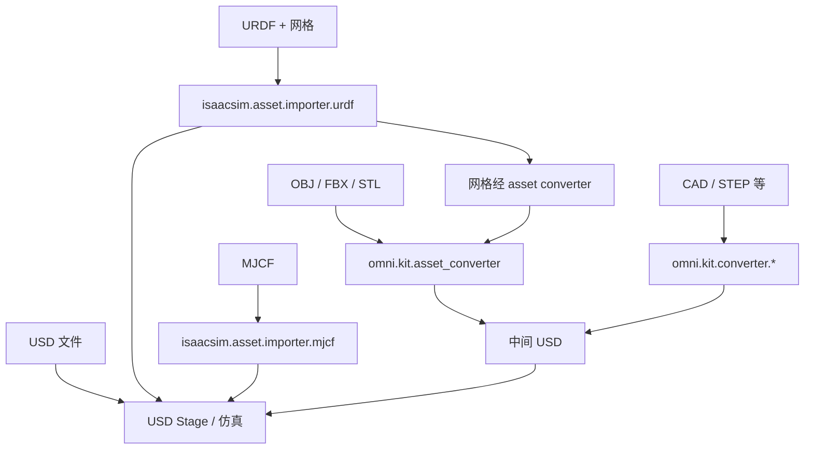

# 3D 建模软件与文件格式 — Isaac Sim 对照说明

> 官方仓库：[IsaacSim](https://github.com/isaac-sim/IsaacSim/blob/main)(https://github.com/isaac-sim/IsaacSim/blob/main/) · 版本见 [VERSION](https://github.com/isaac-sim/IsaacSim/blob/main/VERSION)  
> 表格 **源码** 列指向仓库内可点击文件。

Isaac Sim 基于 **OpenUSD** 组织场景（见 [docs/overview/experimental.rst](https://github.com/isaac-sim/IsaacSim/blob/main/docs/overview/experimental.rst)）。非 USD 资产经各类 **Importer / Converter** 进入 USD Stage，再在 Stage 上补充 PhysX 物理、语义、传感器等。

---

## 一、3D 建模软件（创作端）

以下为常见 DCC / CAD 工具，用于**制作**网格、场景或机器人模型；导入 Isaac Sim 时通常需导出为下文第二节所列格式。

| 软件 | 定位 | 在机器人仿真中的典型用途 |
|------|------|--------------------------|
| **Blender** | 开源全能 3D | 场景（仓库、桌面）、道具网格；可导出 **USD** 或 **OBJ/FBX/STL** 供转换 |
| **Maya / 3ds Max** | 影视 / 游戏 / 可视化 | 高精度外观、动画；常导出 FBX 或 USD |
| **SolidWorks 等 CAD** | 参数化机械设计 | 零件精确尺寸；经 **STEP 等 CAD 格式** 或 **URDF+网格** 进入仿真（见 [README.md](https://github.com/isaac-sim/IsaacSim/blob/main/README.md) 对 CAD 导入的说明） |

**选择建议**

- **机器人整机 / 关节链** → 优先 **URDF** 或 **MJCF**（Isaac Sim 有一等公民导入器，见第三节）  
- **静态场景网格** → Blender 等导出 **USD**，或 **OBJ / FBX / STL** 经 `omni.kit.asset_converter` 转 USD  
- **CAD 零件** → 使用 Omniverse **CAD Converter** 扩展（见 [isaacsim.exp.extscache.kit](https://github.com/isaac-sim/IsaacSim/blob/main/source/apps/isaacsim.exp.extscache.kit) 中 `omni.kit.converter.*`）

---

## 二、文件格式与 Isaac Sim 中的角色

### 2.1 格式对照表

| 格式 | 典型内容 | 在 Isaac Sim 中的位置 | 源码依据 |
|------|----------|----------------------|----------|
| **USD**（`.usd` / `.usda` / `.usdc` / `.usdz`） | 场景图、几何、材质、层级、动画；可挂载 PhysX、语义等扩展 | **原生场景格式**，仿真直接在 USD Stage 上运行 | [experimental.rst](https://github.com/isaac-sim/IsaacSim/blob/main/docs/overview/experimental.rst)；资产概述见 [README 文档链接](https://github.com/isaac-sim/IsaacSim/blob/main/README.md) |
| **URDF**（`.urdf` + 网格） | 连杆、关节、惯性、视觉/碰撞网格引用 | **机器人导入主路径** → 生成带 Articulation 的 USD | [isaacsim.asset.importer.urdf](https://github.com/isaac-sim/IsaacSim/blob/main/source/extensions/isaacsim.asset.importer.urdf/)；示例 [urdf_import.py](https://github.com/isaac-sim/IsaacSim/blob/main/source/standalone_examples/api/isaacsim.asset.importer.urdf/urdf_import.py) |
| **MJCF**（`.xml` 等） | MuJoCo 模型：body、joint、actuator、mesh | 与 URDF 类似的**机器人描述导入** → USD | [isaacsim.asset.importer.mjcf](https://github.com/isaac-sim/IsaacSim/blob/main/source/extensions/isaacsim.asset.importer.mjcf/)；示例 [mjcf_import.py](https://github.com/isaac-sim/IsaacSim/blob/main/source/standalone_examples/api/isaacsim.asset.importer.mjcf/mjcf_import.py) |
| **OBJ / FBX / STL** | 三角网格；FBX 可带动画 | 经 **`omni.kit.asset_converter`** 转为 USD 后引用 | 官方示例列出支持格式：`stl`, `obj`, `fbx` · [asset_usd_converter.py L55](https://github.com/isaac-sim/IsaacSim/blob/main/source/standalone_examples/api/omni.kit.asset_converter/asset_usd_converter.py#L55) |
| **CAD**（STEP、JT、DGN 等） | 精确 B-Rep / 装配 | **CAD Converter** 扩展（非 Isaac 核心 Python，随 Kit 依赖加载） | [isaacsim.exp.extscache.kit L353–361](https://github.com/isaac-sim/IsaacSim/blob/main/source/apps/isaacsim.exp.extscache.kit#L353-L361) |
| **glTF / glB** | Web 3D 场景/网格 | **非** `asset_usd_converter` 示例中的一等导入格式；可作为 **URDF 所引用的网格**（changelog 记载 GLTF mesh 支持） | [URDF CHANGELOG L298](https://github.com/isaac-sim/IsaacSim/blob/main/source/extensions/isaacsim.asset.importer.urdf/docs/CHANGELOG.md#L298)；对比 [asset_usd_converter.py L55](https://github.com/isaac-sim/IsaacSim/blob/main/source/standalone_examples/api/omni.kit.asset_converter/asset_usd_converter.py#L55) |

### 2.2 格式能力说明（通用 + Isaac Sim）

| 格式 | 能较好携带的信息 | 通常需在后处理中补充的内容 |
|------|------------------|---------------------------|
| **USD** | 完整场景图、PBR 材质、层级、变体；Isaac Sim 中可写 PhysX、语义 | 外部导入的纯网格 USD 往往仍要加碰撞、驱动、传感器 |
| **URDF / MJCF** | 运动学树、关节限位、惯性、网格路径 | 导入后常需配置物理场景、地面、驱动（见 [urdf_import.py L45–60](https://github.com/isaac-sim/IsaacSim/blob/main/source/standalone_examples/api/isaacsim.asset.importer.urdf/urdf_import.py#L45-L60)） |
| **OBJ** | 静态网格 + MTL 基础材质 | 动画、关节、物理、PBR |
| **FBX** | 网格、骨骼动画、相机/灯光（视导出设置） | Isaac 侧 PhysX 语义；材质解释依赖转换器 |
| **STL** | **仅**三角面片几何 | 材质、颜色、动画、关节 |
| **glTF** | 网格、PBR、动画（作为网格文件时） | 在 Isaac Sim 中**不要假设**与 OBJ/FBX 相同的「拖入即转 USD」流程；机器人场景优先 URDF/MJCF 或已转好的 USD |

### 2.3 导入路径关系（示意）



---

## 三、Isaac Sim 中的典型工作流

### 3.1 机器人（推荐 URDF / MJCF）

1. 在 CAD / 导出工具中生成 **URDF**（或 **MJCF**）及网格文件。  
2. 在 Isaac Sim 中调用导入命令，例如 URDF：

```python
# 摘自 urdf_import.py 流程
omni.kit.commands.execute("URDFCreateImportConfig")
omni.kit.commands.execute("URDFParseAndImportFile", urdf_path=..., import_config=...)
```

源码：[urdf_import.py L26–41](https://github.com/isaac-sim/IsaacSim/blob/main/source/standalone_examples/api/isaacsim.asset.importer.urdf/urdf_import.py#L26-L41)

3. URDF 中的外部网格由 **MeshImporter** 调用 **omniverse asset converter** 转为 USD 并引用（见 [URDF CHANGELOG L265–267](https://github.com/isaac-sim/IsaacSim/blob/main/source/extensions/isaacsim.asset.importer.urdf/docs/CHANGELOG.md#L265-L267)）。  
4. 在 Stage 上添加 **Physics Scene**、地面、驱动、传感器等（示例同文件 L45 起）。

### 3.2 场景 / 道具网格（OBJ / FBX / STL）

1. 启用扩展 `omni.kit.asset_converter`（见 [asset_usd_converter.py L91](https://github.com/isaac-sim/IsaacSim/blob/main/source/standalone_examples/api/omni.kit.asset_converter/asset_usd_converter.py#L91)）。  
2. 对 `stl` / `obj` / `fbx` 调用 `create_converter_task` 输出 `.usd`。  
3. 将生成的 USD 引用到当前 Stage，再添加碰撞与物理材质。

批量转换示例见 [asset_usd_converter.py L54–83](https://github.com/isaac-sim/IsaacSim/blob/main/source/standalone_examples/api/omni.kit.asset_converter/asset_usd_converter.py#L54-L83)。

### 3.3 已 authoring 的 USD

若 DCC 已导出 **USD**，可直接打开或引用到 Stage，无需再经 mesh converter（URDF 中若 mesh 路径已是 USD，Importer 会直接 `AddReference`，见 [UrdfImporter.cpp L170–173](https://github.com/isaac-sim/IsaacSim/blob/main/source/extensions/isaacsim.asset.importer.urdf/plugins/isaacsim.asset.importer.urdf/UrdfImporter.cpp#L170-L173)）。

### 3.4 仿真中的「纹理 / 图像」

- **物体上的贴图**：存在 USD 材质 / 纹理资源中，由 RTX 渲染使用。  
- **传感器读到的 RGB / 深度 / 分割**：是**每帧渲染或光追输出**，不是再去读取磁盘上的 `.png` 贴图文件。  

这与 Isaac Lab 等下游框架中 Camera 传感器的用法一致。

---

## 四、官方仓库索引

| 用途 | 路径 |
|------|------|
| 项目概述与支持的导入类型 | [README.md](https://github.com/isaac-sim/IsaacSim/blob/main/README.md) |
| OpenUSD 在 Omniverse 中的定位 | [docs/overview/experimental.rst](https://github.com/isaac-sim/IsaacSim/blob/main/docs/overview/experimental.rst) |
| OBJ/FBX/STL → USD 示例 | [standalone_examples/api/omni.kit.asset_converter/asset_usd_converter.py](https://github.com/isaac-sim/IsaacSim/blob/main/source/standalone_examples/api/omni.kit.asset_converter/asset_usd_converter.py) |
| URDF 导入示例 | [standalone_examples/api/isaacsim.asset.importer.urdf/urdf_import.py](https://github.com/isaac-sim/IsaacSim/blob/main/source/standalone_examples/api/isaacsim.asset.importer.urdf/urdf_import.py) |
| MJCF 导入示例 | [standalone_examples/api/isaacsim.asset.importer.mjcf/mjcf_import.py](https://github.com/isaac-sim/IsaacSim/blob/main/source/standalone_examples/api/isaacsim.asset.importer.mjcf/mjcf_import.py) |
| URDF 扩展说明 | [isaacsim.asset.importer.urdf/docs/README.md](https://github.com/isaac-sim/IsaacSim/blob/main/source/extensions/isaacsim.asset.importer.urdf/docs/README.md) |
| MJCF 扩展说明 | [isaacsim.asset.importer.mjcf/docs/README.md](https://github.com/isaac-sim/IsaacSim/blob/main/source/extensions/isaacsim.asset.importer.mjcf/docs/README.md) |
| Kit 依赖（asset_converter、CAD converter） | [source/apps/isaacsim.exp.extscache.kit](https://github.com/isaac-sim/IsaacSim/blob/main/source/apps/isaacsim.exp.extscache.kit) |
| 在线导入导出文档（README 链接） | https://docs.isaacsim.omniverse.nvidia.com/latest/importer_exporter/importers_exporters.html |

---

*基于 Isaac Sim 官方仓库编写。*
