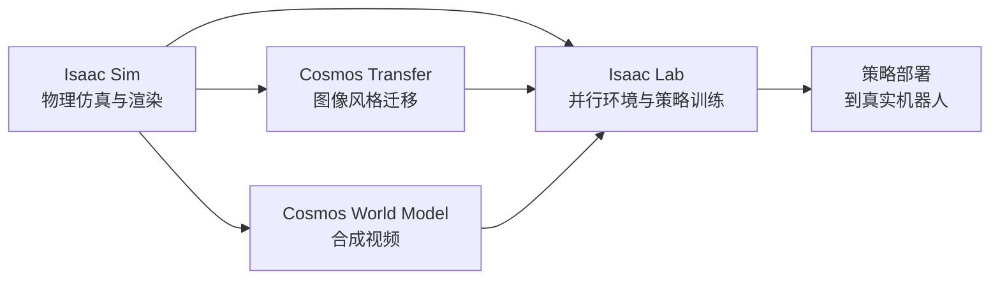

# NVIDIA Isaac Sim、Isaac Lab 与 Cosmos — 定位与协作

> 调研文档 · 延伸阅读：[issac_sim/介绍.md](issac_sim/介绍.md) · [issac_lab/介绍.md](issac_lab/介绍.md)  
> 官方仓库：Isaac Sim [5.1.0-rc.19](https://github.com/isaac-sim/IsaacSim/blob/main/VERSION) · Isaac Lab [2.3.2](https://github.com/isaac-sim/IsaacLab/blob/main/VERSION)

NVIDIA 为机器人仿真与训练提供互补工具：**Isaac Sim** 负责高保真仿真，**Isaac Lab** 负责策略训练与基准，**Cosmos** 负责视觉域迁移与合成数据增强。三者分工不同，常组合使用。

---

## 1. NVIDIA Isaac Sim

### 定位

高保真机器人仿真与数字孪生平台，基于 **NVIDIA Omniverse** 与 **OpenUSD**（见 [Isaac Sim README](https://github.com/isaac-sim/IsaacSim/blob/main/README.md)）。

### 核心能力

- **场景与资产**：USD 原生场景；URDF、MJCF、CAD、OBJ/FBX/STL 等导入（详见 [issac_sim/不同格式3d文件的介绍.md](issac_sim/不同格式3d文件的介绍.md)）。
- **物理**：GPU 加速 **PhysX** 仿真（当前栈对应 PhysX 5.6.x 文档），刚体、关节、接触、可变形体等。
- **传感器**：RTX 相机（RGB/深度）、RTX LiDAR/Radar、IMU、接触与力矩（Effort）等（见 [issac_sim/介绍.md §3.2](issac_sim/介绍.md)）。
- **机器人**：Create 菜单内置 Ant、Spot、Franka、Humanoid、Nova Carter、Quadcopter 等；UR10 等可通过 URDF 或 `/Isaac/Robots/` 资产加载；支持 Surface Gripper（吸盘类）。
- **域随机化 / SDG**：`isaacsim.replicator.domain_randomization`、Omniverse Replicator 合成数据管线。
- **接口**：Python API（`from isaacsim import SimulationApp`）、ROS 2 桥接、OpenXR 等。

### 与训练的关系

Isaac Sim **不提供 RL/IL 训练循环**，输出可步进的仿真世界与传感器流。策略训练通常由 **Isaac Lab** 在 Sim 之上封装并行环境与 MDP 后完成。

**资源**：[开发者页面](https://developer.nvidia.com/isaac-sim) · [在线文档](https://docs.isaacsim.omniverse.nvidia.com/latest/index.html)

---

## 2. NVIDIA Isaac Lab

### 定位

**开源、GPU 加速**的机器人学习框架（Isaac Gym 的继承者），构建于 Isaac Sim 之上（见 [Isaac Lab README](https://github.com/isaac-sim/IsaacLab/blob/main/README.md)）。

### 核心能力

- **并行环境**：单 GPU 上 `num_envs` 可达数千；观测、动作、奖励为 PyTorch 张量 `(num_envs, …)`，减少 CPU–GPU 拷贝。
- **任务库**（`isaaclab_tasks`）：30+ 预置环境，含经典控制、四足/人形运动、Franka 操作（Lift/Stack）、OpenArm 双臂 Reach、Dexsuite 灵巧手、Factory 装配等；Gymnasium 接口（详见 [issac_lab/任务基本介绍.md](issac_lab/任务基本介绍.md)）。
- **强化学习**：主路径 **RSL-RL + PPO**（[train.py](https://github.com/isaac-sim/IsaacLab/blob/main/scripts/reinforcement_learning/rsl_rl/train.py)）；亦支持 **RL-Games、skrl、Stable-Baselines3**（skrl 可选 SAC 等算法）。
- **模仿学习**：遥操作录制 HDF5（[record_demos.py](https://github.com/isaac-sim/IsaacLab/blob/main/scripts/tools/record_demos.py)）→ **Robomimic BC**；**Isaac Lab Mimic**（基于 MimicGen 思路）与 **SkillGen**（cuRobo 运动规划扩增）。
- **域随机化**：各任务 `EventCfg` 中配置 reset/interval 随机化；**ADR** 见于 Dexsuite 等少数任务；**PBT** 在 RL-Games 集成中提供（RSL-RL 默认路径不启用）。
- **观测**：支持向量本体感觉及 RGB/深度等字典观测（按任务配置）。
- **遥操作设备**：keyboard、SpaceMouse、gamepad、handtracking；VR/CloudXR 见官方 CloudXR 文档。
- **编排**：可通过 [NVIDIA OSMO](https://developer.nvidia.com/osmo) 编排多节点/多容器训练工作流（见 Isaac Lab 参考架构文档）。

### 与训练的关系

Isaac Lab 是**直接训练机器人策略的核心平台**：定义 MDP → rollout → 保存 checkpoint（`logs/rsl_rl/...`）→ `play.py` 验证 → 部署真机。

**资源**：[GitHub isaac-sim/IsaacLab](https://github.com/isaac-sim/IsaacLab) · [在线文档](https://isaac-sim.github.io/IsaacLab/)

---

## 3. NVIDIA Cosmos

### 定位

面向物理世界的 **World Foundation Model** 与视觉迁移工具，用于缩小仿真与真实之间的**视觉域差距**（非仿真器、非训练框架）。

### 核心能力

- **Cosmos Transfer**：将仿真渲染图转为更逼真的照片级图像。
- **Cosmos World Foundation Model**：生成逼真场景视频，用于感知训练或数据增强。
- 典型场景：自动驾驶、机器人导航、室内操作等感知闭环。
- Isaac Lab 文档中有 Cosmos Transfer 与 Mimic/Stack 等集成示例（如 `augmented_imitation.rst`）。

### 与训练的关系

Cosmos **不提供仿真环境或策略训练接口**；处理 Sim/Lab 输出的图像/视频，作视觉增强或额外训练数据。Sim-to-real 链路中常位于「渲染输出 → Cosmos → 策略/感知训练」之间。

**资源**：[NVIDIA Cosmos](https://developer.nvidia.com/cosmos) · 更多细节见 [NVIDIA 博客检索 "Cosmos"](https://blogs.nvidia.com/?s=cosmos)

---

## 4. 三者对比

| 维度 | Isaac Sim | Isaac Lab | Cosmos |
|------|-----------|-----------|--------|
| **主要用途** | 高保真仿真与数字孪生 | 策略训练、基准、IL 数据管线 | 视觉迁移与合成数据 |
| **仿真环境** | ✅ 提供 | ❌ 依赖 Sim | ❌ 不提供 |
| **训练框架** | ❌ 不提供 | ✅ RL / IL | ❌ 不提供 |
| **典型输出** | 传感器流、渲染图 | 策略 checkpoint、HDF5 数据集 | 逼真图像/视频 |
| **可独立使用** | ✅ | ✅（需 Sim 运行时） | ✅（需外部图像源） |

### 协作关系

典型流程：在 **Isaac Sim** 中准备 USD 场景与机器人 → **Isaac Lab** 定义任务并训练 → 可选 **Cosmos** 增强视觉观测 → 真机部署。

---

## 5. 许可说明

需区分 **预编译产品** 与 **GitHub 源码仓库**：

### Isaac Sim

| 项目 | 说明 |
|------|------|
| **预编译包** | 在 [developer.nvidia.com/isaac-sim](https://developer.nvidia.com/isaac-sim) 注册后可免费下载；运行依赖 **Omniverse Kit SDK** 等附加组件，见 [LICENSE 附加条款](https://github.com/isaac-sim/IsaacSim/blob/main/LICENSE) |
| **GitHub 仓库** | 官方仓库 [IsaacSim](https://github.com/isaac-sim/IsaacSim/blob/main/) 采用 **Apache 2.0**，含大量扩展与示例源码；**不等于**全部 Kit 运行时闭源组件 |
| **产品许可** | 商业大规模部署等场景须阅读 [NVIDIA Omniverse License](https://developer.nvidia.com/omniverse/license) |

### Isaac Lab

- **BSD-3-Clause** 开源（[LICENSE](https://github.com/isaac-sim/IsaacLab/blob/main/LICENSE)），托管于 [github.com/isaac-sim/IsaacLab](https://github.com/isaac-sim/IsaacLab)。
- 可免费用于学术与商业项目，但**运行时仍依赖 Isaac Sim**。

### 相关开源组件

- **PhysX SDK**：开源于 [NVIDIA-Omniverse/PhysX](https://github.com/NVIDIA-Omniverse/PhysX)（含 Omniverse 扩展与 USD schema）。
- **omni.physx**：随 Isaac Lab 2.3 起开源（[NVIDIA 公告](https://forums.developer.nvidia.com/t/physics-power-unlocked-nvidia-isaac-lab-2-3-is-generally-available-and-omni-physx-is-now-open-source/350982)）。
- **OpenUSD**：Pixar 开源场景描述格式。

### 总结

| 组件 | 免费使用 | 源码开放 | 主要许可 |
|------|----------|----------|----------|
| **Isaac Sim（预编译）** | ✅（需注册） | Kit 核心闭源 | Omniverse License |
| **Isaac Sim（GitHub）** | ✅ | ✅ 扩展与示例（Apache 2.0） | Apache 2.0 + 附加组件 |
| **Isaac Lab** | ✅ | ✅ | BSD-3-Clause |
| **PhysX / omni.physx** | ✅ | ✅ | BSD-3 等 |

**推荐实践**：以开源 **Isaac Lab** 组织训练与任务开发，以 **Isaac Sim** 作为仿真运行时；需修改物理集成时可参考开源 **PhysX / omni.physx** 仓库。

---

## 6. 文档索引

| 主题 | 路径 |
|------|------|
| Isaac Sim 详解 | [issac_sim/介绍.md](issac_sim/介绍.md) |
| 3D 资产格式 | [issac_sim/不同格式3d文件的介绍.md](issac_sim/不同格式3d文件的介绍.md) |
| Isaac Lab 详解 | [issac_lab/介绍.md](issac_lab/介绍.md) |
| 任务与奖励 | [issac_lab/任务基本介绍.md](issac_lab/任务基本介绍.md) |
| 训练流程 | [issac_lab/训练流程.md](issac_lab/训练流程.md) |
| 文档站点 | [在线文档站点](./) |

*Isaac Sim 5.1 · Isaac Lab 2.3.2 · 调研文档*